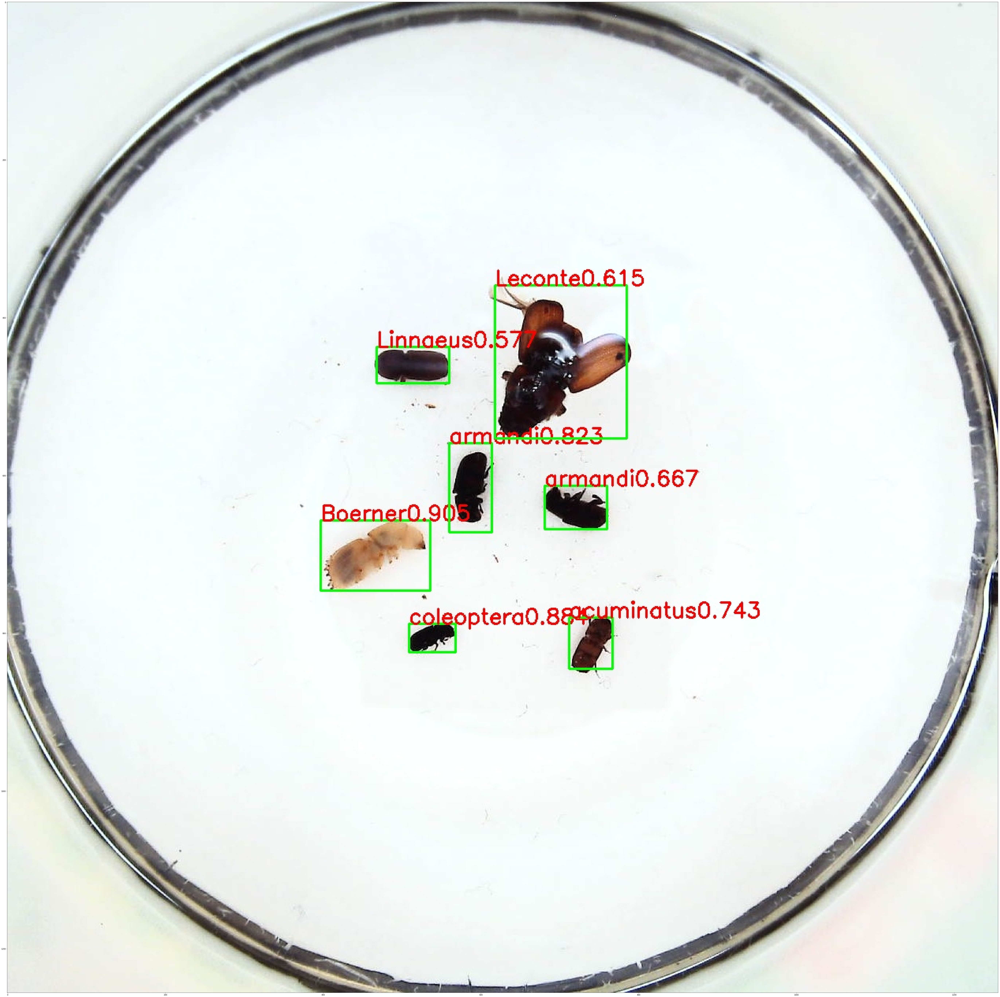

# Hello PPYOLO:从CV小白到第一个可运行的目标检测程序

## 1.安装paddlex


```python
!pip install paddlex
```


## 2.准备数据集


```python
# 解压
!unzip -oq /home/aistudio/data/data34213/insects.zip -d ~/insects
```


```python
%cd ~/insects/
```

### 建立图片与标签路径的连接


```python
import os 
import pandas as pd 

train_list_path = '/home/aistudio/insects/data/insects/train_list.txt'
val_list_path = '/home/aistudio/insects/data/insects/val_list.txt'
label_list_path = '/home/aistudio/insects/data/insects/labels.txt'

#训练集
train_list = os.listdir('./data/insects/train/annotations/xmls')
f = open(train_list_path,'a+')
for filename in train_list:
    name= filename.split('.')
    if name[1] == 'xml':
        annotation_path = os.path.join('annotations/xmls',filename)
        image_path = os.path.join('images',name[0]+'.jpeg')
        f.write(image_path+' '+annotation_path+'\n')
f.close()

#验证集
train_list = os.listdir('./data/insects/val/annotations/xmls')
f = open(val_list_path,'a+')
for filename in train_list:
    name= filename.split('.')
    if name[1] == 'xml':
        annotation_path = os.path.join('annotations/xmls',filename)
        image_path = os.path.join('images',name[0]+'.jpeg')
        f.write(image_path+' '+annotation_path+'\n')
f.close()

#标签
with open(label_list_path,'w') as f:
    f.write('Boerner\n')
    f.write('Leconte\n')
    f.write('Linnaeus\n')
    f.write('acuminatus\n')
    f.write('armandi\n')
    f.write('coleoptera\n')
    f.write('linnaeus')
```

### 图像增强


```python
# 加载paddlex，设置GPU使用环境，如果非GPU环境会自动使用CPU
import paddlex as pdx
os.environ['CUDA_VISIBLE_DEVICE'] = '0'
```


### 图像增强


```python
# 定义训练和验证时的transforms
# API说明：https://github.com/PaddlePaddle/PaddleX/blob/develop/docs/apis/transforms/transforms.md
from paddlex import transforms as T
train_transforms = T.Compose([
    T.MixupImage(mixup_epoch=-1), T.RandomDistort(),
    T.RandomExpand(im_padding_value=[123.675, 116.28, 103.53]), T.RandomCrop(),
    T.RandomHorizontalFlip(), T.BatchRandomResize(
        target_sizes=[320, 352, 384, 416, 448, 480, 512, 544, 576, 608],
        interp='RANDOM'), T.Normalize(
            mean=[0.485, 0.456, 0.406], std=[0.229, 0.224, 0.225])
])

eval_transforms = T.Compose([
    T.Resize(
        target_size=608, interp='CUBIC'), T.Normalize(
            mean=[0.485, 0.456, 0.406], std=[0.229, 0.224, 0.225])
])

```

### 将原始数据集转换为VOC数据集


```python
# 定义训练和验证所用的数据集
# API说明：https://github.com/PaddlePaddle/PaddleX/blob/develop/docs/apis/datasets.md
%cd /home/aistudio/insects/data/

train_dataset = pdx.datasets.VOCDetection(
    data_dir='insects/train',
    file_list='insects/train_list.txt',
    label_list='insects/labels.txt',
    transforms=train_transforms,
    shuffle=True)

eval_dataset = pdx.datasets.VOCDetection(
    data_dir='insects/val',
    file_list='insects/val_list.txt',
    label_list='insects/labels.txt',
    transforms=eval_transforms,
    shuffle=False)
```

### 定义模型

```python
# 初始化模型，并进行训练
# 可使用VisualDL查看训练指标，参考https://github.com/PaddlePaddle/PaddleX/blob/develop/docs/visualdl.md
num_classes = len(train_dataset.labels)
model = pdx.det.PPYOLO(num_classes=num_classes, backbone='ResNet50_vd_dcn')
```


## 3.训练


```python
# API说明：https://github.com/PaddlePaddle/PaddleX/blob/develop/docs/apis/models/detection.md
# 各参数介绍与调整说明：https://github.com/PaddlePaddle/PaddleX/blob/develop/docs/parameters.md
model = pdx.load_model('output/ppyolo_r50vd_dcn/best_model')
model.train(
    num_epochs=150,
    train_dataset=train_dataset,
    train_batch_size=8,
    eval_dataset=eval_dataset,
    pretrain_weights='COCO',
    learning_rate=0.005 / 12,
    warmup_steps=500,
    warmup_start_lr=0.0,
    save_interval_epochs=5,
    lr_decay_epochs=[85, 135],
    save_dir='output/ppyolo_r50vd_dcn',
    use_vdl=True)
```

> 下面显示训练输出，供大家参考训练耗时

    2022-02-26 12:59:25 [INFO]	Model[PPYOLO] loaded.
    2022-02-26 12:59:25 [INFO]	Loading pretrained model from output/ppyolo_r50vd_dcn/pretrain/ppyolo_r50vd_dcn_2x_coco.pdparams
    2022-02-26 12:59:27 [WARNING]	[SKIP] Shape of pretrained params yolo_head.yolo_output.0.weight doesn't match.(Pretrained: (258, 1024, 1, 1), Actual: [39, 1024, 1, 1])
    2022-02-26 12:59:27 [WARNING]	[SKIP] Shape of pretrained params yolo_head.yolo_output.0.bias doesn't match.(Pretrained: (258,), Actual: [39])
    2022-02-26 12:59:27 [WARNING]	[SKIP] Shape of pretrained params yolo_head.yolo_output.1.weight doesn't match.(Pretrained: (258, 512, 1, 1), Actual: [39, 512, 1, 1])
    2022-02-26 12:59:27 [WARNING]	[SKIP] Shape of pretrained params yolo_head.yolo_output.1.bias doesn't match.(Pretrained: (258,), Actual: [39])
    2022-02-26 12:59:27 [WARNING]	[SKIP] Shape of pretrained params yolo_head.yolo_output.2.weight doesn't match.(Pretrained: (258, 256, 1, 1), Actual: [39, 256, 1, 1])
    2022-02-26 12:59:27 [WARNING]	[SKIP] Shape of pretrained params yolo_head.yolo_output.2.bias doesn't match.(Pretrained: (258,), Actual: [39])
    2022-02-26 12:59:27 [INFO]	There are 386/392 variables loaded into PPYOLO.
    2022-02-26 13:00:01 [INFO]	[TRAIN] Epoch=1/150, Step=10/211, loss_xy=4.479962, loss_wh=8.638511, loss_iou=21.034603, loss_iou_aware=4.745147, loss_obj=60.940933, loss_cls=18.903402, loss=118.742561, lr=0.000008, time_each_step=3.4s, eta=29:54:54
    2022-02-26 13:00:31 [INFO]	[TRAIN] Epoch=1/150, Step=20/211, loss_xy=4.660780, loss_wh=9.302165, loss_iou=23.794548, loss_iou_aware=5.269141, loss_obj=47.668770, loss_cls=19.475992, loss=110.171394, lr=0.000016, time_each_step=2.99s, eta=26:17:59
    2022-02-26 13:01:01 [INFO]	[TRAIN] Epoch=1/150, Step=30/211, loss_xy=4.307461, loss_wh=5.862878, loss_iou=20.308731, loss_iou_aware=4.445399, loss_obj=19.891867, loss_cls=18.804295, loss=73.620636, lr=0.000024, time_each_step=3.01s, eta=26:27:51
    2022-02-26 13:01:30 [INFO]	[TRAIN] Epoch=1/150, Step=40/211, loss_xy=4.880270, loss_wh=4.742130, loss_iou=17.204769, loss_iou_aware=4.033047, loss_obj=19.561281, loss_cls=17.784294, loss=68.205795, lr=0.000033, time_each_step=2.89s, eta=25:23:26
    2022-02-26 13:01:53 [INFO]	[TRAIN] Epoch=1/150, Step=50/211, loss_xy=3.849963, loss_wh=4.505912, loss_iou=16.975651, loss_iou_aware=4.055696, loss_obj=17.830755, loss_cls=15.642357, loss=62.860336, lr=0.000041, time_each_step=2.33s, eta=20:29:49
    2022-02-26 13:02:29 [INFO]	[TRAIN] Epoch=1/150, Step=60/211, loss_xy=2.689790, loss_wh=3.515367, loss_iou=15.117802, loss_iou_aware=3.821445, loss_obj=9.618155, loss_cls=16.601242, loss=51.363800, lr=0.000049, time_each_step=3.55s, eta=31:13:30
    2022-02-26 13:03:02 [INFO]	[TRAIN] Epoch=1/150, Step=70/211, loss_xy=2.605943, loss_wh=4.297418, loss_iou=15.518818, loss_iou_aware=3.711884, loss_obj=10.082766, loss_cls=17.678198, loss=53.895027, lr=0.000058, time_each_step=3.34s, eta=29:20:1
    2022-02-26 13:03:33 [INFO]	[TRAIN] Epoch=1/150, Step=80/211, loss_xy=2.403964, loss_wh=3.401972, loss_iou=14.158370, loss_iou_aware=3.523702, loss_obj=6.580948, loss_cls=14.255778, loss=44.324734, lr=0.000066, time_each_step=3.12s, eta=27:24:54
    2022-02-26 13:04:04 [INFO]	[TRAIN] Epoch=1/150, Step=90/211, loss_xy=2.563230, loss_wh=3.286973, loss_iou=13.932497, loss_iou_aware=3.545238, loss_obj=10.010499, loss_cls=15.561931, loss=48.900368, lr=0.000074, time_each_step=3.09s, eta=27:7:41
    2022-02-26 13:04:31 [INFO]	[TRAIN] Epoch=1/150, Step=100/211, loss_xy=3.184296, loss_wh=3.393431, loss_iou=14.255102, loss_iou_aware=3.734010, loss_obj=12.212224, loss_cls=14.940367, loss=51.719429, lr=0.000082, time_each_step=2.63s, eta=23:3:45
    2022-02-26 13:05:06 [INFO]	[TRAIN] Epoch=1/150, Step=110/211, loss_xy=2.640919, loss_wh=3.281750, loss_iou=14.184654, loss_iou_aware=3.665245, loss_obj=9.327064, loss_cls=16.433912, loss=49.533546, lr=0.000091, time_each_step=3.59s, eta=31:27:41
    2022-02-26 13:05:31 [INFO]	[TRAIN] Epoch=1/150, Step=120/211, loss_xy=2.382869, loss_wh=3.197449, loss_iou=13.325706, loss_iou_aware=3.362490, loss_obj=8.042775, loss_cls=14.621925, loss=44.933212, lr=0.000099, time_each_step=2.48s, eta=21:45:31
    2022-02-26 13:06:05 [INFO]	[TRAIN] Epoch=1/150, Step=130/211, loss_xy=2.141947, loss_wh=3.144503, loss_iou=13.046680, loss_iou_aware=3.573563, loss_obj=8.473246, loss_cls=15.832000, loss=46.211937, lr=0.000108, time_each_step=3.38s, eta=29:37:8
    2022-02-26 13:06:38 [INFO]	[TRAIN] Epoch=1/150, Step=140/211, loss_xy=2.501754, loss_wh=2.922819, loss_iou=12.180256, loss_iou_aware=3.377334, loss_obj=8.217342, loss_cls=13.608887, loss=42.808395, lr=0.000116, time_each_step=3.26s, eta=28:33:43
    2022-02-26 13:07:15 [INFO]	[TRAIN] Epoch=1/150, Step=150/211, loss_xy=2.135177, loss_wh=2.668914, loss_iou=11.404371, loss_iou_aware=3.199226, loss_obj=8.433551, loss_cls=13.482398, loss=41.323639, lr=0.000124, time_each_step=3.68s, eta=32:14:24
    2022-02-26 13:07:43 [INFO]	[TRAIN] Epoch=1/150, Step=160/211, loss_xy=2.016397, loss_wh=2.718483, loss_iou=11.988955, loss_iou_aware=3.299103, loss_obj=7.208158, loss_cls=14.323095, loss=41.554192, lr=0.000132, time_each_step=2.9s, eta=25:22:31
    2022-02-26 13:08:15 [INFO]	[TRAIN] Epoch=1/150, Step=170/211, loss_xy=1.791388, loss_wh=2.078091, loss_iou=9.854850, loss_iou_aware=2.836682, loss_obj=5.984077, loss_cls=12.490482, loss=35.035572, lr=0.000141, time_each_step=3.14s, eta=27:28:12
    2022-02-26 13:08:48 [INFO]	[TRAIN] Epoch=1/150, Step=180/211, loss_xy=1.894670, loss_wh=2.467990, loss_iou=11.067377, loss_iou_aware=3.014001, loss_obj=6.598684, loss_cls=14.445459, loss=39.488182, lr=0.000149, time_each_step=3.28s, eta=28:42:31
    2022-02-26 13:09:23 [INFO]	[TRAIN] Epoch=1/150, Step=190/211, loss_xy=1.929606, loss_wh=3.357836, loss_iou=12.997061, loss_iou_aware=3.454675, loss_obj=7.704278, loss_cls=14.542338, loss=43.985794, lr=0.000158, time_each_step=3.49s, eta=30:33:23
    2022-02-26 13:09:59 [INFO]	[TRAIN] Epoch=1/150, Step=200/211, loss_xy=1.806770, loss_wh=2.611119, loss_iou=11.042372, loss_iou_aware=2.961837, loss_obj=8.527678, loss_cls=12.408758, loss=39.358536, lr=0.000166, time_each_step=3.68s, eta=32:8:24
    2022-02-26 13:10:29 [INFO]	[TRAIN] Epoch=1/150, Step=210/211, loss_xy=1.820926, loss_wh=3.322475, loss_iou=13.128698, loss_iou_aware=3.340767, loss_obj=5.549850, loss_cls=14.263631, loss=41.426346, lr=0.000174, time_each_step=2.99s, eta=26:5:49
    2022-02-26 13:10:30 [INFO]	[TRAIN] Epoch 1 finished, loss_xy=2.8430796, loss_wh=3.8792753, loss_iou=14.40127, loss_iou_aware=3.6197007, loss_obj=16.901224, loss_cls=15.635692, loss=57.280243 .
    2022-02-26 13:11:03 [INFO]	[TRAIN] Epoch=2/150, Step=9/211, loss_xy=2.182243, loss_wh=3.268203, loss_iou=13.867452, loss_iou_aware=3.556440, loss_obj=7.225737, loss_cls=15.562017, loss=45.662094, lr=0.000183, time_each_step=3.35s, eta=29:14:2
    2022-02-26 13:11:32 [INFO]	[TRAIN] Epoch=2/150, Step=19/211, loss_xy=2.056196, loss_wh=3.249155, loss_iou=12.327987, loss_iou_aware=3.214640, loss_obj=7.599228, loss_cls=12.868179, loss=41.315384, lr=0.000191, time_each_step=2.94s, eta=25:40:34
    2022-02-26 13:12:05 [INFO]	[TRAIN] Epoch=2/150, Step=29/211, loss_xy=2.099831, loss_wh=3.892871, loss_iou=14.457140, loss_iou_aware=3.753422, loss_obj=8.694341, loss_cls=13.935444, loss=46.833046, lr=0.000199, time_each_step=3.32s, eta=28:57:33
    2022-02-26 13:12:31 [INFO]	[TRAIN] Epoch=2/150, Step=39/211, loss_xy=1.936725, loss_wh=2.651073, loss_iou=10.875316, loss_iou_aware=2.976823, loss_obj=8.375748, loss_cls=12.836306, loss=39.651993, lr=0.000208, time_each_step=2.58s, eta=22:31:2
    2022-02-26 13:13:03 [INFO]	[TRAIN] Epoch=2/150, Step=49/211, loss_xy=2.497820, loss_wh=2.477527, loss_iou=10.988161, loss_iou_aware=3.211104, loss_obj=8.997996, loss_cls=13.095358, loss=41.267967, lr=0.000216, time_each_step=3.18s, eta=27:44:24
    2022-02-26 13:13:35 [INFO]	[TRAIN] Epoch=2/150, Step=59/211, loss_xy=1.847427, loss_wh=3.886244, loss_iou=13.974854, loss_iou_aware=3.355523, loss_obj=7.059314, loss_cls=14.401288, loss=44.524651, lr=0.000224, time_each_step=3.2s, eta=27:56:0
    2022-02-26 13:14:02 [INFO]	[TRAIN] Epoch=2/150, Step=69/211, loss_xy=2.304910, loss_wh=2.445519, loss_iou=10.779062, loss_iou_aware=3.067591, loss_obj=8.002394, loss_cls=12.166664, loss=38.766140, lr=0.000233, time_each_step=2.71s, eta=23:36:31
    2022-02-26 13:14:39 [INFO]	[TRAIN] Epoch=2/150, Step=79/211, loss_xy=1.826889, loss_wh=2.541231, loss_iou=10.985806, loss_iou_aware=3.077422, loss_obj=7.960295, loss_cls=13.419037, loss=39.810680, lr=0.000241, time_each_step=3.68s, eta=32:4:55
    2022-02-26 13:15:05 [INFO]	[TRAIN] Epoch=2/150, Step=89/211, loss_xy=2.203070, loss_wh=3.161180, loss_iou=13.152780, loss_iou_aware=3.643070, loss_obj=10.191736, loss_cls=14.168498, loss=46.520336, lr=0.000249, time_each_step=2.62s, eta=22:50:2
    2022-02-26 13:15:40 [INFO]	[TRAIN] Epoch=2/150, Step=99/211, loss_xy=2.182973, loss_wh=2.479276, loss_iou=10.920445, loss_iou_aware=3.011607, loss_obj=7.498433, loss_cls=12.030348, loss=38.123085, lr=0.000258, time_each_step=3.5s, eta=30:30:7
    2022-02-26 13:16:12 [INFO]	[TRAIN] Epoch=2/150, Step=109/211, loss_xy=1.941215, loss_wh=3.249109, loss_iou=13.269846, loss_iou_aware=3.422161, loss_obj=8.394341, loss_cls=12.933991, loss=43.210663, lr=0.000266, time_each_step=3.2s, eta=27:50:31
    2022-02-26 13:16:46 [INFO]	[TRAIN] Epoch=2/150, Step=119/211, loss_xy=1.832478, loss_wh=2.735299, loss_iou=11.860627, loss_iou_aware=3.158961, loss_obj=8.248352, loss_cls=13.279168, loss=41.114883, lr=0.000274, time_each_step=3.4s, eta=29:38:27
    2022-02-26 13:17:09 [INFO]	[TRAIN] Epoch=2/150, Step=129/211, loss_xy=1.833142, loss_wh=2.864389, loss_iou=12.450061, loss_iou_aware=3.478286, loss_obj=7.639072, loss_cls=13.559210, loss=41.824158, lr=0.000283, time_each_step=2.28s, eta=19:52:2
    2022-02-26 13:17:41 [INFO]	[TRAIN] Epoch=2/150, Step=139/211, loss_xy=2.235198, loss_wh=2.789894, loss_iou=11.582632, loss_iou_aware=3.253358, loss_obj=9.420582, loss_cls=12.403965, loss=41.685627, lr=0.000291, time_each_step=3.2s, eta=27:49:53
    2022-02-26 13:18:07 [INFO]	[TRAIN] Epoch=2/150, Step=149/211, loss_xy=1.706932, loss_wh=2.713475, loss_iou=12.263014, loss_iou_aware=3.508740, loss_obj=8.111210, loss_cls=13.615849, loss=41.919220, lr=0.000299, time_each_step=2.66s, eta=23:6:29
    2022-02-26 13:18:35 [INFO]	[TRAIN] Epoch=2/150, Step=159/211, loss_xy=1.988426, loss_wh=2.565953, loss_iou=11.193781, loss_iou_aware=3.100404, loss_obj=5.979052, loss_cls=12.347666, loss=37.175282, lr=0.000307, time_each_step=2.8s, eta=24:19:22
    2022-02-26 13:19:07 [INFO]	[TRAIN] Epoch=2/150, Step=169/211, loss_xy=1.763247, loss_wh=3.586077, loss_iou=13.566271, loss_iou_aware=3.523051, loss_obj=8.074073, loss_cls=12.804398, loss=43.317116, lr=0.000316, time_each_step=3.16s, eta=27:27:46
    2022-02-26 13:19:31 [INFO]	[TRAIN] Epoch=2/150, Step=179/211, loss_xy=1.810322, loss_wh=2.652465, loss_iou=11.035538, loss_iou_aware=3.174648, loss_obj=8.723248, loss_cls=11.878749, loss=39.274967, lr=0.000324, time_each_step=2.38s, eta=20:40:35
    2022-02-26 13:20:04 [INFO]	[TRAIN] Epoch=2/150, Step=189/211, loss_xy=1.625980, loss_wh=2.285130, loss_iou=9.637273, loss_iou_aware=2.807252, loss_obj=5.418978, loss_cls=11.572996, loss=33.347610, lr=0.000333, time_each_step=3.34s, eta=29:2:35
    2022-02-26 13:20:35 [INFO]	[TRAIN] Epoch=2/150, Step=199/211, loss_xy=1.817915, loss_wh=3.415089, loss_iou=13.790865, loss_iou_aware=3.626498, loss_obj=6.107197, loss_cls=13.337536, loss=42.095100, lr=0.000341, time_each_step=3.04s, eta=26:25:21
    2022-02-26 13:21:07 [INFO]	[TRAIN] Epoch=2/150, Step=209/211, loss_xy=1.686661, loss_wh=4.087822, loss_iou=14.445521, loss_iou_aware=3.691557, loss_obj=7.592259, loss_cls=12.972253, loss=44.476074, lr=0.000349, time_each_step=3.29s, eta=28:32:53
    2022-02-26 13:21:16 [INFO]	[TRAIN] Epoch 2 finished, loss_xy=1.9489774, loss_wh=2.8171833, loss_iou=11.82466, loss_iou_aware=3.216139, loss_obj=7.352841, loss_cls=12.871545, loss=40.03134 .
    2022-02-26 13:21:40 [INFO]	[TRAIN] Epoch=3/150, Step=8/211, loss_xy=1.747427, loss_wh=2.216280, loss_iou=10.167600, loss_iou_aware=2.923115, loss_obj=6.565365, loss_cls=11.306446, loss=34.926231, lr=0.000358, time_each_step=3.28s, eta=28:27:4
    2022-02-26 13:22:17 [INFO]	[TRAIN] Epoch=3/150, Step=18/211, loss_xy=1.588846, loss_wh=3.439982, loss_iou=13.270656, loss_iou_aware=3.422603, loss_obj=6.102289, loss_cls=13.630799, loss=41.455177, lr=0.000366, time_each_step=3.65s, eta=31:40:34
    2022-02-26 13:22:46 [INFO]	[TRAIN] Epoch=3/150, Step=28/211, loss_xy=1.691632, loss_wh=3.222456, loss_iou=13.193368, loss_iou_aware=3.508069, loss_obj=8.575186, loss_cls=13.831239, loss=44.021950, lr=0.000374, time_each_step=2.89s, eta=25:6:49
    2022-02-26 13:23:11 [INFO]	[TRAIN] Epoch=3/150, Step=38/211, loss_xy=2.001878, loss_wh=2.550972, loss_iou=11.274481, loss_iou_aware=3.138333, loss_obj=7.465930, loss_cls=11.685663, loss=38.117256, lr=0.000383, time_each_step=2.48s, eta=21:32:7
    2022-02-26 13:23:41 [INFO]	[TRAIN] Epoch=3/150, Step=48/211, loss_xy=2.059601, loss_wh=2.491459, loss_iou=11.242117, loss_iou_aware=3.118953, loss_obj=5.441053, loss_cls=11.415202, loss=35.768387, lr=0.000391, time_each_step=3.06s, eta=26:33:30
    2022-02-26 13:24:09 [INFO]	[TRAIN] Epoch=3/150, Step=58/211, loss_xy=2.315562, loss_wh=3.183659, loss_iou=13.072989, loss_iou_aware=3.600478, loss_obj=9.061518, loss_cls=13.041029, loss=44.275234, lr=0.000399, time_each_step=2.8s, eta=24:14:16
    2022-02-26 13:24:40 [INFO]	[TRAIN] Epoch=3/150, Step=68/211, loss_xy=1.726012, loss_wh=2.516025, loss_iou=12.438972, loss_iou_aware=3.204437, loss_obj=6.075706, loss_cls=12.347027, loss=38.308182, lr=0.000408, time_each_step=3.13s, eta=27:7:7
    2022-02-26 13:25:11 [INFO]	[TRAIN] Epoch=3/150, Step=78/211, loss_xy=1.935140, loss_wh=2.282201, loss_iou=10.430910, loss_iou_aware=2.979876, loss_obj=7.554997, loss_cls=11.349632, loss=36.532757, lr=0.000416, time_each_step=3.09s, eta=26:45:49
    2022-02-26 13:25:42 [INFO]	[TRAIN] Epoch=3/150, Step=88/211, loss_xy=1.837143, loss_wh=2.258812, loss_iou=10.441849, loss_iou_aware=2.968300, loss_obj=7.881566, loss_cls=11.308745, loss=36.696415, lr=0.000417, time_each_step=3.08s, eta=26:41:18
    2022-02-26 13:26:15 [INFO]	[TRAIN] Epoch=3/150, Step=98/211, loss_xy=1.796245, loss_wh=2.814416, loss_iou=12.168227, loss_iou_aware=3.394601, loss_obj=7.941773, loss_cls=12.691760, loss=40.807022, lr=0.000417, time_each_step=3.32s, eta=28:43:2
    2022-02-26 13:26:45 [INFO]	[TRAIN] Epoch=3/150, Step=108/211, loss_xy=1.603115, loss_wh=2.726376, loss_iou=11.816603, loss_iou_aware=3.158440, loss_obj=8.256220, loss_cls=11.130520, loss=38.691273, lr=0.000417, time_each_step=2.99s, eta=25:52:21
    2022-02-26 13:27:19 [INFO]	[TRAIN] Epoch=3/150, Step=118/211, loss_xy=1.878244, loss_wh=2.396228, loss_iou=10.367393, loss_iou_aware=2.977324, loss_obj=7.631638, loss_cls=10.757169, loss=36.007996, lr=0.000417, time_each_step=3.32s, eta=28:45:20
    2022-02-26 13:27:51 [INFO]	[TRAIN] Epoch=3/150, Step=128/211, loss_xy=1.555635, loss_wh=2.401062, loss_iou=10.489412, loss_iou_aware=2.950428, loss_obj=4.214360, loss_cls=11.441103, loss=33.052002, lr=0.000417, time_each_step=3.21s, eta=27:46:21
    2022-02-26 13:28:25 [INFO]	[TRAIN] Epoch=3/150, Step=138/211, loss_xy=2.043818, loss_wh=3.516915, loss_iou=15.323345, loss_iou_aware=3.758422, loss_obj=7.943201, loss_cls=12.358572, loss=44.944275, lr=0.000417, time_each_step=3.4s, eta=29:21:30
    2022-02-26 13:29:03 [INFO]	[TRAIN] Epoch=3/150, Step=148/211, loss_xy=1.806416, loss_wh=3.793257, loss_iou=14.113766, loss_iou_aware=3.622533, loss_obj=6.376045, loss_cls=12.072265, loss=41.784283, lr=0.000417, time_each_step=3.81s, eta=32:54:40
    2022-02-26 13:29:37 [INFO]	[TRAIN] Epoch=3/150, Step=158/211, loss_xy=1.692970, loss_wh=2.699170, loss_iou=11.202944, loss_iou_aware=3.182578, loss_obj=6.331763, loss_cls=10.729065, loss=35.838490, lr=0.000417, time_each_step=3.42s, eta=29:32:34
    2022-02-26 13:30:04 [INFO]	[TRAIN] Epoch=3/150, Step=168/211, loss_xy=1.662707, loss_wh=3.016742, loss_iou=12.466220, loss_iou_aware=3.375937, loss_obj=6.940776, loss_cls=12.071667, loss=39.534046, lr=0.000417, time_each_step=2.74s, eta=23:40:32
    2022-02-26 13:30:41 [INFO]	[TRAIN] Epoch=3/150, Step=178/211, loss_xy=1.923714, loss_wh=2.628382, loss_iou=11.615238, loss_iou_aware=3.138557, loss_obj=5.757632, loss_cls=11.319976, loss=36.383503, lr=0.000417, time_each_step=3.64s, eta=31:25:43
    2022-02-26 13:31:11 [INFO]	[TRAIN] Epoch=3/150, Step=188/211, loss_xy=1.815146, loss_wh=3.550011, loss_iou=14.543835, loss_iou_aware=3.782502, loss_obj=8.686417, loss_cls=12.603976, loss=44.981884, lr=0.000417, time_each_step=3.05s, eta=26:19:6
    2022-02-26 13:31:43 [INFO]	[TRAIN] Epoch=3/150, Step=198/211, loss_xy=1.814919, loss_wh=2.289228, loss_iou=9.759472, loss_iou_aware=2.799084, loss_obj=6.648187, loss_cls=10.460774, loss=33.771664, lr=0.000417, time_each_step=3.16s, eta=27:15:51
    2022-02-26 13:32:13 [INFO]	[TRAIN] Epoch=3/150, Step=208/211, loss_xy=1.797873, loss_wh=2.961149, loss_iou=11.828175, loss_iou_aware=3.087958, loss_obj=4.275084, loss_cls=11.940308, loss=35.890549, lr=0.000417, time_each_step=3.07s, eta=26:26:25
    2022-02-26 13:32:18 [INFO]	[TRAIN] Epoch 3 finished, loss_xy=1.8591065, loss_wh=2.8865128, loss_iou=12.03041, loss_iou_aware=3.2407908, loss_obj=6.974129, loss_cls=12.02921, loss=39.02016 .
    2022-02-26 13:32:46 [INFO]	[TRAIN] Epoch=4/150, Step=7/211, loss_xy=1.947383, loss_wh=3.421561, loss_iou=13.152224, loss_iou_aware=3.569135, loss_obj=5.191082, loss_cls=11.974102, loss=39.255486, lr=0.000417, time_each_step=3.29s, eta=28:24:26
    2022-02-26 13:33:16 [INFO]	[TRAIN] Epoch=4/150, Step=17/211, loss_xy=1.854615, loss_wh=2.342512, loss_iou=10.153718, loss_iou_aware=2.919796, loss_obj=7.530639, loss_cls=10.441132, loss=35.242413, lr=0.000417, time_each_step=2.93s, eta=25:14:21
    2022-02-26 13:33:45 [INFO]	[TRAIN] Epoch=4/150, Step=27/211, loss_xy=1.761685, loss_wh=2.447174, loss_iou=10.591969, loss_iou_aware=3.007578, loss_obj=6.061582, loss_cls=10.712537, loss=34.582527, lr=0.000417, time_each_step=2.89s, eta=24:54:40
    2022-02-26 13:34:13 [INFO]	[TRAIN] Epoch=4/150, Step=37/211, loss_xy=1.898896, loss_wh=2.817826, loss_iou=12.827235, loss_iou_aware=3.309429, loss_obj=8.485784, loss_cls=13.236088, loss=42.575256, lr=0.000417, time_each_step=2.88s, eta=24:48:13
    2022-02-26 13:34:47 [INFO]	[TRAIN] Epoch=4/150, Step=47/211, loss_xy=2.022671, loss_wh=2.969647, loss_iou=13.007817, loss_iou_aware=3.531468, loss_obj=8.686126, loss_cls=12.379731, loss=42.597462, lr=0.000417, time_each_step=3.31s, eta=28:32:3
    2022-02-26 13:35:20 [INFO]	[TRAIN] Epoch=4/150, Step=57/211, loss_xy=1.763163, loss_wh=2.678109, loss_iou=11.012358, loss_iou_aware=3.012624, loss_obj=6.470101, loss_cls=11.005013, loss=35.941368, lr=0.000417, time_each_step=3.36s, eta=28:54:47
    2022-02-26 13:35:50 [INFO]	[TRAIN] Epoch=4/150, Step=67/211, loss_xy=1.859926, loss_wh=2.727826, loss_iou=11.496612, loss_iou_aware=3.054331, loss_obj=6.845946, loss_cls=10.590179, loss=36.574818, lr=0.000417, time_each_step=3.03s, eta=26:5:7
    2022-02-26 13:36:26 [INFO]	[TRAIN] Epoch=4/150, Step=77/211, loss_xy=1.755013, loss_wh=2.652469, loss_iou=11.328335, loss_iou_aware=3.015803, loss_obj=4.311361, loss_cls=11.302286, loss=34.365265, lr=0.000417, time_each_step=3.55s, eta=30:30:33
    2022-02-26 13:36:52 [INFO]	[TRAIN] Epoch=4/150, Step=87/211, loss_xy=1.709101, loss_wh=2.702202, loss_iou=11.957587, loss_iou_aware=3.349487, loss_obj=6.347974, loss_cls=11.845403, loss=37.911755, lr=0.000417, time_each_step=2.56s, eta=21:59:19
    2022-02-26 13:37:25 [INFO]	[TRAIN] Epoch=4/150, Step=97/211, loss_xy=2.043263, loss_wh=2.726593, loss_iou=11.280493, loss_iou_aware=3.073600, loss_obj=5.670632, loss_cls=10.477693, loss=35.272274, lr=0.000417, time_each_step=3.32s, eta=28:30:31
    2022-02-26 13:37:57 [INFO]	[TRAIN] Epoch=4/150, Step=107/211, loss_xy=1.905837, loss_wh=5.896827, loss_iou=17.639658, loss_iou_aware=4.383671, loss_obj=8.906916, loss_cls=13.776918, loss=52.509827, lr=0.000417, time_each_step=3.18s, eta=27:21:27
    2022-02-26 13:38:26 [INFO]	[TRAIN] Epoch=4/150, Step=117/211, loss_xy=2.362217, loss_wh=3.558683, loss_iou=13.991434, loss_iou_aware=3.765856, loss_obj=9.526587, loss_cls=12.549793, loss=45.754570, lr=0.000417, time_each_step=2.99s, eta=25:39:45
    2022-02-26 13:39:01 [INFO]	[TRAIN] Epoch=4/150, Step=127/211, loss_xy=1.876884, loss_wh=2.267745, loss_iou=10.235946, loss_iou_aware=2.908474, loss_obj=7.106433, loss_cls=10.441693, loss=34.837173, lr=0.000417, time_each_step=3.42s, eta=29:22:29
    2022-02-26 13:39:31 [INFO]	[TRAIN] Epoch=4/150, Step=137/211, loss_xy=1.816590, loss_wh=2.257509, loss_iou=10.203081, loss_iou_aware=2.843186, loss_obj=6.492010, loss_cls=10.284113, loss=33.896488, lr=0.000417, time_each_step=3.07s, eta=26:22:17
    2022-02-26 13:40:03 [INFO]	[TRAIN] Epoch=4/150, Step=147/211, loss_xy=1.962946, loss_wh=2.274600, loss_iou=10.262285, loss_iou_aware=3.029064, loss_obj=6.810483, loss_cls=10.359241, loss=34.698620, lr=0.000417, time_each_step=3.17s, eta=27:12:13
    2022-02-26 13:40:33 [INFO]	[TRAIN] Epoch=4/150, Step=157/211, loss_xy=1.965892, loss_wh=3.181281, loss_iou=13.381838, loss_iou_aware=3.350590, loss_obj=7.000943, loss_cls=12.308602, loss=41.189144, lr=0.000417, time_each_step=2.98s, eta=25:32:37
    2022-02-26 13:41:07 [INFO]	[TRAIN] Epoch=4/150, Step=167/211, loss_xy=2.309360, loss_wh=2.890955, loss_iou=12.240708, loss_iou_aware=3.452852, loss_obj=7.255688, loss_cls=10.416244, loss=38.565807, lr=0.000417, time_each_step=3.4s, eta=29:8:10
    2022-02-26 13:41:35 [INFO]	[TRAIN] Epoch=4/150, Step=177/211, loss_xy=1.821345, loss_wh=2.959264, loss_iou=12.283990, loss_iou_aware=3.249160, loss_obj=5.289505, loss_cls=10.676626, loss=36.279892, lr=0.000417, time_each_step=2.78s, eta=23:52:6
    2022-02-26 13:42:12 [INFO]	[TRAIN] Epoch=4/150, Step=187/211, loss_xy=1.938989, loss_wh=2.714006, loss_iou=11.481954, loss_iou_aware=3.209282, loss_obj=4.126377, loss_cls=10.594814, loss=34.065422, lr=0.000417, time_each_step=3.74s, eta=32:1:44
    2022-02-26 13:42:42 [INFO]	[TRAIN] Epoch=4/150, Step=197/211, loss_xy=1.669571, loss_wh=2.990550, loss_iou=12.024070, loss_iou_aware=3.035097, loss_obj=4.242910, loss_cls=10.854072, loss=34.816269, lr=0.000417, time_each_step=3.0s, eta=25:44:29
    2022-02-26 13:43:10 [INFO]	[TRAIN] Epoch=4/150, Step=207/211, loss_xy=1.810073, loss_wh=3.381142, loss_iou=13.979951, loss_iou_aware=3.479870, loss_obj=7.554961, loss_cls=12.122097, loss=42.328094, lr=0.000417, time_each_step=2.84s, eta=24:19:48
    2022-02-26 13:43:23 [INFO]	[TRAIN] Epoch 4 finished, loss_xy=1.7807155, loss_wh=2.8004634, loss_iou=11.698731, loss_iou_aware=3.1731355, loss_obj=6.1445146, loss_cls=11.286121, loss=36.88368 .
    2022-02-26 13:43:47 [INFO]	[TRAIN] Epoch=5/150, Step=6/211, loss_xy=1.792392, loss_wh=2.616680, loss_iou=11.313583, loss_iou_aware=3.117778, loss_obj=5.197849, loss_cls=10.539293, loss=34.577576, lr=0.000417, time_each_step=3.7s, eta=31:40:32
    2022-02-26 13:44:19 [INFO]	[TRAIN] Epoch=5/150, Step=16/211, loss_xy=1.610683, loss_wh=2.667925, loss_iou=11.467503, loss_iou_aware=3.111979, loss_obj=5.837485, loss_cls=10.248965, loss=34.944538, lr=0.000417, time_each_step=3.13s, eta=26:45:43
    2022-02-26 13:44:48 [INFO]	[TRAIN] Epoch=5/150, Step=26/211, loss_xy=1.811945, loss_wh=2.245330, loss_iou=10.615665, loss_iou_aware=3.054945, loss_obj=6.467544, loss_cls=11.100639, loss=35.296070, lr=0.000417, time_each_step=2.89s, eta=24:43:50
    2022-02-26 13:45:16 [INFO]	[TRAIN] Epoch=5/150, Step=36/211, loss_xy=1.949015, loss_wh=3.110734, loss_iou=13.410383, loss_iou_aware=3.534885, loss_obj=6.321838, loss_cls=12.200056, loss=40.526913, lr=0.000417, time_each_step=2.79s, eta=23:54:33
    2022-02-26 13:45:54 [INFO]	[TRAIN] Epoch=5/150, Step=46/211, loss_xy=2.207800, loss_wh=4.154337, loss_iou=16.878445, loss_iou_aware=3.771981, loss_obj=5.995507, loss_cls=13.306805, loss=46.314873, lr=0.000417, time_each_step=3.89s, eta=33:16:17
    2022-02-26 13:46:21 [INFO]	[TRAIN] Epoch=5/150, Step=56/211, loss_xy=2.306328, loss_wh=3.786201, loss_iou=14.225742, loss_iou_aware=3.859360, loss_obj=8.336360, loss_cls=11.929200, loss=44.443192, lr=0.000417, time_each_step=2.67s, eta=22:49:45
    2022-02-26 13:46:54 [INFO]	[TRAIN] Epoch=5/150, Step=66/211, loss_xy=1.695554, loss_wh=2.507813, loss_iou=11.080352, loss_iou_aware=3.116263, loss_obj=6.733051, loss_cls=11.285687, loss=36.418720, lr=0.000417, time_each_step=3.32s, eta=28:22:39
    2022-02-26 13:47:21 [INFO]	[TRAIN] Epoch=5/150, Step=76/211, loss_xy=2.111774, loss_wh=2.420915, loss_iou=10.622913, loss_iou_aware=3.081091, loss_obj=7.281114, loss_cls=10.011084, loss=35.528893, lr=0.000417, time_each_step=2.7s, eta=23:2:13
    2022-02-26 13:47:54 [INFO]	[TRAIN] Epoch=5/150, Step=86/211, loss_xy=1.541423, loss_wh=3.128293, loss_iou=11.695520, loss_iou_aware=3.166147, loss_obj=7.666569, loss_cls=9.686554, loss=36.884506, lr=0.000417, time_each_step=3.28s, eta=28:3:5
    2022-02-26 13:48:29 [INFO]	[TRAIN] Epoch=5/150, Step=96/211, loss_xy=1.941628, loss_wh=2.935169, loss_iou=13.224170, loss_iou_aware=3.352943, loss_obj=5.138022, loss_cls=12.510228, loss=39.102161, lr=0.000417, time_each_step=3.46s, eta=29:34:2
    2022-02-26 13:48:58 [INFO]	[TRAIN] Epoch=5/150, Step=106/211, loss_xy=1.887901, loss_wh=2.605541, loss_iou=12.057373, loss_iou_aware=3.135234, loss_obj=4.242860, loss_cls=11.339132, loss=35.268044, lr=0.000417, time_each_step=2.91s, eta=24:49:59
    2022-02-26 13:49:30 [INFO]	[TRAIN] Epoch=5/150, Step=116/211, loss_xy=1.710520, loss_wh=2.130125, loss_iou=9.128420, loss_iou_aware=2.618259, loss_obj=5.016002, loss_cls=8.686961, loss=29.290287, lr=0.000417, time_each_step=3.18s, eta=27:7:22
    2022-02-26 13:49:56 [INFO]	[TRAIN] Epoch=5/150, Step=126/211, loss_xy=2.127653, loss_wh=2.769374, loss_iou=12.307712, loss_iou_aware=3.398670, loss_obj=5.146527, loss_cls=10.354979, loss=36.104912, lr=0.000417, time_each_step=2.67s, eta=22:47:20
    2022-02-26 13:50:28 [INFO]	[TRAIN] Epoch=5/150, Step=136/211, loss_xy=1.721493, loss_wh=3.094019, loss_iou=11.985618, loss_iou_aware=3.190220, loss_obj=4.268610, loss_cls=10.685564, loss=34.945522, lr=0.000417, time_each_step=3.12s, eta=26:35:45
    2022-02-26 13:50:58 [INFO]	[TRAIN] Epoch=5/150, Step=146/211, loss_xy=1.942442, loss_wh=3.499614, loss_iou=13.710888, loss_iou_aware=3.634747, loss_obj=5.833417, loss_cls=10.247691, loss=38.868797, lr=0.000417, time_each_step=3.04s, eta=25:55:0
    2022-02-26 13:51:24 [INFO]	[TRAIN] Epoch=5/150, Step=156/211, loss_xy=1.553580, loss_wh=2.732802, loss_iou=10.960176, loss_iou_aware=2.981127, loss_obj=6.161412, loss_cls=10.494023, loss=34.883121, lr=0.000417, time_each_step=2.64s, eta=22:30:32
    2022-02-26 13:51:58 [INFO]	[TRAIN] Epoch=5/150, Step=166/211, loss_xy=1.495455, loss_wh=2.274215, loss_iou=9.790739, loss_iou_aware=2.787307, loss_obj=5.951437, loss_cls=9.154822, loss=31.453976, lr=0.000417, time_each_step=3.34s, eta=28:28:13
    2022-02-26 13:52:26 [INFO]	[TRAIN] Epoch=5/150, Step=176/211, loss_xy=1.723098, loss_wh=2.600190, loss_iou=10.763517, loss_iou_aware=2.900725, loss_obj=4.812618, loss_cls=8.457095, loss=31.257244, lr=0.000417, time_each_step=2.83s, eta=24:7:23
    2022-02-26 13:53:06 [INFO]	[TRAIN] Epoch=5/150, Step=186/211, loss_xy=1.212760, loss_wh=2.518161, loss_iou=10.398146, loss_iou_aware=2.873231, loss_obj=6.137677, loss_cls=10.619072, loss=33.759045, lr=0.000417, time_each_step=3.95s, eta=33:36:44
    2022-02-26 13:53:34 [INFO]	[TRAIN] Epoch=5/150, Step=196/211, loss_xy=1.737087, loss_wh=3.158897, loss_iou=12.380634, loss_iou_aware=3.403791, loss_obj=7.438058, loss_cls=9.000652, loss=37.119122, lr=0.000417, time_each_step=2.89s, eta=24:34:19
    2022-02-26 13:54:07 [INFO]	[TRAIN] Epoch=5/150, Step=206/211, loss_xy=1.622751, loss_wh=3.414968, loss_iou=13.082356, loss_iou_aware=3.530535, loss_obj=9.344400, loss_cls=10.213768, loss=41.208778, lr=0.000417, time_each_step=3.25s, eta=27:37:14
    2022-02-26 13:54:25 [INFO]	[TRAIN] Epoch 5 finished, loss_xy=1.7490755, loss_wh=2.7930267, loss_iou=11.648428, loss_iou_aware=3.157754, loss_obj=5.9378943, loss_cls=10.758614, loss=36.044792 .
    2022-02-26 13:54:25 [WARNING]	Detector only supports single card evaluation with batch_size=1 during evaluation, so batch_size is forcibly set to 1.
    2022-02-26 13:54:25 [INFO]	Start to evaluate(total_samples=245, total_steps=245)...
    2022-02-26 13:54:41 [INFO]	Accumulating evaluatation results...
    2022-02-26 13:54:41 [INFO]	[EVAL] Finished, Epoch=5, bbox_map=69.674013 .
    2022-02-26 13:54:44 [INFO]	Model saved in output/ppyolo_r50vd_dcn/best_model.
    2022-02-26 13:54:44 [INFO]	Current evaluated best model on eval_dataset is epoch_5, bbox_map=69.67401309330855
    2022-02-26 13:54:48 [INFO]	Model saved in output/ppyolo_r50vd_dcn/epoch_5.
    2022-02-26 13:55:12 [INFO]	[TRAIN] Epoch=6/150, Step=5/211, loss_xy=1.469480, loss_wh=1.987091, loss_iou=9.371647, loss_iou_aware=2.779020, loss_obj=4.216677, loss_cls=10.156048, loss=29.979961, lr=0.000417, time_each_step=4.21s, eta=35:57:1
    2022-02-26 13:55:43 [INFO]	[TRAIN] Epoch=6/150, Step=15/211, loss_xy=2.292928, loss_wh=2.669675, loss_iou=11.620857, loss_iou_aware=3.369339, loss_obj=8.924768, loss_cls=10.666103, loss=39.543671, lr=0.000417, time_each_step=3.14s, eta=26:49:30
    2022-02-26 13:56:07 [INFO]	[TRAIN] Epoch=6/150, Step=25/211, loss_xy=1.702295, loss_wh=2.010382, loss_iou=9.109806, loss_iou_aware=2.641210, loss_obj=6.434906, loss_cls=8.965392, loss=30.863991, lr=0.000417, time_each_step=2.43s, eta=20:45:16
    2022-02-26 13:56:43 [INFO]	[TRAIN] Epoch=6/150, Step=35/211, loss_xy=1.608796, loss_wh=3.052591, loss_iou=12.487261, loss_iou_aware=3.284230, loss_obj=4.523926, loss_cls=11.932455, loss=36.889259, lr=0.000417, time_each_step=3.6s, eta=30:44:36
    2022-02-26 13:57:15 [INFO]	[TRAIN] Epoch=6/150, Step=45/211, loss_xy=1.495934, loss_wh=2.391577, loss_iou=10.306623, loss_iou_aware=2.832429, loss_obj=6.224522, loss_cls=9.399267, loss=32.650352, lr=0.000417, time_each_step=3.14s, eta=26:47:41
    2022-02-26 13:57:48 [INFO]	[TRAIN] Epoch=6/150, Step=55/211, loss_xy=1.536850, loss_wh=2.506543, loss_iou=11.467412, loss_iou_aware=3.094819, loss_obj=6.341844, loss_cls=11.394107, loss=36.341576, lr=0.000417, time_each_step=3.35s, eta=28:35:52
    2022-02-26 13:58:14 [INFO]	[TRAIN] Epoch=6/150, Step=65/211, loss_xy=1.851114, loss_wh=2.488296, loss_iou=10.357975, loss_iou_aware=3.051610, loss_obj=6.822783, loss_cls=11.247780, loss=35.819557, lr=0.000417, time_each_step=2.6s, eta=22:13:53
    2022-02-26 13:58:44 [INFO]	[TRAIN] Epoch=6/150, Step=75/211, loss_xy=1.608958, loss_wh=2.434336, loss_iou=10.266604, loss_iou_aware=3.010243, loss_obj=4.644366, loss_cls=10.533323, loss=32.497833, lr=0.000417, time_each_step=2.98s, eta=25:24:55
    2022-02-26 13:59:14 [INFO]	[TRAIN] Epoch=6/150, Step=85/211, loss_xy=1.565347, loss_wh=1.921661, loss_iou=9.109179, loss_iou_aware=2.577549, loss_obj=4.985028, loss_cls=8.288152, loss=28.446915, lr=0.000417, time_each_step=2.97s, eta=25:19:26
    2022-02-26 13:59:46 [INFO]	[TRAIN] Epoch=6/150, Step=95/211, loss_xy=2.026789, loss_wh=2.586520, loss_iou=11.325150, loss_iou_aware=3.279538, loss_obj=7.058496, loss_cls=9.989012, loss=36.265503, lr=0.000417, time_each_step=3.18s, eta=27:6:9
    2022-02-26 14:00:16 [INFO]	[TRAIN] Epoch=6/150, Step=105/211, loss_xy=1.995531, loss_wh=2.711417, loss_iou=11.495276, loss_iou_aware=3.207398, loss_obj=7.335436, loss_cls=10.619025, loss=37.364082, lr=0.000417, time_each_step=3.06s, eta=26:3:42
    2022-02-26 14:00:48 [INFO]	[TRAIN] Epoch=6/150, Step=115/211, loss_xy=1.279335, loss_wh=2.507870, loss_iou=10.081802, loss_iou_aware=2.789117, loss_obj=2.887523, loss_cls=10.295692, loss=29.841339, lr=0.000417, time_each_step=3.14s, eta=26:44:18
    2022-02-26 14:01:18 [INFO]	[TRAIN] Epoch=6/150, Step=125/211, loss_xy=1.783703, loss_wh=2.383632, loss_iou=10.081528, loss_iou_aware=2.841937, loss_obj=5.991098, loss_cls=9.278260, loss=32.360161, lr=0.000417, time_each_step=3.04s, eta=25:53:48
    2022-02-26 14:01:46 [INFO]	[TRAIN] Epoch=6/150, Step=135/211, loss_xy=1.619765, loss_wh=2.922734, loss_iou=12.978960, loss_iou_aware=3.449281, loss_obj=5.696912, loss_cls=11.568321, loss=38.235977, lr=0.000417, time_each_step=2.84s, eta=24:10:56
    2022-02-26 14:02:16 [INFO]	[TRAIN] Epoch=6/150, Step=145/211, loss_xy=1.713450, loss_wh=2.297005, loss_iou=9.789268, loss_iou_aware=2.845667, loss_obj=6.741621, loss_cls=9.828730, loss=33.215740, lr=0.000417, time_each_step=2.96s, eta=25:10:36
    2022-02-26 14:02:48 [INFO]	[TRAIN] Epoch=6/150, Step=155/211, loss_xy=1.463762, loss_wh=2.049693, loss_iou=9.418080, loss_iou_aware=2.742209, loss_obj=6.203108, loss_cls=9.851952, loss=31.728806, lr=0.000417, time_each_step=3.16s, eta=26:52:21
    2022-02-26 14:03:17 [INFO]	[TRAIN] Epoch=6/150, Step=165/211, loss_xy=1.882467, loss_wh=2.198775, loss_iou=9.817547, loss_iou_aware=2.820063, loss_obj=7.307526, loss_cls=8.009182, loss=32.035561, lr=0.000417, time_each_step=2.9s, eta=24:39:58
    2022-02-26 14:03:45 [INFO]	[TRAIN] Epoch=6/150, Step=175/211, loss_xy=1.862296, loss_wh=2.301900, loss_iou=10.550126, loss_iou_aware=3.009925, loss_obj=7.876310, loss_cls=9.722029, loss=35.322586, lr=0.000417, time_each_step=2.79s, eta=23:43:43
    2022-02-26 14:04:25 [INFO]	[TRAIN] Epoch=6/150, Step=185/211, loss_xy=1.599363, loss_wh=2.622355, loss_iou=10.698473, loss_iou_aware=3.047617, loss_obj=5.472545, loss_cls=9.876205, loss=33.316559, lr=0.000417, time_each_step=4.07s, eta=34:33:34
    2022-02-26 14:04:57 [INFO]	[TRAIN] Epoch=6/150, Step=195/211, loss_xy=1.822934, loss_wh=3.020902, loss_iou=12.421309, loss_iou_aware=3.387398, loss_obj=6.302613, loss_cls=9.574055, loss=36.529213, lr=0.000417, time_each_step=3.2s, eta=27:11:24
    2022-02-26 14:05:24 [INFO]	[TRAIN] Epoch=6/150, Step=205/211, loss_xy=1.664894, loss_wh=3.169243, loss_iou=13.067726, loss_iou_aware=3.505292, loss_obj=5.066422, loss_cls=9.575677, loss=36.049252, lr=0.000417, time_each_step=2.72s, eta=23:5:37
    2022-02-26 14:05:46 [INFO]	[TRAIN] Epoch 6 finished, loss_xy=1.7000589, loss_wh=2.6355593, loss_iou=11.206845, loss_iou_aware=3.086692, loss_obj=5.5226817, loss_cls=10.335576, loss=34.487415 .
    2022-02-26 14:06:03 [INFO]	[TRAIN] Epoch=7/150, Step=4/211, loss_xy=1.519314, loss_wh=2.623412, loss_iou=11.579832, loss_iou_aware=3.025496, loss_obj=5.062054, loss_cls=10.519005, loss=34.329109, lr=0.000417, time_each_step=3.81s, eta=32:17:27
    2022-02-26 14:06:32 [INFO]	[TRAIN] Epoch=7/150, Step=14/211, loss_xy=1.356457, loss_wh=2.651290, loss_iou=10.724832, loss_iou_aware=3.067511, loss_obj=7.994467, loss_cls=9.484744, loss=35.279301, lr=0.000417, time_each_step=2.95s, eta=25:1:44
    2022-02-26 14:07:03 [INFO]	[TRAIN] Epoch=7/150, Step=24/211, loss_xy=1.710519, loss_wh=1.938878, loss_iou=9.030680, loss_iou_aware=2.699738, loss_obj=4.150097, loss_cls=9.512322, loss=29.042233, lr=0.000417, time_each_step=3.07s, eta=26:2:45
    2022-02-26 14:07:31 [INFO]	[TRAIN] Epoch=7/150, Step=34/211, loss_xy=1.274383, loss_wh=1.847457, loss_iou=8.959365, loss_iou_aware=2.668975, loss_obj=3.348907, loss_cls=9.201338, loss=27.300425, lr=0.000417, time_each_step=2.79s, eta=23:39:21
    2022-02-26 14:08:07 [INFO]	[TRAIN] Epoch=7/150, Step=44/211, loss_xy=1.965773, loss_wh=2.859169, loss_iou=11.828434, loss_iou_aware=3.409307, loss_obj=4.633031, loss_cls=9.945224, loss=34.640942, lr=0.000417, time_each_step=3.66s, eta=31:0:51
    2022-02-26 14:08:32 [INFO]	[TRAIN] Epoch=7/150, Step=54/211, loss_xy=1.490657, loss_wh=2.231447, loss_iou=10.839483, loss_iou_aware=2.918174, loss_obj=5.383491, loss_cls=8.687566, loss=31.550816, lr=0.000417, time_each_step=2.45s, eta=20:46:31
    2022-02-26 14:09:03 [INFO]	[TRAIN] Epoch=7/150, Step=64/211, loss_xy=2.159423, loss_wh=3.410685, loss_iou=14.564432, loss_iou_aware=3.751562, loss_obj=6.851938, loss_cls=12.655164, loss=43.393204, lr=0.000417, time_each_step=3.11s, eta=26:22:48
    2022-02-26 14:09:35 [INFO]	[TRAIN] Epoch=7/150, Step=74/211, loss_xy=1.873527, loss_wh=2.944252, loss_iou=12.231075, loss_iou_aware=3.204081, loss_obj=7.378339, loss_cls=10.356703, loss=37.987976, lr=0.000417, time_each_step=3.25s, eta=27:30:15
    2022-02-26 14:10:06 [INFO]	[TRAIN] Epoch=7/150, Step=84/211, loss_xy=1.583615, loss_wh=2.352955, loss_iou=10.303741, loss_iou_aware=2.929865, loss_obj=6.520973, loss_cls=8.379405, loss=32.070553, lr=0.000417, time_each_step=3.04s, eta=25:43:25
    2022-02-26 14:10:30 [INFO]	[TRAIN] Epoch=7/150, Step=94/211, loss_xy=1.384596, loss_wh=2.592397, loss_iou=10.900993, loss_iou_aware=2.972539, loss_obj=4.935742, loss_cls=9.919846, loss=32.706112, lr=0.000417, time_each_step=2.46s, eta=20:50:44
    2022-02-26 14:11:04 [INFO]	[TRAIN] Epoch=7/150, Step=104/211, loss_xy=1.781172, loss_wh=2.226812, loss_iou=9.897105, loss_iou_aware=2.804431, loss_obj=3.994573, loss_cls=9.607498, loss=30.311592, lr=0.000417, time_each_step=3.37s, eta=28:30:53
    2022-02-26 14:11:32 [INFO]	[TRAIN] Epoch=7/150, Step=114/211, loss_xy=1.926029, loss_wh=2.836473, loss_iou=11.497673, loss_iou_aware=3.262817, loss_obj=5.956247, loss_cls=10.124872, loss=35.604111, lr=0.000417, time_each_step=2.8s, eta=23:43:10
    2022-02-26 14:11:57 [INFO]	[TRAIN] Epoch=7/150, Step=124/211, loss_xy=1.438042, loss_wh=2.428578, loss_iou=10.617985, loss_iou_aware=2.837156, loss_obj=4.717656, loss_cls=9.592645, loss=31.632061, lr=0.000417, time_each_step=2.47s, eta=20:52:32
    2022-02-26 14:12:37 [INFO]	[TRAIN] Epoch=7/150, Step=134/211, loss_xy=1.780867, loss_wh=2.022310, loss_iou=9.455147, loss_iou_aware=2.784791, loss_obj=5.327376, loss_cls=8.664754, loss=30.035244, lr=0.000417, time_each_step=4.01s, eta=33:52:5
    2022-02-26 14:13:06 [INFO]	[TRAIN] Epoch=7/150, Step=144/211, loss_xy=1.564692, loss_wh=2.492165, loss_iou=10.959998, loss_iou_aware=3.123564, loss_obj=4.767952, loss_cls=10.294379, loss=33.202751, lr=0.000417, time_each_step=2.91s, eta=24:37:35
    2022-02-26 14:13:40 [INFO]	[TRAIN] Epoch=7/150, Step=154/211, loss_xy=1.650068, loss_wh=2.556277, loss_iou=10.492397, loss_iou_aware=2.920579, loss_obj=5.571697, loss_cls=9.691181, loss=32.882198, lr=0.000417, time_each_step=3.41s, eta=28:45:47
    2022-02-26 14:14:10 [INFO]	[TRAIN] Epoch=7/150, Step=164/211, loss_xy=1.968355, loss_wh=2.924434, loss_iou=11.676390, loss_iou_aware=3.243061, loss_obj=8.117056, loss_cls=9.444407, loss=37.373703, lr=0.000417, time_each_step=2.94s, eta=24:50:41
    2022-02-26 14:14:37 [INFO]	[TRAIN] Epoch=7/150, Step=174/211, loss_xy=2.040687, loss_wh=2.494910, loss_iou=11.959298, loss_iou_aware=3.196634, loss_obj=5.162524, loss_cls=9.720224, loss=34.574280, lr=0.000417, time_each_step=2.78s, eta=23:26:43
    2022-02-26 14:15:09 [INFO]	[TRAIN] Epoch=7/150, Step=184/211, loss_xy=1.714596, loss_wh=2.372206, loss_iou=10.084523, loss_iou_aware=2.848852, loss_obj=5.646726, loss_cls=8.257782, loss=30.924686, lr=0.000417, time_each_step=3.18s, eta=26:49:47
    2022-02-26 14:15:35 [INFO]	[TRAIN] Epoch=7/150, Step=194/211, loss_xy=1.762062, loss_wh=2.217588, loss_iou=10.385502, loss_iou_aware=3.010549, loss_obj=5.879450, loss_cls=9.576483, loss=32.831635, lr=0.000417, time_each_step=2.62s, eta=22:7:29
    2022-02-26 14:16:07 [INFO]	[TRAIN] Epoch=7/150, Step=204/211, loss_xy=1.553456, loss_wh=2.293002, loss_iou=10.590224, loss_iou_aware=2.991332, loss_obj=4.846890, loss_cls=9.074296, loss=31.349197, lr=0.000417, time_each_step=3.19s, eta=26:53:45
    2022-02-26 14:16:30 [INFO]	[TRAIN] Epoch 7 finished, loss_xy=1.6664232, loss_wh=2.537142, loss_iou=10.953653, loss_iou_aware=3.052229, loss_obj=5.3280983, loss_cls=9.827734, loss=33.36528 .
    2022-02-26 14:16:41 [INFO]	[TRAIN] Epoch=8/150, Step=3/211, loss_xy=1.653210, loss_wh=2.169331, loss_iou=9.507272, loss_iou_aware=2.758000, loss_obj=5.806918, loss_cls=8.652939, loss=30.547672, lr=0.000417, time_each_step=3.37s, eta=28:24:10
    2022-02-26 14:17:14 [INFO]	[TRAIN] Epoch=8/150, Step=13/211, loss_xy=2.191526, loss_wh=4.330851, loss_iou=17.525196, loss_iou_aware=4.237005, loss_obj=5.477663, loss_cls=13.294272, loss=47.056515, lr=0.000417, time_each_step=3.34s, eta=28:7:28
    2022-02-26 14:17:51 [INFO]	[TRAIN] Epoch=8/150, Step=23/211, loss_xy=1.689254, loss_wh=2.681856, loss_iou=11.299461, loss_iou_aware=3.166867, loss_obj=6.167315, loss_cls=9.458927, loss=34.463676, lr=0.000417, time_each_step=3.7s, eta=31:9:6
    2022-02-26 14:18:20 [INFO]	[TRAIN] Epoch=8/150, Step=33/211, loss_xy=1.688905, loss_wh=3.084499, loss_iou=12.764550, loss_iou_aware=3.207892, loss_obj=4.760633, loss_cls=10.445879, loss=35.952354, lr=0.000417, time_each_step=2.81s, eta=23:39:33
    2022-02-26 14:18:55 [INFO]	[TRAIN] Epoch=8/150, Step=43/211, loss_xy=1.575451, loss_wh=2.220252, loss_iou=10.144095, loss_iou_aware=2.862009, loss_obj=4.233941, loss_cls=8.587054, loss=29.622803, lr=0.000417, time_each_step=3.54s, eta=29:44:36
    2022-02-26 14:19:29 [INFO]	[TRAIN] Epoch=8/150, Step=53/211, loss_xy=1.725598, loss_wh=3.683066, loss_iou=14.120966, loss_iou_aware=3.568329, loss_obj=4.344438, loss_cls=10.606526, loss=38.048923, lr=0.000417, time_each_step=3.38s, eta=28:28:12
    2022-02-26 14:20:01 [INFO]	[TRAIN] Epoch=8/150, Step=63/211, loss_xy=1.458790, loss_wh=2.467124, loss_iou=10.567560, loss_iou_aware=2.880963, loss_obj=4.840181, loss_cls=9.195153, loss=31.409771, lr=0.000417, time_each_step=3.23s, eta=27:11:52
    2022-02-26 14:20:27 [INFO]	[TRAIN] Epoch=8/150, Step=73/211, loss_xy=1.688758, loss_wh=2.405367, loss_iou=11.028965, loss_iou_aware=3.167329, loss_obj=5.534473, loss_cls=9.792829, loss=33.617722, lr=0.000417, time_each_step=2.63s, eta=22:8:11
    2022-02-26 14:20:59 [INFO]	[TRAIN] Epoch=8/150, Step=83/211, loss_xy=1.562611, loss_wh=2.426895, loss_iou=10.346046, loss_iou_aware=2.954924, loss_obj=6.968282, loss_cls=8.963182, loss=33.221939, lr=0.000417, time_each_step=3.11s, eta=26:9:40
    2022-02-26 14:21:32 [INFO]	[TRAIN] Epoch=8/150, Step=93/211, loss_xy=1.692524, loss_wh=2.505407, loss_iou=10.866920, loss_iou_aware=3.000585, loss_obj=4.963501, loss_cls=9.629799, loss=32.658737, lr=0.000417, time_each_step=3.37s, eta=28:16:39
    2022-02-26 14:22:04 [INFO]	[TRAIN] Epoch=8/150, Step=103/211, loss_xy=1.950924, loss_wh=2.495874, loss_iou=11.295867, loss_iou_aware=3.213824, loss_obj=5.935804, loss_cls=10.131983, loss=35.024277, lr=0.000417, time_each_step=3.2s, eta=26:52:45
    2022-02-26 14:22:34 [INFO]	[TRAIN] Epoch=8/150, Step=113/211, loss_xy=1.764414, loss_wh=2.369051, loss_iou=10.927347, loss_iou_aware=3.022803, loss_obj=6.230310, loss_cls=10.258005, loss=34.571930, lr=0.000417, time_each_step=2.96s, eta=24:53:36
    2022-02-26 14:23:05 [INFO]	[TRAIN] Epoch=8/150, Step=123/211, loss_xy=1.695633, loss_wh=2.622206, loss_iou=11.570460, loss_iou_aware=3.115239, loss_obj=5.393930, loss_cls=10.711180, loss=35.108650, lr=0.000417, time_each_step=3.17s, eta=26:35:21
    2022-02-26 14:23:36 [INFO]	[TRAIN] Epoch=8/150, Step=133/211, loss_xy=1.656670, loss_wh=2.699660, loss_iou=11.841818, loss_iou_aware=3.154702, loss_obj=7.008987, loss_cls=9.737282, loss=36.099121, lr=0.000417, time_each_step=3.03s, eta=25:28:18
    2022-02-26 14:24:11 [INFO]	[TRAIN] Epoch=8/150, Step=143/211, loss_xy=1.786816, loss_wh=2.392659, loss_iou=10.228220, loss_iou_aware=2.959919, loss_obj=8.527382, loss_cls=9.964258, loss=35.859253, lr=0.000417, time_each_step=3.51s, eta=29:25:22
    2022-02-26 14:24:33 [INFO]	[TRAIN] Epoch=8/150, Step=153/211, loss_xy=1.988329, loss_wh=2.508180, loss_iou=11.076704, loss_iou_aware=3.240913, loss_obj=6.300119, loss_cls=10.968889, loss=36.083134, lr=0.000417, time_each_step=2.18s, eta=18:19:27
    2022-02-26 14:24:59 [INFO]	[TRAIN] Epoch=8/150, Step=163/211, loss_xy=1.780832, loss_wh=2.871153, loss_iou=11.616533, loss_iou_aware=3.230356, loss_obj=4.543598, loss_cls=10.803133, loss=34.845604, lr=0.000417, time_each_step=2.68s, eta=22:30:1
    2022-02-26 14:25:26 [INFO]	[TRAIN] Epoch=8/150, Step=173/211, loss_xy=1.424212, loss_wh=1.987299, loss_iou=9.290916, loss_iou_aware=2.649697, loss_obj=5.196274, loss_cls=7.703032, loss=28.251431, lr=0.000417, time_each_step=2.64s, eta=22:11:6
    2022-02-26 14:25:58 [INFO]	[TRAIN] Epoch=8/150, Step=183/211, loss_xy=1.557628, loss_wh=2.423555, loss_iou=10.208811, loss_iou_aware=2.838731, loss_obj=5.382934, loss_cls=7.841374, loss=30.253033, lr=0.000417, time_each_step=3.24s, eta=27:6:48
    2022-02-26 14:26:34 [INFO]	[TRAIN] Epoch=8/150, Step=193/211, loss_xy=1.658494, loss_wh=2.823384, loss_iou=11.956502, loss_iou_aware=3.179425, loss_obj=5.379301, loss_cls=10.208719, loss=35.205826, lr=0.000417, time_each_step=3.6s, eta=30:8:46
    2022-02-26 14:27:01 [INFO]	[TRAIN] Epoch=8/150, Step=203/211, loss_xy=1.950496, loss_wh=3.067027, loss_iou=12.336941, loss_iou_aware=3.419837, loss_obj=7.503040, loss_cls=9.574933, loss=37.852276, lr=0.000417, time_each_step=2.66s, eta=22:15:58
    2022-02-26 14:27:24 [INFO]	[TRAIN] Epoch 8 finished, loss_xy=1.6504085, loss_wh=2.591496, loss_iou=11.119929, loss_iou_aware=3.0769095, loss_obj=5.394944, loss_cls=9.5132265, loss=33.346916 .
    2022-02-26 14:27:30 [INFO]	[TRAIN] Epoch=9/150, Step=2/211, loss_xy=1.568068, loss_wh=2.482845, loss_iou=10.439829, loss_iou_aware=2.945939, loss_obj=5.020991, loss_cls=9.301495, loss=31.759165, lr=0.000417, time_each_step=2.89s, eta=24:11:31
    2022-02-26 14:28:02 [INFO]	[TRAIN] Epoch=9/150, Step=12/211, loss_xy=1.628682, loss_wh=2.364413, loss_iou=11.007952, loss_iou_aware=3.088956, loss_obj=4.787669, loss_cls=9.804170, loss=32.681839, lr=0.000417, time_each_step=3.17s, eta=26:33:43
    2022-02-26 14:28:31 [INFO]	[TRAIN] Epoch=9/150, Step=22/211, loss_xy=1.682672, loss_wh=2.680238, loss_iou=11.013804, loss_iou_aware=2.955368, loss_obj=4.385364, loss_cls=9.895926, loss=32.613373, lr=0.000417, time_each_step=2.95s, eta=24:43:28
    2022-02-26 14:29:08 [INFO]	[TRAIN] Epoch=9/150, Step=32/211, loss_xy=1.674995, loss_wh=2.747709, loss_iou=12.400017, loss_iou_aware=3.214744, loss_obj=3.972072, loss_cls=10.806851, loss=34.816391, lr=0.000417, time_each_step=3.67s, eta=30:38:12
    2022-02-26 14:29:45 [INFO]	[TRAIN] Epoch=9/150, Step=42/211, loss_xy=1.632265, loss_wh=2.414764, loss_iou=10.760354, loss_iou_aware=2.935031, loss_obj=3.629761, loss_cls=8.985908, loss=30.358082, lr=0.000417, time_each_step=3.74s, eta=31:14:45
    2022-02-26 14:30:18 [INFO]	[TRAIN] Epoch=9/150, Step=52/211, loss_xy=1.756299, loss_wh=2.419961, loss_iou=10.644711, loss_iou_aware=2.959017, loss_obj=3.513626, loss_cls=9.607821, loss=30.901436, lr=0.000417, time_each_step=3.3s, eta=27:36:35
    2022-02-26 14:30:51 [INFO]	[TRAIN] Epoch=9/150, Step=62/211, loss_xy=1.667574, loss_wh=2.533297, loss_iou=10.788004, loss_iou_aware=3.164533, loss_obj=5.610284, loss_cls=8.255136, loss=32.018829, lr=0.000417, time_each_step=3.25s, eta=27:7:35
    2022-02-26 14:31:19 [INFO]	[TRAIN] Epoch=9/150, Step=72/211, loss_xy=1.716938, loss_wh=2.140431, loss_iou=10.034713, loss_iou_aware=2.927271, loss_obj=4.768698, loss_cls=9.304520, loss=30.892570, lr=0.000417, time_each_step=2.81s, eta=23:27:17
    2022-02-26 14:31:47 [INFO]	[TRAIN] Epoch=9/150, Step=82/211, loss_xy=1.560110, loss_wh=2.295594, loss_iou=10.520874, loss_iou_aware=2.976173, loss_obj=4.671600, loss_cls=9.511717, loss=31.536068, lr=0.000417, time_each_step=2.81s, eta=23:31:3
    2022-02-26 14:32:23 [INFO]	[TRAIN] Epoch=9/150, Step=92/211, loss_xy=1.522332, loss_wh=2.076417, loss_iou=9.298953, loss_iou_aware=2.711539, loss_obj=3.031441, loss_cls=7.326167, loss=25.966850, lr=0.000417, time_each_step=3.64s, eta=30:23:0
    2022-02-26 14:32:50 [INFO]	[TRAIN] Epoch=9/150, Step=102/211, loss_xy=1.793397, loss_wh=2.810638, loss_iou=11.787981, loss_iou_aware=3.245302, loss_obj=7.002057, loss_cls=8.589461, loss=35.228836, lr=0.000417, time_each_step=2.62s, eta=21:53:56
    2022-02-26 14:33:17 [INFO]	[TRAIN] Epoch=9/150, Step=112/211, loss_xy=1.980542, loss_wh=2.985114, loss_iou=12.339350, loss_iou_aware=3.303125, loss_obj=5.047019, loss_cls=9.768559, loss=35.423706, lr=0.000417, time_each_step=2.75s, eta=22:59:31
    2022-02-26 14:33:48 [INFO]	[TRAIN] Epoch=9/150, Step=122/211, loss_xy=1.399209, loss_wh=2.546455, loss_iou=10.579938, loss_iou_aware=2.900188, loss_obj=3.242627, loss_cls=10.592561, loss=31.260979, lr=0.000417, time_each_step=3.1s, eta=25:50:49
    2022-02-26 14:34:21 [INFO]	[TRAIN] Epoch=9/150, Step=132/211, loss_xy=1.665834, loss_wh=2.859074, loss_iou=11.723291, loss_iou_aware=3.188558, loss_obj=4.937360, loss_cls=9.655571, loss=34.029690, lr=0.000417, time_each_step=3.24s, eta=27:1:9
    2022-02-26 14:34:54 [INFO]	[TRAIN] Epoch=9/150, Step=142/211, loss_xy=1.927762, loss_wh=2.596913, loss_iou=11.522178, loss_iou_aware=3.236524, loss_obj=4.696849, loss_cls=9.625957, loss=33.606182, lr=0.000417, time_each_step=3.39s, eta=28:12:24
    2022-02-26 14:35:28 [INFO]	[TRAIN] Epoch=9/150, Step=152/211, loss_xy=1.396241, loss_wh=2.181845, loss_iou=9.593824, loss_iou_aware=2.801917, loss_obj=5.376206, loss_cls=9.382319, loss=30.732353, lr=0.000417, time_each_step=3.4s, eta=28:20:2
    2022-02-26 14:36:01 [INFO]	[TRAIN] Epoch=9/150, Step=162/211, loss_xy=1.358103, loss_wh=2.286058, loss_iou=10.636333, loss_iou_aware=3.026387, loss_obj=4.807753, loss_cls=9.966596, loss=32.081230, lr=0.000417, time_each_step=3.25s, eta=27:4:19
    2022-02-26 14:36:33 [INFO]	[TRAIN] Epoch=9/150, Step=172/211, loss_xy=1.611408, loss_wh=2.211702, loss_iou=10.064513, loss_iou_aware=2.829044, loss_obj=4.058971, loss_cls=8.066818, loss=28.842457, lr=0.000417, time_each_step=3.15s, eta=26:15:32
    2022-02-26 14:37:08 [INFO]	[TRAIN] Epoch=9/150, Step=182/211, loss_xy=1.522720, loss_wh=2.202257, loss_iou=9.499404, loss_iou_aware=2.794383, loss_obj=5.855137, loss_cls=8.681146, loss=30.555046, lr=0.000417, time_each_step=3.57s, eta=29:42:24
    2022-02-26 14:37:31 [INFO]	[TRAIN] Epoch=9/150, Step=192/211, loss_xy=1.689585, loss_wh=2.340222, loss_iou=10.225871, loss_iou_aware=2.788896, loss_obj=5.843089, loss_cls=7.577496, loss=30.465158, lr=0.000417, time_each_step=2.27s, eta=18:56:23
    2022-02-26 14:38:01 [INFO]	[TRAIN] Epoch=9/150, Step=202/211, loss_xy=1.530147, loss_wh=2.742440, loss_iou=11.937078, loss_iou_aware=3.136917, loss_obj=5.309307, loss_cls=9.964510, loss=34.620399, lr=0.000417, time_each_step=3.05s, eta=25:19:46
    2022-02-26 14:38:36 [INFO]	[TRAIN] Epoch 9 finished, loss_xy=1.6306245, loss_wh=2.5391328, loss_iou=10.97105, loss_iou_aware=3.051387, loss_obj=5.1083903, loss_cls=9.35951, loss=32.660095 .
    2022-02-26 14:38:41 [INFO]	[TRAIN] Epoch=10/150, Step=1/211, loss_xy=1.665626, loss_wh=2.264659, loss_iou=9.382145, loss_iou_aware=2.682342, loss_obj=8.020590, loss_cls=10.794930, loss=34.810291, lr=0.000417, time_each_step=3.98s, eta=33:2:4
    2022-02-26 14:39:15 [INFO]	[TRAIN] Epoch=10/150, Step=11/211, loss_xy=1.691881, loss_wh=2.809304, loss_iou=11.708470, loss_iou_aware=3.200691, loss_obj=7.396607, loss_cls=8.702314, loss=35.509270, lr=0.000417, time_each_step=3.4s, eta=28:13:24
    2022-02-26 14:39:52 [INFO]	[TRAIN] Epoch=10/150, Step=21/211, loss_xy=1.716347, loss_wh=2.696943, loss_iou=11.870796, loss_iou_aware=3.064167, loss_obj=4.686939, loss_cls=10.342226, loss=34.377419, lr=0.000417, time_each_step=3.67s, eta=30:27:2
    2022-02-26 14:40:18 [INFO]	[TRAIN] Epoch=10/150, Step=31/211, loss_xy=1.604310, loss_wh=2.197983, loss_iou=9.568801, loss_iou_aware=2.837505, loss_obj=4.821808, loss_cls=9.091170, loss=30.121578, lr=0.000417, time_each_step=2.59s, eta=21:32:13
    2022-02-26 14:40:53 [INFO]	[TRAIN] Epoch=10/150, Step=41/211, loss_xy=1.528881, loss_wh=1.906685, loss_iou=9.062994, loss_iou_aware=2.675963, loss_obj=5.152486, loss_cls=8.228095, loss=28.555103, lr=0.000417, time_each_step=3.46s, eta=28:41:50
    2022-02-26 14:41:29 [INFO]	[TRAIN] Epoch=10/150, Step=51/211, loss_xy=1.766955, loss_wh=3.391679, loss_iou=13.807152, loss_iou_aware=3.492894, loss_obj=4.518847, loss_cls=10.764320, loss=37.741844, lr=0.000417, time_each_step=3.65s, eta=30:15:29
    2022-02-26 14:41:57 [INFO]	[TRAIN] Epoch=10/150, Step=61/211, loss_xy=1.545245, loss_wh=2.231397, loss_iou=9.583167, loss_iou_aware=2.824194, loss_obj=6.346100, loss_cls=6.477949, loss=29.008051, lr=0.000417, time_each_step=2.8s, eta=23:16:18
    2022-02-26 14:42:22 [INFO]	[TRAIN] Epoch=10/150, Step=71/211, loss_xy=1.519525, loss_wh=2.322220, loss_iou=10.541075, loss_iou_aware=2.979336, loss_obj=4.808439, loss_cls=8.386263, loss=30.556858, lr=0.000417, time_each_step=2.51s, eta=20:51:43
    2022-02-26 14:42:59 [INFO]	[TRAIN] Epoch=10/150, Step=81/211, loss_xy=1.410499, loss_wh=2.979678, loss_iou=11.748369, loss_iou_aware=3.257318, loss_obj=4.782567, loss_cls=8.853189, loss=33.031620, lr=0.000417, time_each_step=3.64s, eta=30:7:10
    2022-02-26 14:43:26 [INFO]	[TRAIN] Epoch=10/150, Step=91/211, loss_xy=1.812345, loss_wh=2.391996, loss_iou=10.855897, loss_iou_aware=3.055213, loss_obj=5.478249, loss_cls=9.471357, loss=33.065056, lr=0.000417, time_each_step=2.77s, eta=22:58:45
    2022-02-26 14:43:57 [INFO]	[TRAIN] Epoch=10/150, Step=101/211, loss_xy=1.666706, loss_wh=2.161251, loss_iou=10.159823, loss_iou_aware=3.018851, loss_obj=3.670283, loss_cls=9.352952, loss=30.029865, lr=0.000417, time_each_step=3.07s, eta=25:25:17
    2022-02-26 14:44:29 [INFO]	[TRAIN] Epoch=10/150, Step=111/211, loss_xy=1.721193, loss_wh=2.396959, loss_iou=10.732462, loss_iou_aware=3.052118, loss_obj=4.075899, loss_cls=7.955399, loss=29.934029, lr=0.000417, time_each_step=3.23s, eta=26:45:25
    2022-02-26 14:44:58 [INFO]	[TRAIN] Epoch=10/150, Step=121/211, loss_xy=1.979020, loss_wh=3.535278, loss_iou=15.255225, loss_iou_aware=3.819474, loss_obj=4.397794, loss_cls=10.836565, loss=39.823357, lr=0.000417, time_each_step=2.9s, eta=23:59:54
    2022-02-26 14:45:30 [INFO]	[TRAIN] Epoch=10/150, Step=131/211, loss_xy=1.601899, loss_wh=2.320230, loss_iou=9.467628, loss_iou_aware=2.753429, loss_obj=4.173057, loss_cls=8.369789, loss=28.686031, lr=0.000417, time_each_step=3.14s, eta=25:59:32
    2022-02-26 14:45:56 [INFO]	[TRAIN] Epoch=10/150, Step=141/211, loss_xy=1.700309, loss_wh=2.731606, loss_iou=11.441598, loss_iou_aware=3.058828, loss_obj=5.381191, loss_cls=8.927153, loss=33.240685, lr=0.000417, time_each_step=2.66s, eta=22:2:34
    2022-02-26 14:46:27 [INFO]	[TRAIN] Epoch=10/150, Step=151/211, loss_xy=1.926002, loss_wh=3.186721, loss_iou=11.807922, loss_iou_aware=3.274735, loss_obj=7.580615, loss_cls=9.365954, loss=37.141949, lr=0.000417, time_each_step=3.08s, eta=25:27:8
    2022-02-26 14:47:01 [INFO]	[TRAIN] Epoch=10/150, Step=161/211, loss_xy=1.676417, loss_wh=2.322145, loss_iou=10.420364, loss_iou_aware=3.020981, loss_obj=4.745939, loss_cls=8.397717, loss=30.583565, lr=0.000417, time_each_step=3.41s, eta=28:11:34
    2022-02-26 14:47:29 [INFO]	[TRAIN] Epoch=10/150, Step=171/211, loss_xy=1.571216, loss_wh=2.653790, loss_iou=11.014433, loss_iou_aware=3.011008, loss_obj=4.236485, loss_cls=9.697492, loss=32.184422, lr=0.000417, time_each_step=2.75s, eta=22:47:0
    2022-02-26 14:48:03 [INFO]	[TRAIN] Epoch=10/150, Step=181/211, loss_xy=1.624105, loss_wh=2.833858, loss_iou=12.583264, loss_iou_aware=3.379917, loss_obj=6.023829, loss_cls=8.788213, loss=35.233185, lr=0.000417, time_each_step=3.45s, eta=28:28:41
    2022-02-26 14:48:25 [INFO]	[TRAIN] Epoch=10/150, Step=191/211, loss_xy=1.789745, loss_wh=2.872567, loss_iou=11.659714, loss_iou_aware=3.119632, loss_obj=7.502960, loss_cls=8.455629, loss=35.400246, lr=0.000417, time_each_step=2.21s, eta=18:19:37
    2022-02-26 14:48:54 [INFO]	[TRAIN] Epoch=10/150, Step=201/211, loss_xy=1.779839, loss_wh=2.506541, loss_iou=10.980163, loss_iou_aware=3.126264, loss_obj=4.626898, loss_cls=9.639373, loss=32.659077, lr=0.000417, time_each_step=2.9s, eta=23:57:57
    2022-02-26 14:49:24 [INFO]	[TRAIN] Epoch=10/150, Step=211/211, loss_xy=1.490803, loss_wh=2.017193, loss_iou=9.575005, loss_iou_aware=2.749437, loss_obj=4.088786, loss_cls=7.341121, loss=27.262344, lr=0.000417, time_each_step=2.95s, eta=24:22:2
    2022-02-26 14:49:24 [INFO]	[TRAIN] Epoch 10 finished, loss_xy=1.6439984, loss_wh=2.5223446, loss_iou=10.957476, loss_iou_aware=3.0539064, loss_obj=5.1249113, loss_cls=9.04846, loss=32.351097 .
    2022-02-26 14:49:24 [WARNING]	Detector only supports single card evaluation with batch_size=1 during evaluation, so batch_size is forcibly set to 1.
    2022-02-26 14:49:24 [INFO]	Start to evaluate(total_samples=245, total_steps=245)...
    2022-02-26 14:49:40 [INFO]	Accumulating evaluatation results...
    2022-02-26 14:49:40 [INFO]	[EVAL] Finished, Epoch=10, bbox_map=81.390408 .
    2022-02-26 14:49:44 [INFO]	Model saved in output/ppyolo_r50vd_dcn/best_model.
    2022-02-26 14:49:44 [INFO]	Current evaluated best model on eval_dataset is epoch_10, bbox_map=81.3904080397171
    2022-02-26 14:49:47 [INFO]	Model saved in output/ppyolo_r50vd_dcn/epoch_10.
    2022-02-26 14:50:23 [INFO]	[TRAIN] Epoch=11/150, Step=10/211, loss_xy=1.402465, loss_wh=2.513966, loss_iou=10.745794, loss_iou_aware=2.963464, loss_obj=4.106887, loss_cls=7.854888, loss=29.587467, lr=0.000417, time_each_step=3.56s, eta=29:19:50
    2022-02-26 14:50:49 [INFO]	[TRAIN] Epoch=11/150, Step=20/211, loss_xy=1.453403, loss_wh=2.770419, loss_iou=11.288977, loss_iou_aware=3.070120, loss_obj=4.214992, loss_cls=9.390854, loss=32.188766, lr=0.000417, time_each_step=2.61s, eta=21:33:32
    2022-02-26 14:51:20 [INFO]	[TRAIN] Epoch=11/150, Step=30/211, loss_xy=1.803980, loss_wh=3.342490, loss_iou=13.517906, loss_iou_aware=3.609714, loss_obj=6.573099, loss_cls=8.824273, loss=37.671463, lr=0.000417, time_each_step=3.15s, eta=25:59:51
    2022-02-26 14:51:52 [INFO]	[TRAIN] Epoch=11/150, Step=40/211, loss_xy=1.606539, loss_wh=2.552221, loss_iou=10.783548, loss_iou_aware=3.001340, loss_obj=5.292723, loss_cls=8.734689, loss=31.971062, lr=0.000417, time_each_step=3.2s, eta=26:23:54
    2022-02-26 14:52:28 [INFO]	[TRAIN] Epoch=11/150, Step=50/211, loss_xy=1.927568, loss_wh=3.367042, loss_iou=13.760088, loss_iou_aware=3.436127, loss_obj=6.717023, loss_cls=9.829193, loss=39.037041, lr=0.000417, time_each_step=3.62s, eta=29:49:54
    2022-02-26 14:53:03 [INFO]	[TRAIN] Epoch=11/150, Step=60/211, loss_xy=1.458078, loss_wh=2.252698, loss_iou=9.676264, loss_iou_aware=2.740173, loss_obj=4.414833, loss_cls=8.524667, loss=29.066711, lr=0.000417, time_each_step=3.42s, eta=28:10:51
    2022-02-26 14:53:29 [INFO]	[TRAIN] Epoch=11/150, Step=70/211, loss_xy=1.794173, loss_wh=2.294669, loss_iou=10.364770, loss_iou_aware=3.110101, loss_obj=4.412354, loss_cls=7.125630, loss=29.101698, lr=0.000417, time_each_step=2.58s, eta=21:17:39
    2022-02-26 14:53:52 [INFO]	[TRAIN] Epoch=11/150, Step=80/211, loss_xy=1.566818, loss_wh=2.137799, loss_iou=9.692645, loss_iou_aware=2.760705, loss_obj=3.926091, loss_cls=7.261574, loss=27.345631, lr=0.000417, time_each_step=2.32s, eta=19:6:56
    2022-02-26 14:54:21 [INFO]	[TRAIN] Epoch=11/150, Step=90/211, loss_xy=1.699899, loss_wh=2.985585, loss_iou=12.196222, loss_iou_aware=3.348832, loss_obj=5.024336, loss_cls=8.662723, loss=33.917595, lr=0.000417, time_each_step=2.89s, eta=23:47:49
    2022-02-26 14:54:50 [INFO]	[TRAIN] Epoch=11/150, Step=100/211, loss_xy=2.116032, loss_wh=2.124329, loss_iou=9.702325, loss_iou_aware=2.908040, loss_obj=4.693849, loss_cls=8.569401, loss=30.113976, lr=0.000417, time_each_step=2.92s, eta=24:0:6
    2022-02-26 14:55:19 [INFO]	[TRAIN] Epoch=11/150, Step=110/211, loss_xy=1.437113, loss_wh=2.628760, loss_iou=11.354524, loss_iou_aware=3.211839, loss_obj=4.160716, loss_cls=9.453639, loss=32.246590, lr=0.000417, time_each_step=2.94s, eta=24:12:2
    2022-02-26 14:55:56 [INFO]	[TRAIN] Epoch=11/150, Step=120/211, loss_xy=1.773698, loss_wh=2.520868, loss_iou=11.548572, loss_iou_aware=3.139171, loss_obj=6.892539, loss_cls=9.403447, loss=35.278294, lr=0.000417, time_each_step=3.65s, eta=29:59:7
    2022-02-26 14:56:23 [INFO]	[TRAIN] Epoch=11/150, Step=130/211, loss_xy=1.507539, loss_wh=2.040518, loss_iou=9.262960, loss_iou_aware=2.726524, loss_obj=3.647350, loss_cls=8.186106, loss=27.370998, lr=0.000417, time_each_step=2.73s, eta=22:26:40
    2022-02-26 14:56:46 [INFO]	[TRAIN] Epoch=11/150, Step=140/211, loss_xy=1.553210, loss_wh=2.645286, loss_iou=10.679058, loss_iou_aware=3.020160, loss_obj=4.722745, loss_cls=7.457073, loss=30.077532, lr=0.000417, time_each_step=2.28s, eta=18:45:38
    2022-02-26 14:57:15 [INFO]	[TRAIN] Epoch=11/150, Step=150/211, loss_xy=1.599015, loss_wh=2.384692, loss_iou=10.987585, loss_iou_aware=2.984515, loss_obj=4.046853, loss_cls=8.281054, loss=30.283712, lr=0.000417, time_each_step=2.97s, eta=24:25:8
    2022-02-26 14:57:46 [INFO]	[TRAIN] Epoch=11/150, Step=160/211, loss_xy=1.528945, loss_wh=1.952803, loss_iou=9.050343, loss_iou_aware=2.621834, loss_obj=3.637945, loss_cls=7.836995, loss=26.628864, lr=0.000417, time_each_step=3.06s, eta=25:8:41
    2022-02-26 14:58:13 [INFO]	[TRAIN] Epoch=11/150, Step=170/211, loss_xy=1.665865, loss_wh=1.986619, loss_iou=9.565392, loss_iou_aware=2.749464, loss_obj=3.700865, loss_cls=7.724009, loss=27.392214, lr=0.000417, time_each_step=2.72s, eta=22:19:24
    2022-02-26 14:58:46 [INFO]	[TRAIN] Epoch=11/150, Step=180/211, loss_xy=1.679906, loss_wh=3.228976, loss_iou=13.365484, loss_iou_aware=3.385018, loss_obj=4.598070, loss_cls=11.052524, loss=37.309978, lr=0.000417, time_each_step=3.28s, eta=26:52:44
    2022-02-26 14:59:19 [INFO]	[TRAIN] Epoch=11/150, Step=190/211, loss_xy=1.481999, loss_wh=2.821445, loss_iou=11.761183, loss_iou_aware=3.247048, loss_obj=4.729831, loss_cls=8.292286, loss=32.333794, lr=0.000417, time_each_step=3.32s, eta=27:14:0
    2022-02-26 14:59:50 [INFO]	[TRAIN] Epoch=11/150, Step=200/211, loss_xy=1.352962, loss_wh=2.383659, loss_iou=10.869236, loss_iou_aware=3.019255, loss_obj=2.708291, loss_cls=10.394665, loss=30.728067, lr=0.000417, time_each_step=3.11s, eta=25:29:1
    2022-02-26 15:00:17 [INFO]	[TRAIN] Epoch=11/150, Step=210/211, loss_xy=1.555803, loss_wh=2.226741, loss_iou=10.111349, loss_iou_aware=2.830292, loss_obj=3.151973, loss_cls=8.729268, loss=28.605427, lr=0.000417, time_each_step=2.7s, eta=22:8:11
    2022-02-26 15:00:20 [INFO]	[TRAIN] Epoch 11 finished, loss_xy=1.6103612, loss_wh=2.508059, loss_iou=10.848667, loss_iou_aware=3.0303164, loss_obj=4.8601446, loss_cls=8.714763, loss=31.572311 .
    2022-02-26 15:00:49 [INFO]	[TRAIN] Epoch=12/150, Step=9/211, loss_xy=1.847955, loss_wh=3.041818, loss_iou=12.819266, loss_iou_aware=3.402075, loss_obj=6.698852, loss_cls=11.149129, loss=38.959091, lr=0.000417, time_each_step=3.19s, eta=26:7:58
    2022-02-26 15:01:25 [INFO]	[TRAIN] Epoch=12/150, Step=19/211, loss_xy=1.405667, loss_wh=2.342873, loss_iou=9.692965, loss_iou_aware=2.741375, loss_obj=4.227841, loss_cls=8.599487, loss=29.010208, lr=0.000417, time_each_step=3.61s, eta=29:32:23
    2022-02-26 15:02:00 [INFO]	[TRAIN] Epoch=12/150, Step=29/211, loss_xy=1.538381, loss_wh=2.574409, loss_iou=10.946080, loss_iou_aware=2.951774, loss_obj=3.937546, loss_cls=9.118195, loss=31.066385, lr=0.000417, time_each_step=3.5s, eta=28:39:13
    2022-02-26 15:02:25 [INFO]	[TRAIN] Epoch=12/150, Step=39/211, loss_xy=1.904264, loss_wh=2.449885, loss_iou=11.926169, loss_iou_aware=3.364908, loss_obj=6.772627, loss_cls=10.420594, loss=36.838448, lr=0.000417, time_each_step=2.45s, eta=20:5:56
    2022-02-26 15:02:57 [INFO]	[TRAIN] Epoch=12/150, Step=49/211, loss_xy=1.662251, loss_wh=2.570714, loss_iou=10.657062, loss_iou_aware=3.085780, loss_obj=5.969806, loss_cls=8.075305, loss=32.020920, lr=0.000417, time_each_step=3.23s, eta=26:24:26
    2022-02-26 15:03:25 [INFO]	[TRAIN] Epoch=12/150, Step=59/211, loss_xy=2.285228, loss_wh=3.117314, loss_iou=12.970115, loss_iou_aware=3.603585, loss_obj=7.250962, loss_cls=9.981814, loss=39.209019, lr=0.000417, time_each_step=2.73s, eta=22:20:46
    2022-02-26 15:03:57 [INFO]	[TRAIN] Epoch=12/150, Step=69/211, loss_xy=1.324844, loss_wh=2.639000, loss_iou=10.430516, loss_iou_aware=2.951469, loss_obj=2.942558, loss_cls=6.886485, loss=27.174873, lr=0.000417, time_each_step=3.26s, eta=26:38:3
    2022-02-26 15:04:27 [INFO]	[TRAIN] Epoch=12/150, Step=79/211, loss_xy=1.704733, loss_wh=2.066891, loss_iou=9.208136, loss_iou_aware=2.764982, loss_obj=4.063130, loss_cls=6.822947, loss=26.630819, lr=0.000417, time_each_step=3.03s, eta=24:46:12
    2022-02-26 15:04:54 [INFO]	[TRAIN] Epoch=12/150, Step=89/211, loss_xy=1.679503, loss_wh=2.730363, loss_iou=11.152370, loss_iou_aware=3.069857, loss_obj=3.637633, loss_cls=9.588638, loss=31.858364, lr=0.000417, time_each_step=2.64s, eta=21:37:50
    2022-02-26 15:05:27 [INFO]	[TRAIN] Epoch=12/150, Step=99/211, loss_xy=1.742364, loss_wh=1.981898, loss_iou=9.905111, loss_iou_aware=2.839983, loss_obj=4.922813, loss_cls=7.709960, loss=29.102131, lr=0.000417, time_each_step=3.26s, eta=26:38:15
    2022-02-26 15:06:05 [INFO]	[TRAIN] Epoch=12/150, Step=109/211, loss_xy=1.445097, loss_wh=3.133437, loss_iou=12.028999, loss_iou_aware=3.248914, loss_obj=4.350631, loss_cls=8.353391, loss=32.560471, lr=0.000417, time_each_step=3.83s, eta=31:13:48
    2022-02-26 15:06:39 [INFO]	[TRAIN] Epoch=12/150, Step=119/211, loss_xy=1.685313, loss_wh=2.241566, loss_iou=9.788309, loss_iou_aware=2.764398, loss_obj=2.898957, loss_cls=6.888121, loss=26.266665, lr=0.000417, time_each_step=3.4s, eta=27:46:28
    2022-02-26 15:07:06 [INFO]	[TRAIN] Epoch=12/150, Step=129/211, loss_xy=1.636752, loss_wh=2.511481, loss_iou=11.473186, loss_iou_aware=3.177104, loss_obj=3.394682, loss_cls=7.868243, loss=30.061447, lr=0.000417, time_each_step=2.68s, eta=21:53:26
    2022-02-26 15:07:37 [INFO]	[TRAIN] Epoch=12/150, Step=139/211, loss_xy=1.587887, loss_wh=2.301081, loss_iou=9.828727, loss_iou_aware=2.774044, loss_obj=3.985885, loss_cls=7.185118, loss=27.662741, lr=0.000417, time_each_step=3.17s, eta=25:51:43
    2022-02-26 15:08:08 [INFO]	[TRAIN] Epoch=12/150, Step=149/211, loss_xy=1.391762, loss_wh=2.231483, loss_iou=9.861956, loss_iou_aware=2.800986, loss_obj=3.070614, loss_cls=7.340686, loss=26.697487, lr=0.000417, time_each_step=3.1s, eta=25:14:20
    2022-02-26 15:08:42 [INFO]	[TRAIN] Epoch=12/150, Step=159/211, loss_xy=1.903008, loss_wh=2.650056, loss_iou=11.709304, loss_iou_aware=3.316103, loss_obj=6.427869, loss_cls=9.819162, loss=35.825500, lr=0.000417, time_each_step=3.37s, eta=27:29:19
    2022-02-26 15:09:15 [INFO]	[TRAIN] Epoch=12/150, Step=169/211, loss_xy=1.492538, loss_wh=2.028728, loss_iou=9.314866, loss_iou_aware=2.655086, loss_obj=3.830684, loss_cls=8.384392, loss=27.706293, lr=0.000417, time_each_step=3.33s, eta=27:9:24
    2022-02-26 15:09:52 [INFO]	[TRAIN] Epoch=12/150, Step=179/211, loss_xy=1.448008, loss_wh=2.479178, loss_iou=11.064889, loss_iou_aware=3.042987, loss_obj=5.330451, loss_cls=9.076901, loss=32.442413, lr=0.000417, time_each_step=3.64s, eta=29:36:58
    2022-02-26 15:10:25 [INFO]	[TRAIN] Epoch=12/150, Step=189/211, loss_xy=1.556836, loss_wh=2.792441, loss_iou=11.409766, loss_iou_aware=3.134043, loss_obj=3.908245, loss_cls=11.081168, loss=33.882500, lr=0.000417, time_each_step=3.35s, eta=27:14:40
    2022-02-26 15:10:54 [INFO]	[TRAIN] Epoch=12/150, Step=199/211, loss_xy=1.561010, loss_wh=3.021698, loss_iou=11.523839, loss_iou_aware=3.049974, loss_obj=3.824426, loss_cls=9.939512, loss=32.920456, lr=0.000417, time_each_step=2.89s, eta=23:33:12
    2022-02-26 15:11:25 [INFO]	[TRAIN] Epoch=12/150, Step=209/211, loss_xy=1.454160, loss_wh=2.448535, loss_iou=10.484121, loss_iou_aware=3.008714, loss_obj=3.683982, loss_cls=8.607591, loss=29.687103, lr=0.000417, time_each_step=3.07s, eta=25:0:32
    2022-02-26 15:11:30 [INFO]	[TRAIN] Epoch 12 finished, loss_xy=1.6030965, loss_wh=2.4747157, loss_iou=10.783145, loss_iou_aware=3.0033524, loss_obj=4.674596, loss_cls=8.691587, loss=31.230492 .
    2022-02-26 15:11:59 [INFO]	[TRAIN] Epoch=13/150, Step=8/211, loss_xy=1.632226, loss_wh=1.974881, loss_iou=9.064516, loss_iou_aware=2.716608, loss_obj=3.907326, loss_cls=8.119795, loss=27.415352, lr=0.000417, time_each_step=3.43s, eta=27:51:6
    2022-02-26 15:12:35 [INFO]	[TRAIN] Epoch=13/150, Step=18/211, loss_xy=1.547568, loss_wh=1.937062, loss_iou=9.266526, loss_iou_aware=2.736540, loss_obj=5.731245, loss_cls=7.681919, loss=28.900862, lr=0.000417, time_each_step=3.6s, eta=29:16:29
    2022-02-26 15:13:03 [INFO]	[TRAIN] Epoch=13/150, Step=28/211, loss_xy=1.762465, loss_wh=2.135710, loss_iou=9.997045, loss_iou_aware=2.902208, loss_obj=3.832577, loss_cls=8.094677, loss=28.724682, lr=0.000417, time_each_step=2.74s, eta=22:15:22
    2022-02-26 15:13:30 [INFO]	[TRAIN] Epoch=13/150, Step=38/211, loss_xy=1.868015, loss_wh=2.654655, loss_iou=10.873340, loss_iou_aware=3.025245, loss_obj=5.294484, loss_cls=7.115201, loss=30.830940, lr=0.000417, time_each_step=2.76s, eta=22:27:8
    2022-02-26 15:13:56 [INFO]	[TRAIN] Epoch=13/150, Step=48/211, loss_xy=1.562189, loss_wh=2.584648, loss_iou=10.830740, loss_iou_aware=3.091945, loss_obj=6.408613, loss_cls=7.652800, loss=32.130936, lr=0.000417, time_each_step=2.61s, eta=21:11:14
    2022-02-26 15:14:20 [INFO]	[TRAIN] Epoch=13/150, Step=58/211, loss_xy=1.548145, loss_wh=2.399255, loss_iou=10.301353, loss_iou_aware=2.859282, loss_obj=3.826004, loss_cls=9.284989, loss=30.219028, lr=0.000417, time_each_step=2.38s, eta=19:21:32
    2022-02-26 15:14:58 [INFO]	[TRAIN] Epoch=13/150, Step=68/211, loss_xy=1.573263, loss_wh=2.612712, loss_iou=11.306865, loss_iou_aware=3.108757, loss_obj=7.015729, loss_cls=8.843969, loss=34.461296, lr=0.000417, time_each_step=3.76s, eta=30:27:24
    2022-02-26 15:15:31 [INFO]	[TRAIN] Epoch=13/150, Step=78/211, loss_xy=1.633546, loss_wh=2.016691, loss_iou=9.829954, loss_iou_aware=2.999253, loss_obj=3.432781, loss_cls=8.715934, loss=28.628162, lr=0.000417, time_each_step=3.3s, eta=26:44:8
    2022-02-26 15:16:03 [INFO]	[TRAIN] Epoch=13/150, Step=88/211, loss_xy=1.966554, loss_wh=2.193110, loss_iou=10.659034, loss_iou_aware=3.065555, loss_obj=6.351982, loss_cls=8.645884, loss=32.882118, lr=0.000417, time_each_step=3.22s, eta=26:6:32
    2022-02-26 15:16:36 [INFO]	[TRAIN] Epoch=13/150, Step=98/211, loss_xy=2.055152, loss_wh=3.015446, loss_iou=13.010598, loss_iou_aware=3.612950, loss_obj=5.744817, loss_cls=7.872459, loss=35.311420, lr=0.000417, time_each_step=3.36s, eta=27:13:18
    2022-02-26 15:17:08 [INFO]	[TRAIN] Epoch=13/150, Step=108/211, loss_xy=1.543267, loss_wh=2.952047, loss_iou=12.076113, loss_iou_aware=3.262532, loss_obj=4.571617, loss_cls=8.962488, loss=33.368065, lr=0.000417, time_each_step=3.2s, eta=25:54:32
    2022-02-26 15:17:41 [INFO]	[TRAIN] Epoch=13/150, Step=118/211, loss_xy=1.892869, loss_wh=2.118744, loss_iou=9.885783, loss_iou_aware=2.890039, loss_obj=4.723387, loss_cls=7.291922, loss=28.802746, lr=0.000417, time_each_step=3.24s, eta=26:15:5
    2022-02-26 15:18:13 [INFO]	[TRAIN] Epoch=13/150, Step=128/211, loss_xy=1.461740, loss_wh=2.269992, loss_iou=9.769093, loss_iou_aware=2.822088, loss_obj=5.437879, loss_cls=8.212328, loss=29.973120, lr=0.000417, time_each_step=3.22s, eta=26:5:15
    2022-02-26 15:18:45 [INFO]	[TRAIN] Epoch=13/150, Step=138/211, loss_xy=1.726669, loss_wh=2.384988, loss_iou=10.808555, loss_iou_aware=2.979405, loss_obj=4.014969, loss_cls=7.898755, loss=29.813339, lr=0.000417, time_each_step=3.18s, eta=25:47:9
    2022-02-26 15:19:18 [INFO]	[TRAIN] Epoch=13/150, Step=148/211, loss_xy=1.533526, loss_wh=2.657205, loss_iou=11.400133, loss_iou_aware=3.138746, loss_obj=6.061598, loss_cls=10.502400, loss=35.293610, lr=0.000417, time_each_step=3.3s, eta=26:42:48
    2022-02-26 15:19:45 [INFO]	[TRAIN] Epoch=13/150, Step=158/211, loss_xy=1.604725, loss_wh=3.023107, loss_iou=11.412917, loss_iou_aware=3.152359, loss_obj=4.648010, loss_cls=9.468632, loss=33.309750, lr=0.000417, time_each_step=2.68s, eta=21:41:6
    2022-02-26 15:20:12 [INFO]	[TRAIN] Epoch=13/150, Step=168/211, loss_xy=1.393671, loss_wh=2.169594, loss_iou=9.941056, loss_iou_aware=2.829248, loss_obj=4.037214, loss_cls=8.813819, loss=29.184601, lr=0.000417, time_each_step=2.76s, eta=22:20:36
    2022-02-26 15:20:47 [INFO]	[TRAIN] Epoch=13/150, Step=178/211, loss_xy=1.531385, loss_wh=2.316131, loss_iou=10.218908, loss_iou_aware=2.856433, loss_obj=3.759646, loss_cls=7.184053, loss=27.866556, lr=0.000417, time_each_step=3.51s, eta=28:21:13
    2022-02-26 15:21:20 [INFO]	[TRAIN] Epoch=13/150, Step=188/211, loss_xy=2.376926, loss_wh=3.185086, loss_iou=12.725352, loss_iou_aware=3.590135, loss_obj=8.132194, loss_cls=10.186263, loss=40.195957, lr=0.000417, time_each_step=3.32s, eta=26:50:33
    2022-02-26 15:21:57 [INFO]	[TRAIN] Epoch=13/150, Step=198/211, loss_xy=1.546664, loss_wh=2.669661, loss_iou=10.498335, loss_iou_aware=2.964911, loss_obj=5.962103, loss_cls=6.239693, loss=29.881367, lr=0.000417, time_each_step=3.63s, eta=29:17:54
    2022-02-26 15:22:23 [INFO]	[TRAIN] Epoch=13/150, Step=208/211, loss_xy=1.375636, loss_wh=1.979309, loss_iou=8.713569, loss_iou_aware=2.576154, loss_obj=3.839007, loss_cls=6.217819, loss=24.701494, lr=0.000417, time_each_step=2.6s, eta=21:2:54
    2022-02-26 15:22:29 [INFO]	[TRAIN] Epoch 13 finished, loss_xy=1.5883329, loss_wh=2.41738, loss_iou=10.5096445, loss_iou_aware=2.9482098, loss_obj=4.579729, loss_cls=8.329302, loss=30.372599 .
    2022-02-26 15:22:54 [INFO]	[TRAIN] Epoch=14/150, Step=7/211, loss_xy=1.588469, loss_wh=2.647982, loss_iou=11.366208, loss_iou_aware=3.079804, loss_obj=5.678485, loss_cls=8.883011, loss=33.243958, lr=0.000417, time_each_step=3.07s, eta=24:46:25
    2022-02-26 15:23:26 [INFO]	[TRAIN] Epoch=14/150, Step=17/211, loss_xy=1.679222, loss_wh=3.121634, loss_iou=13.047407, loss_iou_aware=3.375003, loss_obj=7.238899, loss_cls=12.008884, loss=40.471050, lr=0.000417, time_each_step=3.2s, eta=25:51:19
    2022-02-26 15:24:00 [INFO]	[TRAIN] Epoch=14/150, Step=27/211, loss_xy=1.871357, loss_wh=2.253069, loss_iou=10.494539, loss_iou_aware=3.095325, loss_obj=4.654813, loss_cls=8.003899, loss=30.373001, lr=0.000417, time_each_step=3.46s, eta=27:55:36
    2022-02-26 15:24:26 [INFO]	[TRAIN] Epoch=14/150, Step=37/211, loss_xy=1.617904, loss_wh=2.321601, loss_iou=10.926710, loss_iou_aware=3.032022, loss_obj=3.935272, loss_cls=9.983540, loss=31.817049, lr=0.000417, time_each_step=2.54s, eta=20:29:4
    2022-02-26 15:24:54 [INFO]	[TRAIN] Epoch=14/150, Step=47/211, loss_xy=1.553825, loss_wh=2.252720, loss_iou=10.170241, loss_iou_aware=3.033344, loss_obj=3.040717, loss_cls=8.545979, loss=28.596825, lr=0.000417, time_each_step=2.8s, eta=22:35:13
    2022-02-26 15:25:21 [INFO]	[TRAIN] Epoch=14/150, Step=57/211, loss_xy=1.742507, loss_wh=3.067396, loss_iou=12.414794, loss_iou_aware=3.370362, loss_obj=4.138810, loss_cls=9.848328, loss=34.582195, lr=0.000417, time_each_step=2.76s, eta=22:17:54
    2022-02-26 15:25:56 [INFO]	[TRAIN] Epoch=14/150, Step=67/211, loss_xy=1.749336, loss_wh=2.180508, loss_iou=10.045176, loss_iou_aware=2.990346, loss_obj=4.226899, loss_cls=7.701081, loss=28.893345, lr=0.000417, time_each_step=3.49s, eta=28:4:53
    2022-02-26 15:26:34 [INFO]	[TRAIN] Epoch=14/150, Step=77/211, loss_xy=1.908652, loss_wh=2.711721, loss_iou=11.630658, loss_iou_aware=3.319803, loss_obj=6.273738, loss_cls=9.497032, loss=35.341606, lr=0.000417, time_each_step=3.83s, eta=30:51:10
    2022-02-26 15:27:05 [INFO]	[TRAIN] Epoch=14/150, Step=87/211, loss_xy=1.785676, loss_wh=2.458231, loss_iou=10.611568, loss_iou_aware=3.054256, loss_obj=4.753225, loss_cls=6.555386, loss=29.218342, lr=0.000417, time_each_step=3.02s, eta=24:17:56
    2022-02-26 15:27:35 [INFO]	[TRAIN] Epoch=14/150, Step=97/211, loss_xy=1.219162, loss_wh=2.177101, loss_iou=9.507430, loss_iou_aware=2.715762, loss_obj=4.296315, loss_cls=7.031903, loss=26.947672, lr=0.000417, time_each_step=3.03s, eta=24:25:31
    2022-02-26 15:28:04 [INFO]	[TRAIN] Epoch=14/150, Step=107/211, loss_xy=1.567706, loss_wh=2.617246, loss_iou=10.902800, loss_iou_aware=3.099886, loss_obj=3.909670, loss_cls=8.065172, loss=30.162479, lr=0.000417, time_each_step=2.87s, eta=23:5:8
    2022-02-26 15:28:33 [INFO]	[TRAIN] Epoch=14/150, Step=117/211, loss_xy=1.487313, loss_wh=2.583205, loss_iou=11.209233, loss_iou_aware=2.922485, loss_obj=3.682099, loss_cls=7.950125, loss=29.834459, lr=0.000417, time_each_step=2.91s, eta=23:27:30
    2022-02-26 15:29:07 [INFO]	[TRAIN] Epoch=14/150, Step=127/211, loss_xy=1.431764, loss_wh=2.039578, loss_iou=9.536313, loss_iou_aware=2.739223, loss_obj=4.071363, loss_cls=8.223581, loss=28.041822, lr=0.000417, time_each_step=3.39s, eta=27:15:49
    2022-02-26 15:29:37 [INFO]	[TRAIN] Epoch=14/150, Step=137/211, loss_xy=1.639706, loss_wh=2.775626, loss_iou=10.929604, loss_iou_aware=2.985608, loss_obj=3.488537, loss_cls=6.219464, loss=28.038544, lr=0.000417, time_each_step=3.05s, eta=24:33:21
    2022-02-26 15:30:09 [INFO]	[TRAIN] Epoch=14/150, Step=147/211, loss_xy=1.326702, loss_wh=2.129217, loss_iou=9.719479, loss_iou_aware=2.763312, loss_obj=4.685787, loss_cls=8.918758, loss=29.543255, lr=0.000417, time_each_step=3.17s, eta=25:29:43
    2022-02-26 15:30:34 [INFO]	[TRAIN] Epoch=14/150, Step=157/211, loss_xy=1.666672, loss_wh=2.332163, loss_iou=9.911517, loss_iou_aware=2.873515, loss_obj=6.509058, loss_cls=6.960826, loss=30.253750, lr=0.000417, time_each_step=2.5s, eta=20:6:4
    2022-02-26 15:31:09 [INFO]	[TRAIN] Epoch=14/150, Step=167/211, loss_xy=1.725242, loss_wh=2.198948, loss_iou=10.007627, loss_iou_aware=2.947546, loss_obj=5.304205, loss_cls=7.633783, loss=29.817352, lr=0.000417, time_each_step=3.47s, eta=27:53:7
    2022-02-26 15:31:35 [INFO]	[TRAIN] Epoch=14/150, Step=177/211, loss_xy=1.343437, loss_wh=2.231860, loss_iou=9.875460, loss_iou_aware=2.833359, loss_obj=2.302075, loss_cls=8.038235, loss=26.624426, lr=0.000417, time_each_step=2.68s, eta=21:33:38
    2022-02-26 15:32:04 [INFO]	[TRAIN] Epoch=14/150, Step=187/211, loss_xy=1.711515, loss_wh=2.595077, loss_iou=11.466866, loss_iou_aware=3.161764, loss_obj=4.207535, loss_cls=8.651003, loss=31.793760, lr=0.000417, time_each_step=2.81s, eta=22:35:44
    2022-02-26 15:32:36 [INFO]	[TRAIN] Epoch=14/150, Step=197/211, loss_xy=1.464814, loss_wh=2.425459, loss_iou=10.249067, loss_iou_aware=2.967485, loss_obj=5.905439, loss_cls=7.242753, loss=30.255016, lr=0.000417, time_each_step=3.24s, eta=26:0:27
    2022-02-26 15:33:02 [INFO]	[TRAIN] Epoch=14/150, Step=207/211, loss_xy=1.872423, loss_wh=2.066945, loss_iou=9.355045, loss_iou_aware=2.752576, loss_obj=6.245507, loss_cls=8.020157, loss=30.312653, lr=0.000417, time_each_step=2.57s, eta=20:38:57
    2022-02-26 15:33:15 [INFO]	[TRAIN] Epoch 14 finished, loss_xy=1.5903902, loss_wh=2.4191098, loss_iou=10.584661, loss_iou_aware=2.983092, loss_obj=4.612948, loss_cls=8.076161, loss=30.266361 .
    2022-02-26 15:33:31 [INFO]	[TRAIN] Epoch=15/150, Step=6/211, loss_xy=1.506697, loss_wh=2.245190, loss_iou=10.909324, loss_iou_aware=3.005000, loss_obj=3.646312, loss_cls=8.505201, loss=29.817722, lr=0.000417, time_each_step=2.92s, eta=23:22:46
    2022-02-26 15:34:05 [INFO]	[TRAIN] Epoch=15/150, Step=16/211, loss_xy=1.603254, loss_wh=3.895029, loss_iou=15.338680, loss_iou_aware=3.976198, loss_obj=6.256654, loss_cls=10.224355, loss=41.294170, lr=0.000417, time_each_step=3.4s, eta=27:14:53
    2022-02-26 15:34:37 [INFO]	[TRAIN] Epoch=15/150, Step=26/211, loss_xy=1.517242, loss_wh=2.925168, loss_iou=11.800568, loss_iou_aware=3.308383, loss_obj=4.754605, loss_cls=9.095387, loss=33.401352, lr=0.000417, time_each_step=3.18s, eta=25:28:23
    2022-02-26 15:35:05 [INFO]	[TRAIN] Epoch=15/150, Step=36/211, loss_xy=1.903311, loss_wh=2.019395, loss_iou=9.265625, loss_iou_aware=2.800552, loss_obj=6.052484, loss_cls=8.160713, loss=30.202080, lr=0.000417, time_each_step=2.86s, eta=22:53:53
    2022-02-26 15:35:39 [INFO]	[TRAIN] Epoch=15/150, Step=46/211, loss_xy=1.521671, loss_wh=3.010987, loss_iou=12.808865, loss_iou_aware=3.304069, loss_obj=3.216911, loss_cls=9.039171, loss=32.901672, lr=0.000417, time_each_step=3.39s, eta=27:7:3
    2022-02-26 15:36:03 [INFO]	[TRAIN] Epoch=15/150, Step=56/211, loss_xy=1.691265, loss_wh=3.281037, loss_iou=13.670871, loss_iou_aware=3.570810, loss_obj=5.555486, loss_cls=9.435789, loss=37.205261, lr=0.000417, time_each_step=2.39s, eta=19:8:23
    2022-02-26 15:36:31 [INFO]	[TRAIN] Epoch=15/150, Step=66/211, loss_xy=1.562233, loss_wh=2.296074, loss_iou=10.083969, loss_iou_aware=2.906857, loss_obj=3.939594, loss_cls=7.464856, loss=28.253582, lr=0.000417, time_each_step=2.82s, eta=22:34:47
    2022-02-26 15:37:02 [INFO]	[TRAIN] Epoch=15/150, Step=76/211, loss_xy=1.769267, loss_wh=2.352996, loss_iou=10.357987, loss_iou_aware=2.948102, loss_obj=4.296439, loss_cls=7.023877, loss=28.748665, lr=0.000417, time_each_step=3.09s, eta=24:40:35
    2022-02-26 15:37:31 [INFO]	[TRAIN] Epoch=15/150, Step=86/211, loss_xy=1.643096, loss_wh=2.517278, loss_iou=10.927033, loss_iou_aware=2.972527, loss_obj=3.571222, loss_cls=8.769189, loss=30.400345, lr=0.000417, time_each_step=2.87s, eta=22:58:56
    2022-02-26 15:38:01 [INFO]	[TRAIN] Epoch=15/150, Step=96/211, loss_xy=1.560018, loss_wh=2.207900, loss_iou=10.288757, loss_iou_aware=2.969379, loss_obj=3.423451, loss_cls=7.021353, loss=27.470858, lr=0.000417, time_each_step=3.05s, eta=24:22:35
    2022-02-26 15:38:31 [INFO]	[TRAIN] Epoch=15/150, Step=106/211, loss_xy=1.423245, loss_wh=2.304941, loss_iou=9.670403, loss_iou_aware=2.645882, loss_obj=2.797334, loss_cls=9.286644, loss=28.128448, lr=0.000417, time_each_step=2.91s, eta=23:13:23
    2022-02-26 15:38:59 [INFO]	[TRAIN] Epoch=15/150, Step=116/211, loss_xy=1.370887, loss_wh=2.481682, loss_iou=10.928125, loss_iou_aware=2.922255, loss_obj=3.487760, loss_cls=7.559313, loss=28.750023, lr=0.000417, time_each_step=2.86s, eta=22:53:2
    2022-02-26 15:39:31 [INFO]	[TRAIN] Epoch=15/150, Step=126/211, loss_xy=1.314073, loss_wh=1.577122, loss_iou=8.004196, loss_iou_aware=2.450375, loss_obj=3.587338, loss_cls=5.706307, loss=22.639412, lr=0.000417, time_each_step=3.14s, eta=25:6:15
    2022-02-26 15:40:02 [INFO]	[TRAIN] Epoch=15/150, Step=136/211, loss_xy=1.472194, loss_wh=2.228007, loss_iou=9.955114, loss_iou_aware=2.883953, loss_obj=4.434187, loss_cls=8.967813, loss=29.941269, lr=0.000417, time_each_step=3.11s, eta=24:48:15
    2022-02-26 15:40:32 [INFO]	[TRAIN] Epoch=15/150, Step=146/211, loss_xy=1.534711, loss_wh=2.730295, loss_iou=10.806516, loss_iou_aware=2.936427, loss_obj=3.365623, loss_cls=8.941566, loss=30.315136, lr=0.000417, time_each_step=3.08s, eta=24:34:1
    2022-02-26 15:41:09 [INFO]	[TRAIN] Epoch=15/150, Step=156/211, loss_xy=1.437334, loss_wh=2.486219, loss_iou=11.253538, loss_iou_aware=3.043287, loss_obj=3.217208, loss_cls=10.110066, loss=31.547649, lr=0.000417, time_each_step=3.67s, eta=29:13:17
    2022-02-26 15:41:39 [INFO]	[TRAIN] Epoch=15/150, Step=166/211, loss_xy=1.468744, loss_wh=2.077481, loss_iou=9.411240, loss_iou_aware=2.746649, loss_obj=3.393703, loss_cls=7.362058, loss=26.459875, lr=0.000417, time_each_step=2.95s, eta=23:33:3
    2022-02-26 15:42:12 [INFO]	[TRAIN] Epoch=15/150, Step=176/211, loss_xy=1.295579, loss_wh=2.381756, loss_iou=10.513278, loss_iou_aware=2.835173, loss_obj=5.158045, loss_cls=7.322327, loss=29.506157, lr=0.000417, time_each_step=3.38s, eta=26:54:36
    2022-02-26 15:42:47 [INFO]	[TRAIN] Epoch=15/150, Step=186/211, loss_xy=1.422409, loss_wh=2.056241, loss_iou=9.804177, loss_iou_aware=2.907198, loss_obj=3.412436, loss_cls=9.414392, loss=29.016855, lr=0.000417, time_each_step=3.44s, eta=27:25:18
    2022-02-26 15:43:23 [INFO]	[TRAIN] Epoch=15/150, Step=196/211, loss_xy=1.744544, loss_wh=2.030888, loss_iou=9.960054, loss_iou_aware=2.920737, loss_obj=6.047282, loss_cls=7.744426, loss=30.447933, lr=0.000417, time_each_step=3.63s, eta=28:51:7
    2022-02-26 15:43:53 [INFO]	[TRAIN] Epoch=15/150, Step=206/211, loss_xy=1.545644, loss_wh=2.105446, loss_iou=9.631650, loss_iou_aware=2.791109, loss_obj=7.301740, loss_cls=7.873713, loss=31.249302, lr=0.000417, time_each_step=3.02s, eta=24:1:26
    2022-02-26 15:44:02 [INFO]	[TRAIN] Epoch 15 finished, loss_xy=1.5641757, loss_wh=2.3728697, loss_iou=10.467933, loss_iou_aware=2.9499888, loss_obj=4.448797, loss_cls=7.919936, loss=29.723701 .
    2022-02-26 15:44:02 [WARNING]	Detector only supports single card evaluation with batch_size=1 during evaluation, so batch_size is forcibly set to 1.
    2022-02-26 15:44:03 [INFO]	Start to evaluate(total_samples=245, total_steps=245)...
    2022-02-26 15:44:18 [INFO]	Accumulating evaluatation results...
    2022-02-26 15:44:18 [INFO]	[EVAL] Finished, Epoch=15, bbox_map=82.456838 .
    2022-02-26 15:44:22 [INFO]	Model saved in output/ppyolo_r50vd_dcn/best_model.
    2022-02-26 15:44:22 [INFO]	Current evaluated best model on eval_dataset is epoch_15, bbox_map=82.45683783250792
    2022-02-26 15:44:24 [INFO]	Model saved in output/ppyolo_r50vd_dcn/epoch_15.
    2022-02-26 15:44:40 [INFO]	[TRAIN] Epoch=16/150, Step=5/211, loss_xy=1.245608, loss_wh=1.851786, loss_iou=8.319267, loss_iou_aware=2.489817, loss_obj=4.045233, loss_cls=7.008166, loss=24.959877, lr=0.000417, time_each_step=2.55s, eta=20:21:20
    2022-02-26 15:45:16 [INFO]	[TRAIN] Epoch=16/150, Step=15/211, loss_xy=1.348263, loss_wh=2.467842, loss_iou=10.811412, loss_iou_aware=2.852091, loss_obj=3.508292, loss_cls=9.146645, loss=30.134544, lr=0.000417, time_each_step=3.57s, eta=28:22:18
    2022-02-26 15:45:49 [INFO]	[TRAIN] Epoch=16/150, Step=25/211, loss_xy=1.453697, loss_wh=2.019363, loss_iou=8.930466, loss_iou_aware=2.620546, loss_obj=3.676634, loss_cls=7.291713, loss=25.992418, lr=0.000417, time_each_step=3.32s, eta=26:24:10
    2022-02-26 15:46:28 [INFO]	[TRAIN] Epoch=16/150, Step=35/211, loss_xy=1.611942, loss_wh=1.948298, loss_iou=9.354710, loss_iou_aware=2.669021, loss_obj=4.632083, loss_cls=6.380883, loss=26.596939, lr=0.000417, time_each_step=3.86s, eta=30:37:27
    2022-02-26 15:47:00 [INFO]	[TRAIN] Epoch=16/150, Step=45/211, loss_xy=1.348964, loss_wh=2.042917, loss_iou=8.973832, loss_iou_aware=2.568137, loss_obj=3.369442, loss_cls=7.459703, loss=25.762997, lr=0.000417, time_each_step=3.27s, eta=25:56:48
    2022-02-26 15:47:30 [INFO]	[TRAIN] Epoch=16/150, Step=55/211, loss_xy=1.687002, loss_wh=2.302413, loss_iou=10.242072, loss_iou_aware=3.054956, loss_obj=5.052280, loss_cls=6.125613, loss=28.464336, lr=0.000417, time_each_step=2.96s, eta=23:30:4
    2022-02-26 15:48:02 [INFO]	[TRAIN] Epoch=16/150, Step=65/211, loss_xy=1.676973, loss_wh=2.363840, loss_iou=11.092222, loss_iou_aware=3.067721, loss_obj=4.435773, loss_cls=8.079543, loss=30.716072, lr=0.000417, time_each_step=3.18s, eta=25:15:8
    2022-02-26 15:48:33 [INFO]	[TRAIN] Epoch=16/150, Step=75/211, loss_xy=1.370325, loss_wh=2.177648, loss_iou=10.449189, loss_iou_aware=2.859959, loss_obj=4.461303, loss_cls=8.724323, loss=30.042747, lr=0.000417, time_each_step=3.15s, eta=25:0:0
    2022-02-26 15:49:03 [INFO]	[TRAIN] Epoch=16/150, Step=85/211, loss_xy=1.351714, loss_wh=1.970261, loss_iou=9.417415, loss_iou_aware=2.744220, loss_obj=4.261769, loss_cls=7.215215, loss=26.960594, lr=0.000417, time_each_step=2.94s, eta=23:22:44
    2022-02-26 15:49:39 [INFO]	[TRAIN] Epoch=16/150, Step=95/211, loss_xy=1.638739, loss_wh=2.441223, loss_iou=10.512705, loss_iou_aware=3.022079, loss_obj=5.708291, loss_cls=7.825762, loss=31.148798, lr=0.000417, time_each_step=3.59s, eta=28:27:0
    2022-02-26 15:50:09 [INFO]	[TRAIN] Epoch=16/150, Step=105/211, loss_xy=1.742127, loss_wh=2.020722, loss_iou=10.148266, loss_iou_aware=2.951828, loss_obj=4.273023, loss_cls=8.100679, loss=29.236647, lr=0.000417, time_each_step=2.99s, eta=23:43:53
    2022-02-26 15:50:37 [INFO]	[TRAIN] Epoch=16/150, Step=115/211, loss_xy=1.522270, loss_wh=2.598217, loss_iou=11.030661, loss_iou_aware=3.188987, loss_obj=6.773823, loss_cls=8.332811, loss=33.446770, lr=0.000417, time_each_step=2.9s, eta=22:59:5
    2022-02-26 15:51:11 [INFO]	[TRAIN] Epoch=16/150, Step=125/211, loss_xy=1.730364, loss_wh=2.269329, loss_iou=10.375929, loss_iou_aware=2.914621, loss_obj=3.391264, loss_cls=7.954801, loss=28.636309, lr=0.000417, time_each_step=3.35s, eta=26:30:12
    2022-02-26 15:51:39 [INFO]	[TRAIN] Epoch=16/150, Step=135/211, loss_xy=1.479194, loss_wh=2.437169, loss_iou=10.469419, loss_iou_aware=2.946035, loss_obj=4.801548, loss_cls=8.002961, loss=30.136326, lr=0.000417, time_each_step=2.77s, eta=21:56:52
    2022-02-26 15:52:13 [INFO]	[TRAIN] Epoch=16/150, Step=145/211, loss_xy=1.656027, loss_wh=2.777692, loss_iou=12.142447, loss_iou_aware=3.356548, loss_obj=2.967025, loss_cls=8.768897, loss=31.668636, lr=0.000417, time_each_step=3.47s, eta=27:27:26
    2022-02-26 15:52:44 [INFO]	[TRAIN] Epoch=16/150, Step=155/211, loss_xy=1.456949, loss_wh=1.942059, loss_iou=8.885100, loss_iou_aware=2.634761, loss_obj=3.816821, loss_cls=5.942950, loss=24.678642, lr=0.000417, time_each_step=3.05s, eta=24:8:54
    2022-02-26 15:53:20 [INFO]	[TRAIN] Epoch=16/150, Step=165/211, loss_xy=1.524016, loss_wh=2.908359, loss_iou=12.340535, loss_iou_aware=3.304868, loss_obj=5.789645, loss_cls=9.339566, loss=35.206985, lr=0.000417, time_each_step=3.59s, eta=28:21:57
    2022-02-26 15:53:57 [INFO]	[TRAIN] Epoch=16/150, Step=175/211, loss_xy=1.476010, loss_wh=2.266565, loss_iou=10.129059, loss_iou_aware=2.934708, loss_obj=3.758388, loss_cls=8.829841, loss=29.394569, lr=0.000417, time_each_step=3.69s, eta=29:9:56
    2022-02-26 15:54:36 [INFO]	[TRAIN] Epoch=16/150, Step=185/211, loss_xy=1.811950, loss_wh=2.838105, loss_iou=11.519434, loss_iou_aware=3.167875, loss_obj=5.867568, loss_cls=8.557554, loss=33.762486, lr=0.000417, time_each_step=3.96s, eta=31:16:20
    2022-02-26 15:55:10 [INFO]	[TRAIN] Epoch=16/150, Step=195/211, loss_xy=1.406589, loss_wh=1.874979, loss_iou=8.849903, loss_iou_aware=2.583768, loss_obj=3.739496, loss_cls=7.697550, loss=26.152285, lr=0.000417, time_each_step=3.41s, eta=26:57:29
    2022-02-26 15:55:51 [INFO]	[TRAIN] Epoch=16/150, Step=205/211, loss_xy=1.721592, loss_wh=2.414325, loss_iou=11.584888, loss_iou_aware=2.986439, loss_obj=4.249476, loss_cls=8.051095, loss=31.007812, lr=0.000417, time_each_step=4.11s, eta=32:24:20
    2022-02-26 15:56:09 [INFO]	[TRAIN] Epoch 16 finished, loss_xy=1.5759364, loss_wh=2.3729305, loss_iou=10.465624, loss_iou_aware=2.947953, loss_obj=4.549187, loss_cls=7.856426, loss=29.768057 .
    2022-02-26 15:56:23 [INFO]	[TRAIN] Epoch=17/150, Step=4/211, loss_xy=1.680415, loss_wh=2.416661, loss_iou=10.782298, loss_iou_aware=2.923754, loss_obj=5.708040, loss_cls=7.397467, loss=30.908634, lr=0.000417, time_each_step=3.15s, eta=24:55:3
    2022-02-26 15:56:57 [INFO]	[TRAIN] Epoch=17/150, Step=14/211, loss_xy=1.484388, loss_wh=1.814984, loss_iou=8.580082, loss_iou_aware=2.564305, loss_obj=3.788338, loss_cls=6.737629, loss=24.969727, lr=0.000417, time_each_step=3.45s, eta=27:13:51
    2022-02-26 15:57:26 [INFO]	[TRAIN] Epoch=17/150, Step=24/211, loss_xy=1.449551, loss_wh=1.929088, loss_iou=9.400935, loss_iou_aware=2.836906, loss_obj=3.724995, loss_cls=7.889117, loss=27.230591, lr=0.000417, time_each_step=2.82s, eta=22:16:29
    2022-02-26 15:58:03 [INFO]	[TRAIN] Epoch=17/150, Step=34/211, loss_xy=1.237024, loss_wh=2.000993, loss_iou=8.859595, loss_iou_aware=2.624004, loss_obj=3.316081, loss_cls=5.648508, loss=23.686205, lr=0.000417, time_each_step=3.71s, eta=29:12:58
    2022-02-26 15:58:31 [INFO]	[TRAIN] Epoch=17/150, Step=44/211, loss_xy=1.349044, loss_wh=2.079271, loss_iou=9.255903, loss_iou_aware=2.719845, loss_obj=3.641590, loss_cls=6.352823, loss=25.398476, lr=0.000417, time_each_step=2.88s, eta=22:42:22
    2022-02-26 15:59:12 [INFO]	[TRAIN] Epoch=17/150, Step=54/211, loss_xy=1.257356, loss_wh=2.173600, loss_iou=10.062542, loss_iou_aware=2.861816, loss_obj=3.307688, loss_cls=7.923781, loss=27.586782, lr=0.000417, time_each_step=4.06s, eta=31:58:54
    2022-02-26 15:59:50 [INFO]	[TRAIN] Epoch=17/150, Step=64/211, loss_xy=1.817251, loss_wh=2.982730, loss_iou=12.504275, loss_iou_aware=3.458449, loss_obj=5.478183, loss_cls=8.022688, loss=34.263577, lr=0.000417, time_each_step=3.76s, eta=29:38:9
    2022-02-26 16:00:22 [INFO]	[TRAIN] Epoch=17/150, Step=74/211, loss_xy=1.147542, loss_wh=2.016021, loss_iou=9.222733, loss_iou_aware=2.716709, loss_obj=2.912781, loss_cls=8.200059, loss=26.215843, lr=0.000417, time_each_step=3.23s, eta=25:25:25
    2022-02-26 16:00:50 [INFO]	[TRAIN] Epoch=17/150, Step=84/211, loss_xy=1.440372, loss_wh=2.697028, loss_iou=11.998196, loss_iou_aware=3.086339, loss_obj=3.938416, loss_cls=10.698942, loss=33.859291, lr=0.000417, time_each_step=2.79s, eta=22:0:8
    2022-02-26 16:01:18 [INFO]	[TRAIN] Epoch=17/150, Step=94/211, loss_xy=1.734843, loss_wh=2.492759, loss_iou=11.140605, loss_iou_aware=3.073127, loss_obj=5.379347, loss_cls=8.044429, loss=31.865112, lr=0.000417, time_each_step=2.77s, eta=21:50:26
    2022-02-26 16:01:55 [INFO]	[TRAIN] Epoch=17/150, Step=104/211, loss_xy=1.974810, loss_wh=2.827400, loss_iou=11.509448, loss_iou_aware=3.275473, loss_obj=6.135866, loss_cls=8.865542, loss=34.588539, lr=0.000417, time_each_step=3.74s, eta=29:25:11
    2022-02-26 16:02:20 [INFO]	[TRAIN] Epoch=17/150, Step=114/211, loss_xy=1.608035, loss_wh=2.719189, loss_iou=10.791996, loss_iou_aware=2.860979, loss_obj=3.539456, loss_cls=9.461060, loss=30.980713, lr=0.000417, time_each_step=2.51s, eta=19:46:19
    2022-02-26 16:02:55 [INFO]	[TRAIN] Epoch=17/150, Step=124/211, loss_xy=1.781500, loss_wh=2.136375, loss_iou=10.044079, loss_iou_aware=2.971255, loss_obj=4.347903, loss_cls=6.134591, loss=27.415703, lr=0.000417, time_each_step=3.5s, eta=27:30:10
    2022-02-26 16:03:18 [INFO]	[TRAIN] Epoch=17/150, Step=134/211, loss_xy=1.655235, loss_wh=2.403528, loss_iou=10.787117, loss_iou_aware=3.043638, loss_obj=3.384887, loss_cls=7.551944, loss=28.826351, lr=0.000417, time_each_step=2.34s, eta=18:24:16
    2022-02-26 16:03:49 [INFO]	[TRAIN] Epoch=17/150, Step=144/211, loss_xy=1.443604, loss_wh=2.060270, loss_iou=9.306446, loss_iou_aware=2.765944, loss_obj=3.363061, loss_cls=7.020731, loss=25.960056, lr=0.000417, time_each_step=3.01s, eta=23:39:55
    2022-02-26 16:04:20 [INFO]	[TRAIN] Epoch=17/150, Step=154/211, loss_xy=1.635091, loss_wh=3.026422, loss_iou=12.572012, loss_iou_aware=3.401297, loss_obj=7.450767, loss_cls=9.361724, loss=37.447315, lr=0.000417, time_each_step=3.18s, eta=24:59:19
    2022-02-26 16:04:56 [INFO]	[TRAIN] Epoch=17/150, Step=164/211, loss_xy=1.381408, loss_wh=1.862244, loss_iou=8.585485, loss_iou_aware=2.590439, loss_obj=3.887058, loss_cls=6.685573, loss=24.992207, lr=0.000417, time_each_step=3.56s, eta=27:54:47
    2022-02-26 16:05:26 [INFO]	[TRAIN] Epoch=17/150, Step=174/211, loss_xy=1.295900, loss_wh=2.176764, loss_iou=10.432064, loss_iou_aware=2.966762, loss_obj=3.729076, loss_cls=9.271748, loss=29.872314, lr=0.000417, time_each_step=2.98s, eta=23:24:39
    2022-02-26 16:05:57 [INFO]	[TRAIN] Epoch=17/150, Step=184/211, loss_xy=1.358685, loss_wh=2.160605, loss_iou=9.267483, loss_iou_aware=2.699427, loss_obj=2.875808, loss_cls=6.460308, loss=24.822315, lr=0.000417, time_each_step=3.14s, eta=24:39:33
    2022-02-26 16:06:26 [INFO]	[TRAIN] Epoch=17/150, Step=194/211, loss_xy=1.446640, loss_wh=1.877731, loss_iou=9.071831, loss_iou_aware=2.685699, loss_obj=3.183018, loss_cls=6.981229, loss=25.246147, lr=0.000417, time_each_step=2.94s, eta=23:5:31
    2022-02-26 16:06:55 [INFO]	[TRAIN] Epoch=17/150, Step=204/211, loss_xy=1.469891, loss_wh=2.406373, loss_iou=9.880320, loss_iou_aware=2.822100, loss_obj=3.021205, loss_cls=7.698956, loss=27.298843, lr=0.000417, time_each_step=2.86s, eta=22:26:13
    2022-02-26 16:07:24 [INFO]	[TRAIN] Epoch 17 finished, loss_xy=1.5397874, loss_wh=2.329341, loss_iou=10.334252, loss_iou_aware=2.9304013, loss_obj=4.349453, loss_cls=7.6618886, loss=29.145126 .
    2022-02-26 16:07:37 [INFO]	[TRAIN] Epoch=18/150, Step=3/211, loss_xy=1.295668, loss_wh=1.943279, loss_iou=9.235535, loss_iou_aware=2.706550, loss_obj=3.889695, loss_cls=6.903074, loss=25.973803, lr=0.000417, time_each_step=4.15s, eta=32:27:31
    2022-02-26 16:08:08 [INFO]	[TRAIN] Epoch=18/150, Step=13/211, loss_xy=1.269494, loss_wh=2.017378, loss_iou=9.761086, loss_iou_aware=2.785621, loss_obj=4.104464, loss_cls=8.974666, loss=28.912708, lr=0.000417, time_each_step=3.11s, eta=24:21:41
    2022-02-26 16:08:37 [INFO]	[TRAIN] Epoch=18/150, Step=23/211, loss_xy=1.305518, loss_wh=2.461684, loss_iou=9.969913, loss_iou_aware=2.916246, loss_obj=2.989045, loss_cls=7.408956, loss=27.051363, lr=0.000417, time_each_step=2.93s, eta=22:57:9
    2022-02-26 16:09:05 [INFO]	[TRAIN] Epoch=18/150, Step=33/211, loss_xy=1.542038, loss_wh=1.898353, loss_iou=8.795517, loss_iou_aware=2.664862, loss_obj=2.768020, loss_cls=5.169307, loss=22.838097, lr=0.000417, time_each_step=2.83s, eta=22:9:40
    2022-02-26 16:09:31 [INFO]	[TRAIN] Epoch=18/150, Step=43/211, loss_xy=1.229662, loss_wh=2.108141, loss_iou=8.914701, loss_iou_aware=2.440556, loss_obj=3.212031, loss_cls=7.065140, loss=24.970230, lr=0.000417, time_each_step=2.57s, eta=20:9:59
    2022-02-26 16:10:00 [INFO]	[TRAIN] Epoch=18/150, Step=53/211, loss_xy=1.134634, loss_wh=2.303947, loss_iou=10.276735, loss_iou_aware=2.794723, loss_obj=2.542742, loss_cls=8.527522, loss=27.580303, lr=0.000417, time_each_step=2.95s, eta=23:7:0
    2022-02-26 16:10:25 [INFO]	[TRAIN] Epoch=18/150, Step=63/211, loss_xy=1.856082, loss_wh=2.470985, loss_iou=10.553982, loss_iou_aware=3.102785, loss_obj=4.839468, loss_cls=7.147546, loss=29.970848, lr=0.000417, time_each_step=2.44s, eta=19:6:53
    2022-02-26 16:10:59 [INFO]	[TRAIN] Epoch=18/150, Step=73/211, loss_xy=1.390739, loss_wh=2.112700, loss_iou=10.196526, loss_iou_aware=2.943037, loss_obj=3.367432, loss_cls=7.666535, loss=27.676970, lr=0.000417, time_each_step=3.37s, eta=26:22:31
    2022-02-26 16:11:38 [INFO]	[TRAIN] Epoch=18/150, Step=83/211, loss_xy=1.566018, loss_wh=2.424592, loss_iou=10.988557, loss_iou_aware=3.131251, loss_obj=5.554095, loss_cls=7.458471, loss=31.122984, lr=0.000417, time_each_step=3.95s, eta=30:50:1
    2022-02-26 16:12:06 [INFO]	[TRAIN] Epoch=18/150, Step=93/211, loss_xy=1.396331, loss_wh=1.870300, loss_iou=8.670027, loss_iou_aware=2.595507, loss_obj=3.109400, loss_cls=6.293540, loss=23.935102, lr=0.000417, time_each_step=2.79s, eta=21:49:49
    2022-02-26 16:12:36 [INFO]	[TRAIN] Epoch=18/150, Step=103/211, loss_xy=1.560967, loss_wh=1.872806, loss_iou=8.834236, loss_iou_aware=2.641539, loss_obj=4.385896, loss_cls=7.239926, loss=26.535370, lr=0.000417, time_each_step=3.03s, eta=23:40:26
    2022-02-26 16:13:07 [INFO]	[TRAIN] Epoch=18/150, Step=113/211, loss_xy=1.571289, loss_wh=1.907109, loss_iou=9.355979, loss_iou_aware=2.744432, loss_obj=3.423440, loss_cls=7.028372, loss=26.030621, lr=0.000417, time_each_step=3.05s, eta=23:50:11
    2022-02-26 16:13:33 [INFO]	[TRAIN] Epoch=18/150, Step=123/211, loss_xy=1.500878, loss_wh=1.970649, loss_iou=9.134495, loss_iou_aware=2.651779, loss_obj=2.670309, loss_cls=7.717474, loss=25.645584, lr=0.000417, time_each_step=2.6s, eta=20:20:52
    2022-02-26 16:14:01 [INFO]	[TRAIN] Epoch=18/150, Step=133/211, loss_xy=1.707018, loss_wh=2.267093, loss_iou=11.036539, loss_iou_aware=3.182224, loss_obj=4.777794, loss_cls=9.180218, loss=32.150887, lr=0.000417, time_each_step=2.85s, eta=22:15:8
    2022-02-26 16:14:38 [INFO]	[TRAIN] Epoch=18/150, Step=143/211, loss_xy=1.579556, loss_wh=2.537932, loss_iou=12.186117, loss_iou_aware=3.177791, loss_obj=4.360777, loss_cls=10.269029, loss=34.111202, lr=0.000417, time_each_step=3.72s, eta=29:0:9
    2022-02-26 16:15:11 [INFO]	[TRAIN] Epoch=18/150, Step=153/211, loss_xy=1.441099, loss_wh=2.232281, loss_iou=10.813230, loss_iou_aware=2.940245, loss_obj=4.314146, loss_cls=7.820841, loss=29.561842, lr=0.000417, time_each_step=3.21s, eta=25:1:26
    2022-02-26 16:15:43 [INFO]	[TRAIN] Epoch=18/150, Step=163/211, loss_xy=2.019382, loss_wh=2.790175, loss_iou=11.297612, loss_iou_aware=3.248355, loss_obj=7.272019, loss_cls=6.762706, loss=33.390251, lr=0.000417, time_each_step=3.28s, eta=25:35:16
    2022-02-26 16:16:18 [INFO]	[TRAIN] Epoch=18/150, Step=173/211, loss_xy=1.875068, loss_wh=2.694489, loss_iou=11.634568, loss_iou_aware=3.309492, loss_obj=5.657068, loss_cls=8.257854, loss=33.428543, lr=0.000417, time_each_step=3.46s, eta=26:56:12
    2022-02-26 16:16:45 [INFO]	[TRAIN] Epoch=18/150, Step=183/211, loss_xy=1.448877, loss_wh=2.351013, loss_iou=10.762233, loss_iou_aware=3.016981, loss_obj=5.043457, loss_cls=8.509015, loss=31.131577, lr=0.000417, time_each_step=2.68s, eta=20:55:27
    2022-02-26 16:17:19 [INFO]	[TRAIN] Epoch=18/150, Step=193/211, loss_xy=1.386809, loss_wh=2.725899, loss_iou=11.585661, loss_iou_aware=3.099055, loss_obj=4.742410, loss_cls=9.121946, loss=32.661781, lr=0.000417, time_each_step=3.41s, eta=26:33:2
    2022-02-26 16:17:55 [INFO]	[TRAIN] Epoch=18/150, Step=203/211, loss_xy=1.216053, loss_wh=2.739602, loss_iou=12.093851, loss_iou_aware=3.206551, loss_obj=3.574084, loss_cls=8.208165, loss=31.038303, lr=0.000417, time_each_step=3.64s, eta=28:18:3
    2022-02-26 16:18:21 [INFO]	[TRAIN] Epoch 18 finished, loss_xy=1.5480442, loss_wh=2.3359835, loss_iou=10.350287, loss_iou_aware=2.9315562, loss_obj=4.2546515, loss_cls=7.544787, loss=28.965307 .
    2022-02-26 16:18:29 [INFO]	[TRAIN] Epoch=19/150, Step=2/211, loss_xy=1.453219, loss_wh=1.972344, loss_iou=9.318134, loss_iou_aware=2.654153, loss_obj=3.848156, loss_cls=7.588581, loss=26.834587, lr=0.000417, time_each_step=3.36s, eta=26:9:47
    2022-02-26 16:18:59 [INFO]	[TRAIN] Epoch=19/150, Step=12/211, loss_xy=1.335785, loss_wh=2.063221, loss_iou=9.252020, loss_iou_aware=2.748904, loss_obj=3.494220, loss_cls=7.384094, loss=26.278244, lr=0.000417, time_each_step=3.0s, eta=23:20:27
    2022-02-26 16:19:27 [INFO]	[TRAIN] Epoch=19/150, Step=22/211, loss_xy=1.518193, loss_wh=3.016118, loss_iou=12.189693, loss_iou_aware=3.104905, loss_obj=3.110475, loss_cls=9.077355, loss=32.016739, lr=0.000417, time_each_step=2.77s, eta=21:32:46
    2022-02-26 16:19:58 [INFO]	[TRAIN] Epoch=19/150, Step=32/211, loss_xy=1.495737, loss_wh=2.901282, loss_iou=12.056554, loss_iou_aware=3.254254, loss_obj=4.084989, loss_cls=8.123080, loss=31.915897, lr=0.000417, time_each_step=3.1s, eta=24:7:17
    2022-02-26 16:20:30 [INFO]	[TRAIN] Epoch=19/150, Step=42/211, loss_xy=1.895081, loss_wh=3.580171, loss_iou=14.437685, loss_iou_aware=3.664536, loss_obj=7.420556, loss_cls=9.295571, loss=40.293598, lr=0.000417, time_each_step=3.19s, eta=24:47:28
    2022-02-26 16:20:51 [INFO]	[TRAIN] Epoch=19/150, Step=52/211, loss_xy=1.595179, loss_wh=1.907894, loss_iou=9.214941, loss_iou_aware=2.841562, loss_obj=5.271123, loss_cls=6.740659, loss=27.571358, lr=0.000417, time_each_step=2.19s, eta=17:2:58
    2022-02-26 16:21:19 [INFO]	[TRAIN] Epoch=19/150, Step=62/211, loss_xy=1.549774, loss_wh=2.076431, loss_iou=8.769252, loss_iou_aware=2.629628, loss_obj=3.802311, loss_cls=5.755932, loss=24.583328, lr=0.000417, time_each_step=2.8s, eta=21:46:25
    2022-02-26 16:21:52 [INFO]	[TRAIN] Epoch=19/150, Step=72/211, loss_xy=1.725858, loss_wh=2.783441, loss_iou=11.911943, loss_iou_aware=3.224975, loss_obj=3.902933, loss_cls=9.146010, loss=32.695160, lr=0.000417, time_each_step=3.3s, eta=25:36:9
    2022-02-26 16:22:19 [INFO]	[TRAIN] Epoch=19/150, Step=82/211, loss_xy=1.574849, loss_wh=2.136564, loss_iou=9.794813, loss_iou_aware=2.943222, loss_obj=5.837129, loss_cls=6.935247, loss=29.221825, lr=0.000417, time_each_step=2.68s, eta=20:49:25
    2022-02-26 16:22:47 [INFO]	[TRAIN] Epoch=19/150, Step=92/211, loss_xy=1.743190, loss_wh=1.974436, loss_iou=9.443882, loss_iou_aware=2.801702, loss_obj=4.692183, loss_cls=5.708281, loss=26.363676, lr=0.000417, time_each_step=2.82s, eta=21:51:52
    2022-02-26 16:23:19 [INFO]	[TRAIN] Epoch=19/150, Step=102/211, loss_xy=1.873634, loss_wh=2.186219, loss_iou=9.672956, loss_iou_aware=2.856804, loss_obj=2.871202, loss_cls=6.527393, loss=25.988209, lr=0.000417, time_each_step=3.19s, eta=24:42:17
    2022-02-26 16:23:50 [INFO]	[TRAIN] Epoch=19/150, Step=112/211, loss_xy=1.715693, loss_wh=2.270682, loss_iou=10.742358, loss_iou_aware=3.055064, loss_obj=4.190379, loss_cls=7.543612, loss=29.517788, lr=0.000417, time_each_step=3.03s, eta=23:29:15
    2022-02-26 16:24:18 [INFO]	[TRAIN] Epoch=19/150, Step=122/211, loss_xy=1.683088, loss_wh=2.432370, loss_iou=10.480856, loss_iou_aware=3.019250, loss_obj=4.786259, loss_cls=7.709316, loss=30.111139, lr=0.000417, time_each_step=2.85s, eta=22:7:36
    2022-02-26 16:24:56 [INFO]	[TRAIN] Epoch=19/150, Step=132/211, loss_xy=1.669027, loss_wh=2.246370, loss_iou=10.724073, loss_iou_aware=2.894681, loss_obj=5.130004, loss_cls=8.188521, loss=30.852680, lr=0.000417, time_each_step=3.75s, eta=29:1:40
    2022-02-26 16:25:27 [INFO]	[TRAIN] Epoch=19/150, Step=142/211, loss_xy=1.559996, loss_wh=1.775023, loss_iou=8.600255, loss_iou_aware=2.583287, loss_obj=4.422726, loss_cls=6.390533, loss=25.331821, lr=0.000417, time_each_step=3.15s, eta=24:24:46
    2022-02-26 16:25:56 [INFO]	[TRAIN] Epoch=19/150, Step=152/211, loss_xy=1.439384, loss_wh=1.843716, loss_iou=9.178670, loss_iou_aware=2.628308, loss_obj=3.511109, loss_cls=6.922234, loss=25.523418, lr=0.000417, time_each_step=2.85s, eta=22:6:51
    2022-02-26 16:26:22 [INFO]	[TRAIN] Epoch=19/150, Step=162/211, loss_xy=1.609450, loss_wh=1.902597, loss_iou=8.770143, loss_iou_aware=2.655551, loss_obj=4.429952, loss_cls=6.291270, loss=25.658966, lr=0.000417, time_each_step=2.66s, eta=20:36:42
    2022-02-26 16:26:56 [INFO]	[TRAIN] Epoch=19/150, Step=172/211, loss_xy=1.678220, loss_wh=2.118060, loss_iou=10.312542, loss_iou_aware=2.976351, loss_obj=4.674858, loss_cls=8.149729, loss=29.909760, lr=0.000417, time_each_step=3.38s, eta=26:8:49
    2022-02-26 16:27:26 [INFO]	[TRAIN] Epoch=19/150, Step=182/211, loss_xy=1.493423, loss_wh=1.949392, loss_iou=9.184963, loss_iou_aware=2.630587, loss_obj=4.066499, loss_cls=7.168982, loss=26.493845, lr=0.000417, time_each_step=3.0s, eta=23:13:44
    2022-02-26 16:27:58 [INFO]	[TRAIN] Epoch=19/150, Step=192/211, loss_xy=1.360215, loss_wh=2.223037, loss_iou=9.768167, loss_iou_aware=2.846213, loss_obj=3.162613, loss_cls=6.497568, loss=25.857813, lr=0.000417, time_each_step=3.21s, eta=24:47:2
    2022-02-26 16:28:25 [INFO]	[TRAIN] Epoch=19/150, Step=202/211, loss_xy=1.638447, loss_wh=1.815053, loss_iou=8.644772, loss_iou_aware=2.564268, loss_obj=5.569996, loss_cls=5.739439, loss=25.971973, lr=0.000417, time_each_step=2.65s, eta=20:30:14
    2022-02-26 16:28:52 [INFO]	[TRAIN] Epoch 19 finished, loss_xy=1.5417418, loss_wh=2.2672124, loss_iou=10.172465, loss_iou_aware=2.9068995, loss_obj=4.199579, loss_cls=7.32368, loss=28.411577 .
    2022-02-26 16:28:59 [INFO]	[TRAIN] Epoch=20/150, Step=1/211, loss_xy=1.274715, loss_wh=1.782330, loss_iou=8.577797, loss_iou_aware=2.408399, loss_obj=3.343112, loss_cls=6.720959, loss=24.107313, lr=0.000417, time_each_step=3.38s, eta=26:7:19
    2022-02-26 16:29:30 [INFO]	[TRAIN] Epoch=20/150, Step=11/211, loss_xy=1.490795, loss_wh=2.240969, loss_iou=9.706040, loss_iou_aware=2.802080, loss_obj=4.002844, loss_cls=5.742591, loss=25.985321, lr=0.000417, time_each_step=3.14s, eta=24:13:29
    2022-02-26 16:30:03 [INFO]	[TRAIN] Epoch=20/150, Step=21/211, loss_xy=1.526537, loss_wh=2.169366, loss_iou=9.419538, loss_iou_aware=2.760200, loss_obj=3.857324, loss_cls=5.834960, loss=25.567928, lr=0.000417, time_each_step=3.31s, eta=25:33:29
    2022-02-26 16:30:33 [INFO]	[TRAIN] Epoch=20/150, Step=31/211, loss_xy=1.471640, loss_wh=2.500135, loss_iou=12.445827, loss_iou_aware=3.142489, loss_obj=3.657638, loss_cls=8.342929, loss=31.560658, lr=0.000417, time_each_step=2.94s, eta=22:43:42
    2022-02-26 16:31:07 [INFO]	[TRAIN] Epoch=20/150, Step=41/211, loss_xy=1.645945, loss_wh=1.983095, loss_iou=9.856234, loss_iou_aware=2.764201, loss_obj=5.470301, loss_cls=7.335635, loss=29.055408, lr=0.000417, time_each_step=3.43s, eta=26:26:28
    2022-02-26 16:31:35 [INFO]	[TRAIN] Epoch=20/150, Step=51/211, loss_xy=1.778286, loss_wh=2.456412, loss_iou=10.847498, loss_iou_aware=3.197745, loss_obj=3.545160, loss_cls=6.920094, loss=28.745195, lr=0.000417, time_each_step=2.77s, eta=21:22:49
    2022-02-26 16:32:08 [INFO]	[TRAIN] Epoch=20/150, Step=61/211, loss_xy=1.233712, loss_wh=2.242652, loss_iou=10.330974, loss_iou_aware=2.906170, loss_obj=4.464252, loss_cls=7.453241, loss=28.631002, lr=0.000417, time_each_step=3.38s, eta=26:2:48
    2022-02-26 16:32:33 [INFO]	[TRAIN] Epoch=20/150, Step=71/211, loss_xy=1.407287, loss_wh=2.351790, loss_iou=10.259278, loss_iou_aware=2.880579, loss_obj=3.875405, loss_cls=6.775322, loss=27.549660, lr=0.000417, time_each_step=2.46s, eta=18:59:23
    2022-02-26 16:33:06 [INFO]	[TRAIN] Epoch=20/150, Step=81/211, loss_xy=1.731873, loss_wh=2.599245, loss_iou=10.959151, loss_iou_aware=3.014261, loss_obj=5.540986, loss_cls=5.689689, loss=29.535206, lr=0.000417, time_each_step=3.34s, eta=25:42:50
    2022-02-26 16:33:31 [INFO]	[TRAIN] Epoch=20/150, Step=91/211, loss_xy=1.670826, loss_wh=2.315610, loss_iou=10.999867, loss_iou_aware=3.031767, loss_obj=4.985419, loss_cls=7.530974, loss=30.534462, lr=0.000417, time_each_step=2.44s, eta=18:50:30
    2022-02-26 16:34:02 [INFO]	[TRAIN] Epoch=20/150, Step=101/211, loss_xy=1.243369, loss_wh=1.983454, loss_iou=9.650004, loss_iou_aware=2.627918, loss_obj=2.941199, loss_cls=7.877217, loss=26.323160, lr=0.000417, time_each_step=3.15s, eta=24:14:43
    2022-02-26 16:34:37 [INFO]	[TRAIN] Epoch=20/150, Step=111/211, loss_xy=1.550210, loss_wh=2.383689, loss_iou=10.437359, loss_iou_aware=2.857098, loss_obj=2.840756, loss_cls=7.331849, loss=27.400959, lr=0.000417, time_each_step=3.45s, eta=26:33:25
    2022-02-26 16:35:12 [INFO]	[TRAIN] Epoch=20/150, Step=121/211, loss_xy=1.421495, loss_wh=2.228372, loss_iou=10.279892, loss_iou_aware=2.845026, loss_obj=3.597790, loss_cls=8.010408, loss=28.382984, lr=0.000417, time_each_step=3.56s, eta=27:21:32
    2022-02-26 16:35:44 [INFO]	[TRAIN] Epoch=20/150, Step=131/211, loss_xy=1.558316, loss_wh=2.019989, loss_iou=9.716406, loss_iou_aware=2.888768, loss_obj=3.167971, loss_cls=6.902020, loss=26.253468, lr=0.000417, time_each_step=3.14s, eta=24:8:22
    2022-02-26 16:36:09 [INFO]	[TRAIN] Epoch=20/150, Step=141/211, loss_xy=1.505230, loss_wh=2.432729, loss_iou=10.792984, loss_iou_aware=3.024454, loss_obj=4.722075, loss_cls=7.709694, loss=30.187164, lr=0.000417, time_each_step=2.55s, eta=19:39:35
    2022-02-26 16:36:40 [INFO]	[TRAIN] Epoch=20/150, Step=151/211, loss_xy=1.437079, loss_wh=2.147038, loss_iou=10.109991, loss_iou_aware=2.828091, loss_obj=3.287815, loss_cls=6.910388, loss=26.720402, lr=0.000417, time_each_step=3.09s, eta=23:43:53
    2022-02-26 16:37:12 [INFO]	[TRAIN] Epoch=20/150, Step=161/211, loss_xy=1.563728, loss_wh=2.248550, loss_iou=10.112554, loss_iou_aware=3.005039, loss_obj=3.668734, loss_cls=6.213974, loss=26.812578, lr=0.000417, time_each_step=3.17s, eta=24:19:2
    2022-02-26 16:37:45 [INFO]	[TRAIN] Epoch=20/150, Step=171/211, loss_xy=1.682270, loss_wh=1.684841, loss_iou=8.467897, loss_iou_aware=2.562252, loss_obj=3.258896, loss_cls=6.699564, loss=24.355721, lr=0.000417, time_each_step=3.27s, eta=25:5:43
    2022-02-26 16:38:12 [INFO]	[TRAIN] Epoch=20/150, Step=181/211, loss_xy=1.449424, loss_wh=1.977533, loss_iou=8.959494, loss_iou_aware=2.619711, loss_obj=3.081287, loss_cls=5.946666, loss=24.034117, lr=0.000417, time_each_step=2.74s, eta=21:0:52
    2022-02-26 16:38:41 [INFO]	[TRAIN] Epoch=20/150, Step=191/211, loss_xy=1.518937, loss_wh=2.524470, loss_iou=10.674421, loss_iou_aware=3.052101, loss_obj=4.690557, loss_cls=6.052646, loss=28.513134, lr=0.000417, time_each_step=2.85s, eta=21:54:23
    2022-02-26 16:39:09 [INFO]	[TRAIN] Epoch=20/150, Step=201/211, loss_xy=1.461147, loss_wh=2.672063, loss_iou=10.832203, loss_iou_aware=2.797178, loss_obj=3.771810, loss_cls=8.329858, loss=29.864262, lr=0.000417, time_each_step=2.89s, eta=22:10:23
    2022-02-26 16:39:44 [INFO]	[TRAIN] Epoch=20/150, Step=211/211, loss_xy=1.575482, loss_wh=1.968167, loss_iou=9.052733, loss_iou_aware=2.676463, loss_obj=4.576264, loss_cls=5.539971, loss=25.389080, lr=0.000417, time_each_step=3.5s, eta=26:48:54
    2022-02-26 16:39:45 [INFO]	[TRAIN] Epoch 20 finished, loss_xy=1.5151124, loss_wh=2.289781, loss_iou=10.246774, loss_iou_aware=2.9099526, loss_obj=4.1362815, loss_cls=7.1879144, loss=28.285818 .
    2022-02-26 16:39:45 [WARNING]	Detector only supports single card evaluation with batch_size=1 during evaluation, so batch_size is forcibly set to 1.
    2022-02-26 16:39:45 [INFO]	Start to evaluate(total_samples=245, total_steps=245)...
    2022-02-26 16:40:01 [INFO]	Accumulating evaluatation results...
    2022-02-26 16:40:01 [INFO]	[EVAL] Finished, Epoch=20, bbox_map=83.839093 .
    2022-02-26 16:40:05 [INFO]	Model saved in output/ppyolo_r50vd_dcn/best_model.
    2022-02-26 16:40:05 [INFO]	Current evaluated best model on eval_dataset is epoch_20, bbox_map=83.83909312501892
    2022-02-26 16:40:07 [INFO]	Model saved in output/ppyolo_r50vd_dcn/epoch_20.
    2022-02-26 16:40:33 [INFO]	[TRAIN] Epoch=21/150, Step=10/211, loss_xy=1.441013, loss_wh=1.956220, loss_iou=8.689425, loss_iou_aware=2.650898, loss_obj=3.856486, loss_cls=6.659322, loss=25.253365, lr=0.000417, time_each_step=2.67s, eta=20:28:4
    2022-02-26 16:41:09 [INFO]	[TRAIN] Epoch=21/150, Step=20/211, loss_xy=1.354868, loss_wh=2.074458, loss_iou=9.430403, loss_iou_aware=2.642169, loss_obj=2.890395, loss_cls=7.651269, loss=26.043560, lr=0.000417, time_each_step=3.59s, eta=27:27:19
    2022-02-26 16:41:35 [INFO]	[TRAIN] Epoch=21/150, Step=30/211, loss_xy=1.443652, loss_wh=2.088184, loss_iou=9.953023, loss_iou_aware=2.975872, loss_obj=5.572037, loss_cls=7.682074, loss=29.714842, lr=0.000417, time_each_step=2.58s, eta=19:48:11
    2022-02-26 16:42:10 [INFO]	[TRAIN] Epoch=21/150, Step=40/211, loss_xy=1.548923, loss_wh=2.653990, loss_iou=10.985441, loss_iou_aware=3.160074, loss_obj=5.050666, loss_cls=6.743566, loss=30.142658, lr=0.000417, time_each_step=3.51s, eta=26:50:58
    2022-02-26 16:42:43 [INFO]	[TRAIN] Epoch=21/150, Step=50/211, loss_xy=1.458137, loss_wh=2.100890, loss_iou=9.802982, loss_iou_aware=2.936874, loss_obj=3.622280, loss_cls=7.332051, loss=27.253216, lr=0.000417, time_each_step=3.27s, eta=25:0:49
    2022-02-26 16:43:11 [INFO]	[TRAIN] Epoch=21/150, Step=60/211, loss_xy=1.658049, loss_wh=2.282876, loss_iou=10.072675, loss_iou_aware=2.904647, loss_obj=4.229537, loss_cls=7.772649, loss=28.920433, lr=0.000417, time_each_step=2.86s, eta=21:54:14
    2022-02-26 16:43:40 [INFO]	[TRAIN] Epoch=21/150, Step=70/211, loss_xy=1.906530, loss_wh=2.781768, loss_iou=11.506313, loss_iou_aware=3.279780, loss_obj=7.590142, loss_cls=7.604886, loss=34.669418, lr=0.000417, time_each_step=2.89s, eta=22:6:28
    2022-02-26 16:44:13 [INFO]	[TRAIN] Epoch=21/150, Step=80/211, loss_xy=1.541516, loss_wh=2.660663, loss_iou=12.511178, loss_iou_aware=3.318237, loss_obj=4.842176, loss_cls=9.137001, loss=34.010773, lr=0.000417, time_each_step=3.28s, eta=25:5:26
    2022-02-26 16:44:42 [INFO]	[TRAIN] Epoch=21/150, Step=90/211, loss_xy=1.411822, loss_wh=2.190390, loss_iou=9.232086, loss_iou_aware=2.634988, loss_obj=3.951334, loss_cls=7.562411, loss=26.983030, lr=0.000417, time_each_step=2.84s, eta=21:45:16
    2022-02-26 16:45:14 [INFO]	[TRAIN] Epoch=21/150, Step=100/211, loss_xy=1.432854, loss_wh=1.902294, loss_iou=8.604315, loss_iou_aware=2.613603, loss_obj=3.438700, loss_cls=6.124098, loss=24.115864, lr=0.000417, time_each_step=3.21s, eta=24:31:19
    2022-02-26 16:45:46 [INFO]	[TRAIN] Epoch=21/150, Step=110/211, loss_xy=1.447504, loss_wh=2.439637, loss_iou=10.262574, loss_iou_aware=2.916343, loss_obj=4.232094, loss_cls=4.875020, loss=26.173172, lr=0.000417, time_each_step=3.18s, eta=24:18:52
    2022-02-26 16:46:16 [INFO]	[TRAIN] Epoch=21/150, Step=120/211, loss_xy=1.594074, loss_wh=2.317811, loss_iou=10.331095, loss_iou_aware=3.002891, loss_obj=4.123320, loss_cls=6.172787, loss=27.541977, lr=0.000417, time_each_step=3.05s, eta=23:16:43
    2022-02-26 16:46:52 [INFO]	[TRAIN] Epoch=21/150, Step=130/211, loss_xy=1.991203, loss_wh=2.104156, loss_iou=10.217602, loss_iou_aware=3.055968, loss_obj=5.029956, loss_cls=7.194148, loss=29.593033, lr=0.000417, time_each_step=3.58s, eta=27:16:15
    2022-02-26 16:47:27 [INFO]	[TRAIN] Epoch=21/150, Step=140/211, loss_xy=1.330560, loss_wh=2.466162, loss_iou=10.851629, loss_iou_aware=2.995198, loss_obj=4.960661, loss_cls=7.971424, loss=30.575634, lr=0.000417, time_each_step=3.48s, eta=26:32:16
    2022-02-26 16:47:54 [INFO]	[TRAIN] Epoch=21/150, Step=150/211, loss_xy=1.610920, loss_wh=2.262586, loss_iou=10.379177, loss_iou_aware=2.973724, loss_obj=4.892248, loss_cls=6.733079, loss=28.851734, lr=0.000417, time_each_step=2.71s, eta=20:40:56
    2022-02-26 16:48:25 [INFO]	[TRAIN] Epoch=21/150, Step=160/211, loss_xy=1.588649, loss_wh=1.914488, loss_iou=8.985963, loss_iou_aware=2.747450, loss_obj=4.251651, loss_cls=5.876850, loss=25.365051, lr=0.000417, time_each_step=3.1s, eta=23:37:33
    2022-02-26 16:48:58 [INFO]	[TRAIN] Epoch=21/150, Step=170/211, loss_xy=1.525819, loss_wh=2.888515, loss_iou=12.390551, loss_iou_aware=3.092119, loss_obj=2.929623, loss_cls=8.566662, loss=31.393290, lr=0.000417, time_each_step=3.35s, eta=25:30:26
    2022-02-26 16:49:31 [INFO]	[TRAIN] Epoch=21/150, Step=180/211, loss_xy=1.741170, loss_wh=2.346890, loss_iou=10.661144, loss_iou_aware=3.017841, loss_obj=5.296753, loss_cls=8.896086, loss=31.959885, lr=0.000417, time_each_step=3.29s, eta=25:3:7
    2022-02-26 16:50:04 [INFO]	[TRAIN] Epoch=21/150, Step=190/211, loss_xy=1.615307, loss_wh=3.246291, loss_iou=14.194319, loss_iou_aware=3.402349, loss_obj=5.089200, loss_cls=9.468480, loss=37.015945, lr=0.000417, time_each_step=3.29s, eta=25:3:6
    2022-02-26 16:50:32 [INFO]	[TRAIN] Epoch=21/150, Step=200/211, loss_xy=1.648730, loss_wh=2.421337, loss_iou=10.229796, loss_iou_aware=2.949231, loss_obj=3.922736, loss_cls=8.404181, loss=29.576012, lr=0.000417, time_each_step=2.84s, eta=21:37:17
    2022-02-26 16:51:03 [INFO]	[TRAIN] Epoch=21/150, Step=210/211, loss_xy=1.526076, loss_wh=2.172184, loss_iou=10.170589, loss_iou_aware=2.924043, loss_obj=4.571137, loss_cls=8.512787, loss=29.876816, lr=0.000417, time_each_step=3.04s, eta=23:8:27
    2022-02-26 16:51:03 [INFO]	[TRAIN] Epoch 21 finished, loss_xy=1.5264553, loss_wh=2.2618425, loss_iou=10.13872, loss_iou_aware=2.896901, loss_obj=4.143751, loss_cls=7.0155077, loss=27.983177 .
    2022-02-26 16:51:39 [INFO]	[TRAIN] Epoch=22/150, Step=9/211, loss_xy=1.835039, loss_wh=3.003003, loss_iou=12.832453, loss_iou_aware=3.384637, loss_obj=4.907671, loss_cls=8.673396, loss=34.636200, lr=0.000417, time_each_step=3.65s, eta=27:44:28
    2022-02-26 16:52:13 [INFO]	[TRAIN] Epoch=22/150, Step=19/211, loss_xy=1.666960, loss_wh=2.567868, loss_iou=11.375726, loss_iou_aware=2.984758, loss_obj=3.824092, loss_cls=9.185928, loss=31.605331, lr=0.000417, time_each_step=3.35s, eta=25:28:11
    2022-02-26 16:52:39 [INFO]	[TRAIN] Epoch=22/150, Step=29/211, loss_xy=1.469323, loss_wh=2.448845, loss_iou=10.676935, loss_iou_aware=3.039484, loss_obj=2.851740, loss_cls=7.108928, loss=27.595255, lr=0.000417, time_each_step=2.63s, eta=19:59:7
    2022-02-26 16:53:08 [INFO]	[TRAIN] Epoch=22/150, Step=39/211, loss_xy=1.467560, loss_wh=2.123195, loss_iou=9.492913, loss_iou_aware=2.794581, loss_obj=3.339940, loss_cls=4.829303, loss=24.047493, lr=0.000417, time_each_step=2.91s, eta=22:5:13
    2022-02-26 16:53:39 [INFO]	[TRAIN] Epoch=22/150, Step=49/211, loss_xy=1.754524, loss_wh=2.319833, loss_iou=10.423753, loss_iou_aware=3.119818, loss_obj=5.060412, loss_cls=6.402591, loss=29.080933, lr=0.000417, time_each_step=3.05s, eta=23:11:38
    2022-02-26 16:54:13 [INFO]	[TRAIN] Epoch=22/150, Step=59/211, loss_xy=1.405529, loss_wh=2.568721, loss_iou=10.686234, loss_iou_aware=2.985582, loss_obj=4.565254, loss_cls=8.450217, loss=30.661537, lr=0.000417, time_each_step=3.38s, eta=25:39:58
    2022-02-26 16:54:43 [INFO]	[TRAIN] Epoch=22/150, Step=69/211, loss_xy=1.358346, loss_wh=2.141374, loss_iou=9.845380, loss_iou_aware=2.806688, loss_obj=2.387296, loss_cls=6.934780, loss=25.473864, lr=0.000417, time_each_step=3.06s, eta=23:14:1
    2022-02-26 16:55:10 [INFO]	[TRAIN] Epoch=22/150, Step=79/211, loss_xy=1.636403, loss_wh=2.504324, loss_iou=10.770966, loss_iou_aware=2.934985, loss_obj=4.641518, loss_cls=7.419474, loss=29.907671, lr=0.000417, time_each_step=2.69s, eta=20:24:12
    2022-02-26 16:55:43 [INFO]	[TRAIN] Epoch=22/150, Step=89/211, loss_xy=1.520867, loss_wh=1.888592, loss_iou=8.706363, loss_iou_aware=2.589768, loss_obj=3.230563, loss_cls=5.637186, loss=23.573339, lr=0.000417, time_each_step=3.29s, eta=24:54:45
    2022-02-26 16:56:12 [INFO]	[TRAIN] Epoch=22/150, Step=99/211, loss_xy=1.641222, loss_wh=2.281917, loss_iou=9.960770, loss_iou_aware=2.910419, loss_obj=2.990216, loss_cls=6.679861, loss=26.464403, lr=0.000417, time_each_step=2.91s, eta=22:2:30
    2022-02-26 16:56:43 [INFO]	[TRAIN] Epoch=22/150, Step=109/211, loss_xy=1.714139, loss_wh=1.911178, loss_iou=9.348592, loss_iou_aware=2.601558, loss_obj=3.332687, loss_cls=7.310176, loss=26.218330, lr=0.000417, time_each_step=3.06s, eta=23:13:5
    2022-02-26 16:57:13 [INFO]	[TRAIN] Epoch=22/150, Step=119/211, loss_xy=1.588730, loss_wh=2.320592, loss_iou=10.876078, loss_iou_aware=3.095794, loss_obj=2.607572, loss_cls=8.816153, loss=29.304918, lr=0.000417, time_each_step=3.05s, eta=23:8:28
    2022-02-26 16:57:44 [INFO]	[TRAIN] Epoch=22/150, Step=129/211, loss_xy=1.339475, loss_wh=2.866880, loss_iou=11.758289, loss_iou_aware=3.212242, loss_obj=4.512657, loss_cls=7.802360, loss=31.491905, lr=0.000417, time_each_step=3.08s, eta=23:21:26
    2022-02-26 16:58:13 [INFO]	[TRAIN] Epoch=22/150, Step=139/211, loss_xy=1.505869, loss_wh=2.412850, loss_iou=10.868982, loss_iou_aware=3.033962, loss_obj=6.704141, loss_cls=8.298789, loss=32.824593, lr=0.000417, time_each_step=2.9s, eta=21:57:26
    2022-02-26 16:58:38 [INFO]	[TRAIN] Epoch=22/150, Step=149/211, loss_xy=1.989069, loss_wh=2.188918, loss_iou=10.169180, loss_iou_aware=2.943681, loss_obj=4.503897, loss_cls=5.574824, loss=27.369572, lr=0.000417, time_each_step=2.49s, eta=18:50:45
    2022-02-26 16:59:14 [INFO]	[TRAIN] Epoch=22/150, Step=159/211, loss_xy=1.832621, loss_wh=1.972494, loss_iou=9.324257, loss_iou_aware=2.818748, loss_obj=5.261381, loss_cls=6.296461, loss=27.505962, lr=0.000417, time_each_step=3.58s, eta=27:1:54
    2022-02-26 16:59:45 [INFO]	[TRAIN] Epoch=22/150, Step=169/211, loss_xy=1.305237, loss_wh=1.597084, loss_iou=7.884847, loss_iou_aware=2.382140, loss_obj=2.811363, loss_cls=5.852124, loss=21.832794, lr=0.000417, time_each_step=3.09s, eta=23:23:34
    2022-02-26 17:00:19 [INFO]	[TRAIN] Epoch=22/150, Step=179/211, loss_xy=1.606684, loss_wh=2.246191, loss_iou=10.269862, loss_iou_aware=3.009148, loss_obj=3.236368, loss_cls=7.175462, loss=27.543713, lr=0.000417, time_each_step=3.46s, eta=26:9:36
    2022-02-26 17:00:51 [INFO]	[TRAIN] Epoch=22/150, Step=189/211, loss_xy=1.452282, loss_wh=2.412870, loss_iou=10.358232, loss_iou_aware=2.891647, loss_obj=7.403650, loss_cls=7.148909, loss=31.667591, lr=0.000417, time_each_step=3.22s, eta=24:19:30
    2022-02-26 17:01:23 [INFO]	[TRAIN] Epoch=22/150, Step=199/211, loss_xy=1.714771, loss_wh=2.307786, loss_iou=10.729019, loss_iou_aware=3.027175, loss_obj=3.882094, loss_cls=8.472695, loss=30.133541, lr=0.000417, time_each_step=3.13s, eta=23:37:6
    2022-02-26 17:01:54 [INFO]	[TRAIN] Epoch=22/150, Step=209/211, loss_xy=1.464515, loss_wh=2.097413, loss_iou=9.644669, loss_iou_aware=2.786499, loss_obj=3.899721, loss_cls=5.939826, loss=25.832644, lr=0.000417, time_each_step=3.11s, eta=23:28:55
    2022-02-26 17:01:58 [INFO]	[TRAIN] Epoch 22 finished, loss_xy=1.5324626, loss_wh=2.2339995, loss_iou=10.087136, loss_iou_aware=2.8885596, loss_obj=4.0998197, loss_cls=6.954337, loss=27.796314 .
    2022-02-26 17:02:29 [INFO]	[TRAIN] Epoch=23/150, Step=8/211, loss_xy=1.279812, loss_wh=2.353309, loss_iou=9.775276, loss_iou_aware=2.674901, loss_obj=2.917133, loss_cls=5.813552, loss=24.813984, lr=0.000417, time_each_step=3.56s, eta=26:51:10
    2022-02-26 17:03:04 [INFO]	[TRAIN] Epoch=23/150, Step=18/211, loss_xy=1.484676, loss_wh=1.910341, loss_iou=8.664187, loss_iou_aware=2.586767, loss_obj=2.665981, loss_cls=7.245749, loss=24.557701, lr=0.000417, time_each_step=3.46s, eta=26:6:58
    2022-02-26 17:03:38 [INFO]	[TRAIN] Epoch=23/150, Step=28/211, loss_xy=1.322439, loss_wh=1.928261, loss_iou=8.677176, loss_iou_aware=2.625094, loss_obj=4.516372, loss_cls=5.970366, loss=25.039707, lr=0.000417, time_each_step=3.35s, eta=25:13:30
    2022-02-26 17:04:09 [INFO]	[TRAIN] Epoch=23/150, Step=38/211, loss_xy=1.463461, loss_wh=2.043899, loss_iou=9.518893, loss_iou_aware=2.785442, loss_obj=3.443182, loss_cls=6.795665, loss=26.050541, lr=0.000417, time_each_step=3.14s, eta=23:41:42
    2022-02-26 17:04:41 [INFO]	[TRAIN] Epoch=23/150, Step=48/211, loss_xy=1.384237, loss_wh=2.311929, loss_iou=10.140772, loss_iou_aware=2.966647, loss_obj=3.944224, loss_cls=7.775845, loss=28.523653, lr=0.000417, time_each_step=3.23s, eta=24:22:22
    2022-02-26 17:05:07 [INFO]	[TRAIN] Epoch=23/150, Step=58/211, loss_xy=1.701174, loss_wh=1.849284, loss_iou=8.553156, loss_iou_aware=2.649676, loss_obj=4.470548, loss_cls=6.653032, loss=25.876871, lr=0.000417, time_each_step=2.52s, eta=19:1:21
    2022-02-26 17:05:36 [INFO]	[TRAIN] Epoch=23/150, Step=68/211, loss_xy=1.312226, loss_wh=2.056792, loss_iou=8.961332, loss_iou_aware=2.641675, loss_obj=2.596163, loss_cls=4.852065, loss=22.420254, lr=0.000417, time_each_step=2.94s, eta=22:10:12
    2022-02-26 17:06:04 [INFO]	[TRAIN] Epoch=23/150, Step=78/211, loss_xy=1.289644, loss_wh=1.685154, loss_iou=8.184632, loss_iou_aware=2.379158, loss_obj=1.799680, loss_cls=6.001416, loss=21.339684, lr=0.000417, time_each_step=2.81s, eta=21:8:21
    2022-02-26 17:06:33 [INFO]	[TRAIN] Epoch=23/150, Step=88/211, loss_xy=1.612016, loss_wh=2.337593, loss_iou=10.091548, loss_iou_aware=2.987898, loss_obj=5.485637, loss_cls=6.447336, loss=28.962027, lr=0.000417, time_each_step=2.88s, eta=21:41:4
    2022-02-26 17:06:59 [INFO]	[TRAIN] Epoch=23/150, Step=98/211, loss_xy=1.833264, loss_wh=2.734645, loss_iou=12.317529, loss_iou_aware=3.233829, loss_obj=6.948898, loss_cls=7.961520, loss=35.029686, lr=0.000417, time_each_step=2.58s, eta=19:26:42
    2022-02-26 17:07:32 [INFO]	[TRAIN] Epoch=23/150, Step=108/211, loss_xy=1.587146, loss_wh=2.651568, loss_iou=10.929271, loss_iou_aware=3.033782, loss_obj=4.292626, loss_cls=7.608804, loss=30.103195, lr=0.000417, time_each_step=3.3s, eta=24:48:51
    2022-02-26 17:07:59 [INFO]	[TRAIN] Epoch=23/150, Step=118/211, loss_xy=1.601197, loss_wh=2.518891, loss_iou=11.122379, loss_iou_aware=3.256908, loss_obj=3.886335, loss_cls=6.612602, loss=28.998312, lr=0.000417, time_each_step=2.76s, eta=20:46:2
    2022-02-26 17:08:28 [INFO]	[TRAIN] Epoch=23/150, Step=128/211, loss_xy=1.508833, loss_wh=1.674144, loss_iou=8.666219, loss_iou_aware=2.647222, loss_obj=3.213200, loss_cls=6.479023, loss=24.188641, lr=0.000417, time_each_step=2.92s, eta=21:55:54
    2022-02-26 17:08:56 [INFO]	[TRAIN] Epoch=23/150, Step=138/211, loss_xy=1.760022, loss_wh=2.056476, loss_iou=9.481572, loss_iou_aware=2.834301, loss_obj=5.104568, loss_cls=6.564099, loss=27.801037, lr=0.000417, time_each_step=2.8s, eta=21:2:43
    2022-02-26 17:09:32 [INFO]	[TRAIN] Epoch=23/150, Step=148/211, loss_xy=1.659085, loss_wh=2.857960, loss_iou=12.101126, loss_iou_aware=3.211202, loss_obj=4.465398, loss_cls=8.384078, loss=32.678852, lr=0.000417, time_each_step=3.59s, eta=26:57:12
    2022-02-26 17:10:10 [INFO]	[TRAIN] Epoch=23/150, Step=158/211, loss_xy=1.760369, loss_wh=2.415233, loss_iou=10.116528, loss_iou_aware=2.771949, loss_obj=3.881484, loss_cls=7.065298, loss=28.010862, lr=0.000417, time_each_step=3.81s, eta=28:34:2
    2022-02-26 17:10:39 [INFO]	[TRAIN] Epoch=23/150, Step=168/211, loss_xy=1.671215, loss_wh=2.576928, loss_iou=10.147679, loss_iou_aware=2.730608, loss_obj=2.288127, loss_cls=7.232432, loss=26.646988, lr=0.000417, time_each_step=2.87s, eta=21:31:27
    2022-02-26 17:11:04 [INFO]	[TRAIN] Epoch=23/150, Step=178/211, loss_xy=1.459494, loss_wh=2.085089, loss_iou=9.580651, loss_iou_aware=2.795204, loss_obj=3.439178, loss_cls=7.460698, loss=26.820316, lr=0.000417, time_each_step=2.44s, eta=18:20:43
    2022-02-26 17:11:36 [INFO]	[TRAIN] Epoch=23/150, Step=188/211, loss_xy=1.530321, loss_wh=2.093802, loss_iou=9.383382, loss_iou_aware=2.730435, loss_obj=5.647182, loss_cls=6.555807, loss=27.940929, lr=0.000417, time_each_step=3.22s, eta=24:7:42
    2022-02-26 17:12:05 [INFO]	[TRAIN] Epoch=23/150, Step=198/211, loss_xy=1.528380, loss_wh=2.086033, loss_iou=9.334916, loss_iou_aware=2.808481, loss_obj=3.948446, loss_cls=7.537768, loss=27.244022, lr=0.000417, time_each_step=2.92s, eta=21:53:31
    2022-02-26 17:12:38 [INFO]	[TRAIN] Epoch=23/150, Step=208/211, loss_xy=1.549212, loss_wh=2.437458, loss_iou=11.371984, loss_iou_aware=3.142484, loss_obj=3.421935, loss_cls=9.233520, loss=31.156593, lr=0.000417, time_each_step=3.34s, eta=24:59:17
    2022-02-26 17:12:51 [INFO]	[TRAIN] Epoch 23 finished, loss_xy=1.5076164, loss_wh=2.2252865, loss_iou=9.974143, loss_iou_aware=2.8615203, loss_obj=3.9665, loss_cls=6.879729, loss=27.414797 .
    2022-02-26 17:13:16 [INFO]	[TRAIN] Epoch=24/150, Step=7/211, loss_xy=1.542197, loss_wh=2.735250, loss_iou=11.239484, loss_iou_aware=3.027087, loss_obj=4.831111, loss_cls=8.377255, loss=31.752384, lr=0.000417, time_each_step=3.8s, eta=28:25:13
    2022-02-26 17:13:50 [INFO]	[TRAIN] Epoch=24/150, Step=17/211, loss_xy=1.563271, loss_wh=2.634249, loss_iou=12.129332, loss_iou_aware=3.384268, loss_obj=6.561907, loss_cls=8.195758, loss=34.468784, lr=0.000417, time_each_step=3.39s, eta=25:19:49
    2022-02-26 17:14:18 [INFO]	[TRAIN] Epoch=24/150, Step=27/211, loss_xy=1.556762, loss_wh=2.293089, loss_iou=10.136511, loss_iou_aware=2.977863, loss_obj=3.684507, loss_cls=5.824708, loss=26.473440, lr=0.000417, time_each_step=2.76s, eta=20:40:5
    2022-02-26 17:14:48 [INFO]	[TRAIN] Epoch=24/150, Step=37/211, loss_xy=1.703639, loss_wh=2.197882, loss_iou=10.101170, loss_iou_aware=2.838688, loss_obj=3.957304, loss_cls=5.101463, loss=25.900145, lr=0.000417, time_each_step=3.02s, eta=22:36:28
    2022-02-26 17:15:20 [INFO]	[TRAIN] Epoch=24/150, Step=47/211, loss_xy=1.373966, loss_wh=2.405146, loss_iou=10.242670, loss_iou_aware=2.920165, loss_obj=3.818861, loss_cls=6.536037, loss=27.296846, lr=0.000417, time_each_step=3.14s, eta=23:27:56
    2022-02-26 17:15:49 [INFO]	[TRAIN] Epoch=24/150, Step=57/211, loss_xy=1.658827, loss_wh=2.219489, loss_iou=9.795064, loss_iou_aware=2.803992, loss_obj=3.731051, loss_cls=5.528464, loss=25.736885, lr=0.000417, time_each_step=2.92s, eta=21:49:24
    2022-02-26 17:16:13 [INFO]	[TRAIN] Epoch=24/150, Step=67/211, loss_xy=1.717576, loss_wh=2.310309, loss_iou=9.889299, loss_iou_aware=2.790631, loss_obj=3.669920, loss_cls=5.435077, loss=25.812813, lr=0.000417, time_each_step=2.45s, eta=18:22:2
    2022-02-26 17:16:45 [INFO]	[TRAIN] Epoch=24/150, Step=77/211, loss_xy=1.299383, loss_wh=1.986777, loss_iou=9.131551, loss_iou_aware=2.753589, loss_obj=2.684689, loss_cls=7.228836, loss=25.084824, lr=0.000417, time_each_step=3.18s, eta=23:44:39
    2022-02-26 17:17:14 [INFO]	[TRAIN] Epoch=24/150, Step=87/211, loss_xy=1.307643, loss_wh=1.682162, loss_iou=7.713244, loss_iou_aware=2.312646, loss_obj=4.474782, loss_cls=4.673969, loss=22.164446, lr=0.000417, time_each_step=2.95s, eta=21:59:59
    2022-02-26 17:17:48 [INFO]	[TRAIN] Epoch=24/150, Step=97/211, loss_xy=1.379017, loss_wh=2.407827, loss_iou=11.146358, loss_iou_aware=2.930567, loss_obj=3.478128, loss_cls=8.694839, loss=30.036736, lr=0.000417, time_each_step=3.32s, eta=24:44:36
    2022-02-26 17:18:20 [INFO]	[TRAIN] Epoch=24/150, Step=107/211, loss_xy=1.516683, loss_wh=2.263032, loss_iou=10.507847, loss_iou_aware=2.901901, loss_obj=2.962628, loss_cls=7.091673, loss=27.243763, lr=0.000417, time_each_step=3.25s, eta=24:13:9
    2022-02-26 17:18:54 [INFO]	[TRAIN] Epoch=24/150, Step=117/211, loss_xy=1.469798, loss_wh=2.263711, loss_iou=9.490539, loss_iou_aware=2.812932, loss_obj=5.362431, loss_cls=6.443094, loss=27.842503, lr=0.000417, time_each_step=3.42s, eta=25:28:24
    2022-02-26 17:19:22 [INFO]	[TRAIN] Epoch=24/150, Step=127/211, loss_xy=1.468132, loss_wh=1.909874, loss_iou=9.012472, loss_iou_aware=2.667084, loss_obj=4.484404, loss_cls=7.020597, loss=26.562563, lr=0.000417, time_each_step=2.79s, eta=20:49:43
    2022-02-26 17:19:56 [INFO]	[TRAIN] Epoch=24/150, Step=137/211, loss_xy=1.389563, loss_wh=1.915120, loss_iou=9.305801, loss_iou_aware=2.740097, loss_obj=4.931514, loss_cls=6.205734, loss=26.487831, lr=0.000417, time_each_step=3.36s, eta=25:1:13
    2022-02-26 17:20:27 [INFO]	[TRAIN] Epoch=24/150, Step=147/211, loss_xy=1.550199, loss_wh=2.790979, loss_iou=12.374070, loss_iou_aware=3.394749, loss_obj=4.615227, loss_cls=8.862858, loss=33.588081, lr=0.000417, time_each_step=3.09s, eta=23:1:23
    2022-02-26 17:20:58 [INFO]	[TRAIN] Epoch=24/150, Step=157/211, loss_xy=1.490141, loss_wh=2.101155, loss_iou=9.988926, loss_iou_aware=2.860021, loss_obj=3.548496, loss_cls=7.031946, loss=27.020685, lr=0.000417, time_each_step=3.12s, eta=23:14:12
    2022-02-26 17:21:29 [INFO]	[TRAIN] Epoch=24/150, Step=167/211, loss_xy=1.321181, loss_wh=2.388219, loss_iou=9.498462, loss_iou_aware=2.711985, loss_obj=4.205698, loss_cls=6.554179, loss=26.679724, lr=0.000417, time_each_step=3.14s, eta=23:22:33
    2022-02-26 17:22:04 [INFO]	[TRAIN] Epoch=24/150, Step=177/211, loss_xy=1.455845, loss_wh=2.327676, loss_iou=9.884815, loss_iou_aware=2.845668, loss_obj=3.560399, loss_cls=6.320773, loss=26.395176, lr=0.000417, time_each_step=3.51s, eta=26:4:17
    2022-02-26 17:22:33 [INFO]	[TRAIN] Epoch=24/150, Step=187/211, loss_xy=1.249972, loss_wh=2.051972, loss_iou=9.306867, loss_iou_aware=2.730261, loss_obj=3.145044, loss_cls=6.873203, loss=25.357319, lr=0.000417, time_each_step=2.91s, eta=21:37:38
    2022-02-26 17:23:08 [INFO]	[TRAIN] Epoch=24/150, Step=197/211, loss_xy=1.607811, loss_wh=1.967757, loss_iou=9.024734, loss_iou_aware=2.733082, loss_obj=2.743395, loss_cls=4.194195, loss=22.270973, lr=0.000417, time_each_step=3.43s, eta=25:29:11
    2022-02-26 17:23:40 [INFO]	[TRAIN] Epoch=24/150, Step=207/211, loss_xy=1.383574, loss_wh=1.682604, loss_iou=8.253152, loss_iou_aware=2.504363, loss_obj=3.953363, loss_cls=5.235233, loss=23.012289, lr=0.000417, time_each_step=3.27s, eta=24:19:5
    2022-02-26 17:23:53 [INFO]	[TRAIN] Epoch 24 finished, loss_xy=1.5162501, loss_wh=2.2221017, loss_iou=9.995946, loss_iou_aware=2.872096, loss_obj=3.9574716, loss_cls=6.74443, loss=27.308298 .
    2022-02-26 17:24:11 [INFO]	[TRAIN] Epoch=25/150, Step=6/211, loss_xy=1.221186, loss_wh=2.353913, loss_iou=9.422092, loss_iou_aware=2.732383, loss_obj=4.461530, loss_cls=6.438378, loss=26.629482, lr=0.000417, time_each_step=3.02s, eta=22:26:6
    2022-02-26 17:24:47 [INFO]	[TRAIN] Epoch=25/150, Step=16/211, loss_xy=1.319648, loss_wh=2.336436, loss_iou=10.151103, loss_iou_aware=2.962192, loss_obj=3.997608, loss_cls=7.308543, loss=28.075529, lr=0.000417, time_each_step=3.64s, eta=27:0:14
    2022-02-26 17:25:14 [INFO]	[TRAIN] Epoch=25/150, Step=26/211, loss_xy=1.415650, loss_wh=2.089382, loss_iou=10.046824, loss_iou_aware=2.790353, loss_obj=2.956896, loss_cls=7.154379, loss=26.453484, lr=0.000417, time_each_step=2.69s, eta=19:58:1
    2022-02-26 17:25:52 [INFO]	[TRAIN] Epoch=25/150, Step=36/211, loss_xy=1.621279, loss_wh=2.792336, loss_iou=12.854742, loss_iou_aware=3.369848, loss_obj=3.312700, loss_cls=8.980231, loss=32.931137, lr=0.000417, time_each_step=3.83s, eta=28:23:53
    2022-02-26 17:26:19 [INFO]	[TRAIN] Epoch=25/150, Step=46/211, loss_xy=1.449476, loss_wh=2.641241, loss_iou=11.833719, loss_iou_aware=3.179609, loss_obj=4.095996, loss_cls=8.014297, loss=31.214340, lr=0.000417, time_each_step=2.63s, eta=19:31:56
    2022-02-26 17:26:42 [INFO]	[TRAIN] Epoch=25/150, Step=56/211, loss_xy=1.717756, loss_wh=3.187344, loss_iou=12.584220, loss_iou_aware=3.334459, loss_obj=4.367418, loss_cls=9.601544, loss=34.792740, lr=0.000417, time_each_step=2.36s, eta=17:31:46
    2022-02-26 17:27:12 [INFO]	[TRAIN] Epoch=25/150, Step=66/211, loss_xy=1.296645, loss_wh=2.295043, loss_iou=10.387532, loss_iou_aware=3.019221, loss_obj=3.526485, loss_cls=6.544463, loss=27.069387, lr=0.000417, time_each_step=3.03s, eta=22:28:51
    2022-02-26 17:27:49 [INFO]	[TRAIN] Epoch=25/150, Step=76/211, loss_xy=1.656639, loss_wh=2.624126, loss_iou=12.261005, loss_iou_aware=3.195495, loss_obj=4.065243, loss_cls=9.460812, loss=33.263321, lr=0.000417, time_each_step=3.6s, eta=26:41:13
    2022-02-26 17:28:21 [INFO]	[TRAIN] Epoch=25/150, Step=86/211, loss_xy=1.649072, loss_wh=2.032055, loss_iou=9.596629, loss_iou_aware=2.780324, loss_obj=2.990250, loss_cls=5.262611, loss=24.310942, lr=0.000417, time_each_step=3.27s, eta=24:13:55
    2022-02-26 17:28:51 [INFO]	[TRAIN] Epoch=25/150, Step=96/211, loss_xy=1.526352, loss_wh=2.108849, loss_iou=9.837038, loss_iou_aware=2.893046, loss_obj=2.398360, loss_cls=6.233344, loss=24.996988, lr=0.000417, time_each_step=3.02s, eta=22:21:54
    2022-02-26 17:29:22 [INFO]	[TRAIN] Epoch=25/150, Step=106/211, loss_xy=1.434825, loss_wh=2.034261, loss_iou=9.299674, loss_iou_aware=2.798075, loss_obj=4.072775, loss_cls=6.632152, loss=26.271763, lr=0.000417, time_each_step=3.07s, eta=22:44:59
    2022-02-26 17:29:52 [INFO]	[TRAIN] Epoch=25/150, Step=116/211, loss_xy=2.001851, loss_wh=2.253807, loss_iou=10.324667, loss_iou_aware=3.064727, loss_obj=5.050992, loss_cls=7.923868, loss=30.619913, lr=0.000417, time_each_step=2.98s, eta=22:2:53
    2022-02-26 17:30:20 [INFO]	[TRAIN] Epoch=25/150, Step=126/211, loss_xy=1.898149, loss_wh=2.325400, loss_iou=10.171904, loss_iou_aware=2.985871, loss_obj=4.482257, loss_cls=6.615680, loss=28.479259, lr=0.000417, time_each_step=2.8s, eta=20:44:5
    2022-02-26 17:30:46 [INFO]	[TRAIN] Epoch=25/150, Step=136/211, loss_xy=1.573261, loss_wh=1.704060, loss_iou=7.917301, loss_iou_aware=2.483124, loss_obj=3.644238, loss_cls=4.861238, loss=22.183220, lr=0.000417, time_each_step=2.61s, eta=19:19:11
    2022-02-26 17:31:17 [INFO]	[TRAIN] Epoch=25/150, Step=146/211, loss_xy=1.327529, loss_wh=2.152007, loss_iou=9.450929, loss_iou_aware=2.771233, loss_obj=3.908629, loss_cls=7.032777, loss=26.643105, lr=0.000417, time_each_step=3.08s, eta=22:44:20
    2022-02-26 17:31:51 [INFO]	[TRAIN] Epoch=25/150, Step=156/211, loss_xy=1.297092, loss_wh=1.946042, loss_iou=8.829852, loss_iou_aware=2.574764, loss_obj=3.502795, loss_cls=6.433259, loss=24.583805, lr=0.000417, time_each_step=3.42s, eta=25:14:51
    2022-02-26 17:32:20 [INFO]	[TRAIN] Epoch=25/150, Step=166/211, loss_xy=1.608045, loss_wh=2.027944, loss_iou=9.530537, loss_iou_aware=2.694975, loss_obj=5.400340, loss_cls=6.754556, loss=28.016396, lr=0.000417, time_each_step=2.93s, eta=21:38:33
    2022-02-26 17:32:52 [INFO]	[TRAIN] Epoch=25/150, Step=176/211, loss_xy=1.611606, loss_wh=2.008540, loss_iou=9.256184, loss_iou_aware=2.796678, loss_obj=3.732705, loss_cls=6.615584, loss=26.021297, lr=0.000417, time_each_step=3.12s, eta=23:2:12
    2022-02-26 17:33:22 [INFO]	[TRAIN] Epoch=25/150, Step=186/211, loss_xy=1.572856, loss_wh=2.023600, loss_iou=9.663543, loss_iou_aware=2.779069, loss_obj=3.178891, loss_cls=6.891392, loss=26.109352, lr=0.000417, time_each_step=3.03s, eta=22:23:43
    2022-02-26 17:33:45 [INFO]	[TRAIN] Epoch=25/150, Step=196/211, loss_xy=1.489568, loss_wh=2.374691, loss_iou=10.142319, loss_iou_aware=2.898661, loss_obj=3.782740, loss_cls=7.006913, loss=27.694891, lr=0.000417, time_each_step=2.28s, eta=16:50:57
    2022-02-26 17:34:28 [INFO]	[TRAIN] Epoch=25/150, Step=206/211, loss_xy=1.281471, loss_wh=1.833190, loss_iou=9.717532, loss_iou_aware=2.769576, loss_obj=1.894138, loss_cls=7.269614, loss=24.765520, lr=0.000417, time_each_step=4.36s, eta=32:3:42
    2022-02-26 17:34:48 [INFO]	[TRAIN] Epoch 25 finished, loss_xy=1.5075105, loss_wh=2.1909916, loss_iou=9.9646845, loss_iou_aware=2.8635201, loss_obj=3.8739188, loss_cls=6.752875, loss=27.153502 .
    2022-02-26 17:34:48 [WARNING]	Detector only supports single card evaluation with batch_size=1 during evaluation, so batch_size is forcibly set to 1.
    2022-02-26 17:34:48 [INFO]	Start to evaluate(total_samples=245, total_steps=245)...
    2022-02-26 17:35:03 [INFO]	Accumulating evaluatation results...
    2022-02-26 17:35:04 [INFO]	[EVAL] Finished, Epoch=25, bbox_map=86.018016 .
    2022-02-26 17:35:08 [INFO]	Model saved in output/ppyolo_r50vd_dcn/best_model.
    2022-02-26 17:35:08 [INFO]	Current evaluated best model on eval_dataset is epoch_25, bbox_map=86.01801566049576
    2022-02-26 17:35:09 [INFO]	Model saved in output/ppyolo_r50vd_dcn/epoch_25.
    2022-02-26 17:35:26 [INFO]	[TRAIN] Epoch=26/150, Step=5/211, loss_xy=1.824803, loss_wh=2.513433, loss_iou=11.482676, loss_iou_aware=3.197103, loss_obj=5.228184, loss_cls=6.447941, loss=30.694139, lr=0.000417, time_each_step=3.56s, eta=26:12:32
    2022-02-26 17:36:36 [INFO]	[TRAIN] Epoch=26/150, Step=25/211, loss_xy=1.726790, loss_wh=2.317858, loss_iou=10.757451, loss_iou_aware=3.077483, loss_obj=3.611344, loss_cls=6.319986, loss=27.810911, lr=0.000417, time_each_step=3.39s, eta=24:57:19
    2022-02-26 17:37:07 [INFO]	[TRAIN] Epoch=26/150, Step=35/211, loss_xy=1.429596, loss_wh=2.371571, loss_iou=9.814877, loss_iou_aware=2.753538, loss_obj=3.012902, loss_cls=6.591243, loss=25.973728, lr=0.000417, time_each_step=3.08s, eta=22:38:32
    2022-02-26 17:37:39 [INFO]	[TRAIN] Epoch=26/150, Step=45/211, loss_xy=1.716311, loss_wh=2.212754, loss_iou=11.597526, loss_iou_aware=3.182045, loss_obj=3.498612, loss_cls=7.374591, loss=29.581841, lr=0.000417, time_each_step=3.17s, eta=23:20:19
    2022-02-26 17:38:04 [INFO]	[TRAIN] Epoch=26/150, Step=55/211, loss_xy=1.428969, loss_wh=2.165551, loss_iou=9.690347, loss_iou_aware=2.827958, loss_obj=4.343009, loss_cls=6.269431, loss=26.725266, lr=0.000417, time_each_step=2.51s, eta=18:29:18
    2022-02-26 17:38:37 [INFO]	[TRAIN] Epoch=26/150, Step=65/211, loss_xy=1.394977, loss_wh=2.428996, loss_iou=10.291145, loss_iou_aware=2.759113, loss_obj=2.198062, loss_cls=6.489458, loss=25.561754, lr=0.000417, time_each_step=3.34s, eta=24:32:40
    2022-02-26 17:39:04 [INFO]	[TRAIN] Epoch=26/150, Step=75/211, loss_xy=1.204297, loss_wh=2.031921, loss_iou=9.107873, loss_iou_aware=2.762676, loss_obj=5.057451, loss_cls=6.459905, loss=26.624123, lr=0.000417, time_each_step=2.69s, eta=19:49:19
    2022-02-26 17:39:34 [INFO]	[TRAIN] Epoch=26/150, Step=85/211, loss_xy=1.620989, loss_wh=2.658161, loss_iou=11.967134, loss_iou_aware=3.301396, loss_obj=4.478458, loss_cls=7.545518, loss=31.571655, lr=0.000417, time_each_step=3.02s, eta=22:9:33
    2022-02-26 17:40:09 [INFO]	[TRAIN] Epoch=26/150, Step=95/211, loss_xy=1.487367, loss_wh=2.570920, loss_iou=11.997150, loss_iou_aware=3.428879, loss_obj=4.378108, loss_cls=8.498358, loss=32.360786, lr=0.000417, time_each_step=3.47s, eta=25:28:18
    2022-02-26 17:40:35 [INFO]	[TRAIN] Epoch=26/150, Step=105/211, loss_xy=1.406632, loss_wh=2.136370, loss_iou=10.348359, loss_iou_aware=3.064484, loss_obj=3.889331, loss_cls=8.291083, loss=29.136261, lr=0.000417, time_each_step=2.64s, eta=19:26:5
    2022-02-26 17:41:12 [INFO]	[TRAIN] Epoch=26/150, Step=115/211, loss_xy=1.732142, loss_wh=2.126580, loss_iou=9.362862, loss_iou_aware=2.701654, loss_obj=3.761494, loss_cls=4.757607, loss=24.442341, lr=0.000417, time_each_step=3.63s, eta=26:37:7
    2022-02-26 17:41:46 [INFO]	[TRAIN] Epoch=26/150, Step=125/211, loss_xy=1.338378, loss_wh=1.868309, loss_iou=8.803456, loss_iou_aware=2.482501, loss_obj=3.056770, loss_cls=7.036288, loss=24.585701, lr=0.000417, time_each_step=3.44s, eta=25:11:49
    2022-02-26 17:42:16 [INFO]	[TRAIN] Epoch=26/150, Step=135/211, loss_xy=1.758277, loss_wh=2.118939, loss_iou=10.366348, loss_iou_aware=2.963683, loss_obj=3.290461, loss_cls=7.488009, loss=27.985718, lr=0.000417, time_each_step=3.01s, eta=22:6:39
    2022-02-26 17:42:45 [INFO]	[TRAIN] Epoch=26/150, Step=145/211, loss_xy=1.301233, loss_wh=1.808027, loss_iou=9.336204, loss_iou_aware=2.718536, loss_obj=3.725704, loss_cls=6.356803, loss=25.246506, lr=0.000417, time_each_step=2.88s, eta=21:5:35
    2022-02-26 17:43:22 [INFO]	[TRAIN] Epoch=26/150, Step=155/211, loss_xy=1.272142, loss_wh=1.901832, loss_iou=8.507948, loss_iou_aware=2.509147, loss_obj=3.109606, loss_cls=5.351849, loss=22.652525, lr=0.000417, time_each_step=3.7s, eta=27:6:0
    2022-02-26 17:43:49 [INFO]	[TRAIN] Epoch=26/150, Step=165/211, loss_xy=1.263076, loss_wh=1.727916, loss_iou=8.273876, loss_iou_aware=2.476339, loss_obj=3.422359, loss_cls=6.637636, loss=23.801201, lr=0.000417, time_each_step=2.68s, eta=19:39:9
    2022-02-26 17:44:29 [INFO]	[TRAIN] Epoch=26/150, Step=175/211, loss_xy=1.460806, loss_wh=1.730579, loss_iou=8.502010, loss_iou_aware=2.551805, loss_obj=3.094578, loss_cls=5.872841, loss=23.212620, lr=0.000417, time_each_step=3.99s, eta=29:12:13
    2022-02-26 17:45:04 [INFO]	[TRAIN] Epoch=26/150, Step=185/211, loss_xy=1.534950, loss_wh=2.220911, loss_iou=9.811911, loss_iou_aware=2.820597, loss_obj=3.626368, loss_cls=5.034216, loss=25.048952, lr=0.000417, time_each_step=3.55s, eta=25:55:53
    2022-02-26 17:45:32 [INFO]	[TRAIN] Epoch=26/150, Step=195/211, loss_xy=1.668981, loss_wh=2.732596, loss_iou=11.641490, loss_iou_aware=3.261208, loss_obj=4.486767, loss_cls=7.244079, loss=31.035120, lr=0.000417, time_each_step=2.78s, eta=20:23:5
    2022-02-26 17:45:56 [INFO]	[TRAIN] Epoch=26/150, Step=205/211, loss_xy=1.416860, loss_wh=2.044879, loss_iou=9.653589, loss_iou_aware=2.803162, loss_obj=3.202162, loss_cls=5.837731, loss=24.958382, lr=0.000417, time_each_step=2.42s, eta=17:43:8
    2022-02-26 17:46:18 [INFO]	[TRAIN] Epoch 26 finished, loss_xy=1.4947734, loss_wh=2.1751971, loss_iou=9.925102, loss_iou_aware=2.8541288, loss_obj=3.9329205, loss_cls=6.5484014, loss=26.930525 .
    2022-02-26 17:46:32 [INFO]	[TRAIN] Epoch=27/150, Step=4/211, loss_xy=1.564239, loss_wh=2.044647, loss_iou=9.024039, loss_iou_aware=2.706334, loss_obj=3.993104, loss_cls=6.094506, loss=25.426868, lr=0.000417, time_each_step=3.56s, eta=26:0:54
    2022-02-26 17:47:06 [INFO]	[TRAIN] Epoch=27/150, Step=14/211, loss_xy=1.602576, loss_wh=1.901165, loss_iou=9.005663, loss_iou_aware=2.616293, loss_obj=3.326633, loss_cls=6.600803, loss=25.053135, lr=0.000417, time_each_step=3.43s, eta=25:2:41
    2022-02-26 17:47:33 [INFO]	[TRAIN] Epoch=27/150, Step=24/211, loss_xy=1.631494, loss_wh=2.649821, loss_iou=10.964810, loss_iou_aware=3.038135, loss_obj=3.183349, loss_cls=6.008312, loss=27.475922, lr=0.000417, time_each_step=2.72s, eta=19:52:17
    2022-02-26 17:48:02 [INFO]	[TRAIN] Epoch=27/150, Step=34/211, loss_xy=1.662874, loss_wh=2.356835, loss_iou=10.152115, loss_iou_aware=2.979502, loss_obj=3.485500, loss_cls=5.932974, loss=26.569799, lr=0.000417, time_each_step=2.9s, eta=21:11:24
    2022-02-26 17:48:35 [INFO]	[TRAIN] Epoch=27/150, Step=44/211, loss_xy=1.458759, loss_wh=2.324235, loss_iou=10.565514, loss_iou_aware=2.880806, loss_obj=2.970793, loss_cls=6.228104, loss=26.428209, lr=0.000417, time_each_step=3.24s, eta=23:37:12
    2022-02-26 17:49:01 [INFO]	[TRAIN] Epoch=27/150, Step=54/211, loss_xy=1.588736, loss_wh=2.056939, loss_iou=9.277153, loss_iou_aware=2.830593, loss_obj=3.632133, loss_cls=5.490973, loss=24.876528, lr=0.000417, time_each_step=2.59s, eta=18:55:39
    2022-02-26 17:49:33 [INFO]	[TRAIN] Epoch=27/150, Step=64/211, loss_xy=1.324696, loss_wh=1.977724, loss_iou=9.030001, loss_iou_aware=2.681247, loss_obj=2.964715, loss_cls=6.525963, loss=24.504347, lr=0.000417, time_each_step=3.23s, eta=23:31:23
    2022-02-26 17:50:03 [INFO]	[TRAIN] Epoch=27/150, Step=74/211, loss_xy=1.472123, loss_wh=2.037401, loss_iou=9.953317, loss_iou_aware=2.854808, loss_obj=2.654086, loss_cls=5.644838, loss=24.616575, lr=0.000417, time_each_step=3.06s, eta=22:18:59
    2022-02-26 17:50:41 [INFO]	[TRAIN] Epoch=27/150, Step=84/211, loss_xy=1.473798, loss_wh=2.029027, loss_iou=9.849475, loss_iou_aware=2.813002, loss_obj=3.410193, loss_cls=7.652426, loss=27.227921, lr=0.000417, time_each_step=3.72s, eta=27:4:47
    2022-02-26 17:51:12 [INFO]	[TRAIN] Epoch=27/150, Step=94/211, loss_xy=1.283290, loss_wh=2.331022, loss_iou=10.032237, loss_iou_aware=2.714465, loss_obj=4.088474, loss_cls=6.743567, loss=27.193054, lr=0.000417, time_each_step=3.14s, eta=22:50:41
    2022-02-26 17:51:44 [INFO]	[TRAIN] Epoch=27/150, Step=104/211, loss_xy=1.280778, loss_wh=2.228751, loss_iou=9.918567, loss_iou_aware=2.915762, loss_obj=3.365301, loss_cls=6.260730, loss=25.969891, lr=0.000417, time_each_step=3.23s, eta=23:31:3
    2022-02-26 17:52:22 [INFO]	[TRAIN] Epoch=27/150, Step=114/211, loss_xy=1.593657, loss_wh=2.155774, loss_iou=9.555551, loss_iou_aware=2.835736, loss_obj=3.654388, loss_cls=6.091175, loss=25.886280, lr=0.000417, time_each_step=3.75s, eta=27:14:28
    2022-02-26 17:52:51 [INFO]	[TRAIN] Epoch=27/150, Step=124/211, loss_xy=1.446985, loss_wh=1.873689, loss_iou=8.260857, loss_iou_aware=2.465211, loss_obj=3.877873, loss_cls=5.245284, loss=23.169897, lr=0.000417, time_each_step=2.92s, eta=21:13:49
    2022-02-26 17:53:22 [INFO]	[TRAIN] Epoch=27/150, Step=134/211, loss_xy=1.455580, loss_wh=2.107259, loss_iou=9.592249, loss_iou_aware=2.833053, loss_obj=3.206017, loss_cls=5.903709, loss=25.097866, lr=0.000417, time_each_step=3.13s, eta=22:44:10
    2022-02-26 17:53:57 [INFO]	[TRAIN] Epoch=27/150, Step=144/211, loss_xy=1.333439, loss_wh=2.039640, loss_iou=9.347475, loss_iou_aware=2.689011, loss_obj=3.165645, loss_cls=5.622888, loss=24.198099, lr=0.000417, time_each_step=3.48s, eta=25:19:41
    2022-02-26 17:54:34 [INFO]	[TRAIN] Epoch=27/150, Step=154/211, loss_xy=1.425179, loss_wh=2.347310, loss_iou=10.794564, loss_iou_aware=3.030859, loss_obj=3.212512, loss_cls=8.356020, loss=29.166445, lr=0.000417, time_each_step=3.75s, eta=27:15:9
    2022-02-26 17:55:10 [INFO]	[TRAIN] Epoch=27/150, Step=164/211, loss_xy=1.427275, loss_wh=1.654800, loss_iou=8.281903, loss_iou_aware=2.520371, loss_obj=2.425408, loss_cls=5.267153, loss=21.576910, lr=0.000417, time_each_step=3.6s, eta=26:9:29
    2022-02-26 17:55:36 [INFO]	[TRAIN] Epoch=27/150, Step=174/211, loss_xy=1.543866, loss_wh=1.732755, loss_iou=8.706171, loss_iou_aware=2.651132, loss_obj=2.265199, loss_cls=5.191378, loss=22.090502, lr=0.000417, time_each_step=2.55s, eta=18:33:45
    2022-02-26 17:56:01 [INFO]	[TRAIN] Epoch=27/150, Step=184/211, loss_xy=1.224968, loss_wh=2.033635, loss_iou=9.029797, loss_iou_aware=2.585651, loss_obj=3.983915, loss_cls=5.602376, loss=24.460342, lr=0.000417, time_each_step=2.54s, eta=18:28:52
    2022-02-26 17:56:36 [INFO]	[TRAIN] Epoch=27/150, Step=194/211, loss_xy=1.503740, loss_wh=2.669214, loss_iou=11.003329, loss_iou_aware=3.072301, loss_obj=4.129658, loss_cls=5.658572, loss=28.036814, lr=0.000417, time_each_step=3.45s, eta=25:1:24
    2022-02-26 17:57:06 [INFO]	[TRAIN] Epoch=27/150, Step=204/211, loss_xy=1.403810, loss_wh=2.012420, loss_iou=9.350123, loss_iou_aware=2.694586, loss_obj=3.621547, loss_cls=5.850221, loss=24.932709, lr=0.000417, time_each_step=3.05s, eta=22:7:58
    2022-02-26 17:57:34 [INFO]	[TRAIN] Epoch 27 finished, loss_xy=1.5003939, loss_wh=2.218971, loss_iou=10.030544, loss_iou_aware=2.8741126, loss_obj=3.8524098, loss_cls=6.6217384, loss=27.09817 .
    2022-02-26 17:57:48 [INFO]	[TRAIN] Epoch=28/150, Step=3/211, loss_xy=1.678635, loss_wh=2.251276, loss_iou=9.906506, loss_iou_aware=2.838918, loss_obj=3.926510, loss_cls=6.312716, loss=26.914560, lr=0.000417, time_each_step=4.17s, eta=30:11:12
    2022-02-26 17:58:18 [INFO]	[TRAIN] Epoch=28/150, Step=13/211, loss_xy=1.550423, loss_wh=2.028637, loss_iou=9.195235, loss_iou_aware=2.664454, loss_obj=4.279576, loss_cls=5.417304, loss=25.135630, lr=0.000417, time_each_step=2.98s, eta=21:37:32
    2022-02-26 17:58:48 [INFO]	[TRAIN] Epoch=28/150, Step=23/211, loss_xy=1.571988, loss_wh=1.656399, loss_iou=7.977453, loss_iou_aware=2.353481, loss_obj=2.917701, loss_cls=5.190825, loss=21.667847, lr=0.000417, time_each_step=2.96s, eta=21:26:38
    2022-02-26 17:59:19 [INFO]	[TRAIN] Epoch=28/150, Step=33/211, loss_xy=1.392956, loss_wh=1.824547, loss_iou=8.273726, loss_iou_aware=2.545086, loss_obj=3.337705, loss_cls=7.187197, loss=24.561218, lr=0.000417, time_each_step=3.18s, eta=23:1:23
    2022-02-26 17:59:50 [INFO]	[TRAIN] Epoch=28/150, Step=43/211, loss_xy=1.617206, loss_wh=2.070808, loss_iou=10.127211, loss_iou_aware=2.860989, loss_obj=4.058990, loss_cls=6.323400, loss=27.058603, lr=0.000417, time_each_step=3.02s, eta=21:52:52
    2022-02-26 18:00:18 [INFO]	[TRAIN] Epoch=28/150, Step=53/211, loss_xy=1.501571, loss_wh=1.665148, loss_iou=7.960196, loss_iou_aware=2.419400, loss_obj=2.395078, loss_cls=5.171708, loss=21.113100, lr=0.000417, time_each_step=2.81s, eta=20:21:27
    2022-02-26 18:00:51 [INFO]	[TRAIN] Epoch=28/150, Step=63/211, loss_xy=1.581299, loss_wh=2.216269, loss_iou=10.497751, loss_iou_aware=2.802696, loss_obj=4.539033, loss_cls=6.744448, loss=28.381498, lr=0.000417, time_each_step=3.3s, eta=23:52:40
    2022-02-26 18:01:28 [INFO]	[TRAIN] Epoch=28/150, Step=73/211, loss_xy=1.537057, loss_wh=2.173208, loss_iou=10.307728, loss_iou_aware=2.891500, loss_obj=4.226764, loss_cls=5.469833, loss=26.606091, lr=0.000417, time_each_step=3.76s, eta=27:9:38
    2022-02-26 18:01:52 [INFO]	[TRAIN] Epoch=28/150, Step=83/211, loss_xy=1.349835, loss_wh=2.053139, loss_iou=9.785336, loss_iou_aware=2.744087, loss_obj=2.755970, loss_cls=6.573817, loss=25.262184, lr=0.000417, time_each_step=2.38s, eta=17:15:3
    2022-02-26 18:02:24 [INFO]	[TRAIN] Epoch=28/150, Step=93/211, loss_xy=1.405337, loss_wh=1.696138, loss_iou=8.137440, loss_iou_aware=2.545615, loss_obj=3.493300, loss_cls=5.281365, loss=22.559195, lr=0.000417, time_each_step=3.15s, eta=22:47:9
    2022-02-26 18:02:48 [INFO]	[TRAIN] Epoch=28/150, Step=103/211, loss_xy=1.622851, loss_wh=1.636597, loss_iou=8.103119, loss_iou_aware=2.540820, loss_obj=4.278766, loss_cls=5.651546, loss=23.833698, lr=0.000417, time_each_step=2.49s, eta=18:0:21
    2022-02-26 18:03:22 [INFO]	[TRAIN] Epoch=28/150, Step=113/211, loss_xy=1.528605, loss_wh=1.904176, loss_iou=8.863065, loss_iou_aware=2.622388, loss_obj=5.501318, loss_cls=5.771807, loss=26.191359, lr=0.000417, time_each_step=3.35s, eta=24:11:43
    2022-02-26 18:03:51 [INFO]	[TRAIN] Epoch=28/150, Step=123/211, loss_xy=1.472878, loss_wh=2.377469, loss_iou=10.825073, loss_iou_aware=3.058267, loss_obj=2.326725, loss_cls=7.937671, loss=27.998085, lr=0.000417, time_each_step=2.86s, eta=20:40:45
    2022-02-26 18:04:20 [INFO]	[TRAIN] Epoch=28/150, Step=133/211, loss_xy=1.719477, loss_wh=2.209323, loss_iou=9.450092, loss_iou_aware=2.778405, loss_obj=5.214931, loss_cls=5.599365, loss=26.971594, lr=0.000417, time_each_step=2.91s, eta=20:58:50
    2022-02-26 18:04:55 [INFO]	[TRAIN] Epoch=28/150, Step=143/211, loss_xy=1.495950, loss_wh=2.118091, loss_iou=9.234767, loss_iou_aware=2.699979, loss_obj=3.584888, loss_cls=5.829868, loss=24.963543, lr=0.000417, time_each_step=3.56s, eta=25:37:45
    2022-02-26 18:05:23 [INFO]	[TRAIN] Epoch=28/150, Step=153/211, loss_xy=1.590399, loss_wh=1.711852, loss_iou=8.645491, loss_iou_aware=2.654592, loss_obj=4.347092, loss_cls=6.083627, loss=25.033054, lr=0.000417, time_each_step=2.82s, eta=20:22:48
    2022-02-26 18:05:57 [INFO]	[TRAIN] Epoch=28/150, Step=163/211, loss_xy=1.432867, loss_wh=2.510827, loss_iou=11.444872, loss_iou_aware=3.092945, loss_obj=3.532128, loss_cls=7.291125, loss=29.304764, lr=0.000417, time_each_step=3.32s, eta=23:55:26
    2022-02-26 18:06:32 [INFO]	[TRAIN] Epoch=28/150, Step=173/211, loss_xy=1.481743, loss_wh=3.141345, loss_iou=12.427143, loss_iou_aware=3.306824, loss_obj=5.212637, loss_cls=6.306197, loss=31.875889, lr=0.000417, time_each_step=3.53s, eta=25:23:53
    2022-02-26 18:07:03 [INFO]	[TRAIN] Epoch=28/150, Step=183/211, loss_xy=1.511567, loss_wh=2.213284, loss_iou=10.007923, loss_iou_aware=2.902406, loss_obj=3.439548, loss_cls=5.792760, loss=25.867485, lr=0.000417, time_each_step=3.14s, eta=22:36:53
    2022-02-26 18:07:31 [INFO]	[TRAIN] Epoch=28/150, Step=193/211, loss_xy=1.129427, loss_wh=1.865425, loss_iou=8.826201, loss_iou_aware=2.732252, loss_obj=2.710662, loss_cls=6.313509, loss=23.577477, lr=0.000417, time_each_step=2.81s, eta=20:13:31
    2022-02-26 18:08:00 [INFO]	[TRAIN] Epoch=28/150, Step=203/211, loss_xy=1.310574, loss_wh=1.673216, loss_iou=8.296884, loss_iou_aware=2.472053, loss_obj=3.044727, loss_cls=5.820123, loss=22.617579, lr=0.000417, time_each_step=2.9s, eta=20:53:26
    2022-02-26 18:08:21 [INFO]	[TRAIN] Epoch 28 finished, loss_xy=1.4968927, loss_wh=2.146296, loss_iou=9.858313, loss_iou_aware=2.8375978, loss_obj=3.7348685, loss_cls=6.44959, loss=26.523563 .
    2022-02-26 18:08:28 [INFO]	[TRAIN] Epoch=29/150, Step=2/211, loss_xy=1.470376, loss_wh=2.338531, loss_iou=10.298210, loss_iou_aware=2.801925, loss_obj=3.077127, loss_cls=6.211001, loss=26.197170, lr=0.000417, time_each_step=2.72s, eta=19:34:16
    2022-02-26 18:09:01 [INFO]	[TRAIN] Epoch=29/150, Step=12/211, loss_xy=1.516127, loss_wh=2.292340, loss_iou=10.029920, loss_iou_aware=2.819175, loss_obj=3.320530, loss_cls=5.387117, loss=25.365210, lr=0.000417, time_each_step=3.32s, eta=23:50:42
    2022-02-26 18:09:33 [INFO]	[TRAIN] Epoch=29/150, Step=22/211, loss_xy=1.483195, loss_wh=1.801631, loss_iou=8.213671, loss_iou_aware=2.529706, loss_obj=2.377856, loss_cls=4.777903, loss=21.183962, lr=0.000417, time_each_step=3.21s, eta=23:4:42
    2022-02-26 18:10:04 [INFO]	[TRAIN] Epoch=29/150, Step=32/211, loss_xy=1.303149, loss_wh=1.525285, loss_iou=7.683763, loss_iou_aware=2.395012, loss_obj=3.230331, loss_cls=5.437667, loss=21.575207, lr=0.000417, time_each_step=3.13s, eta=22:29:25
    2022-02-26 18:10:36 [INFO]	[TRAIN] Epoch=29/150, Step=42/211, loss_xy=1.291490, loss_wh=1.401525, loss_iou=7.341283, loss_iou_aware=2.294881, loss_obj=2.636111, loss_cls=4.625363, loss=19.590652, lr=0.000417, time_each_step=3.18s, eta=22:50:32
    2022-02-26 18:11:08 [INFO]	[TRAIN] Epoch=29/150, Step=52/211, loss_xy=1.575452, loss_wh=2.005489, loss_iou=10.150887, loss_iou_aware=2.994936, loss_obj=4.075171, loss_cls=5.770640, loss=26.572573, lr=0.000417, time_each_step=3.18s, eta=22:51:10
    2022-02-26 18:11:37 [INFO]	[TRAIN] Epoch=29/150, Step=62/211, loss_xy=1.271339, loss_wh=1.902049, loss_iou=8.969874, loss_iou_aware=2.551060, loss_obj=3.355644, loss_cls=5.583723, loss=23.633690, lr=0.000417, time_each_step=2.94s, eta=21:5:37
    2022-02-26 18:12:15 [INFO]	[TRAIN] Epoch=29/150, Step=72/211, loss_xy=1.490816, loss_wh=1.897069, loss_iou=9.063408, loss_iou_aware=2.779183, loss_obj=2.327960, loss_cls=5.933642, loss=23.492077, lr=0.000417, time_each_step=3.75s, eta=26:54:9
    2022-02-26 18:12:46 [INFO]	[TRAIN] Epoch=29/150, Step=82/211, loss_xy=1.877822, loss_wh=1.901714, loss_iou=9.693537, loss_iou_aware=2.800004, loss_obj=3.690878, loss_cls=5.436460, loss=25.400415, lr=0.000417, time_each_step=3.14s, eta=22:29:59
    2022-02-26 18:13:20 [INFO]	[TRAIN] Epoch=29/150, Step=92/211, loss_xy=1.370207, loss_wh=2.012683, loss_iou=8.947880, loss_iou_aware=2.570350, loss_obj=4.083841, loss_cls=5.007308, loss=23.992268, lr=0.000417, time_each_step=3.34s, eta=23:57:47
    2022-02-26 18:13:53 [INFO]	[TRAIN] Epoch=29/150, Step=102/211, loss_xy=1.443428, loss_wh=1.721628, loss_iou=8.583163, loss_iou_aware=2.563322, loss_obj=2.804086, loss_cls=5.925639, loss=23.041267, lr=0.000417, time_each_step=3.35s, eta=23:58:31
    2022-02-26 18:14:29 [INFO]	[TRAIN] Epoch=29/150, Step=112/211, loss_xy=1.528831, loss_wh=2.666874, loss_iou=11.875082, loss_iou_aware=3.335651, loss_obj=4.332059, loss_cls=7.651432, loss=31.389929, lr=0.000417, time_each_step=3.56s, eta=25:30:2
    2022-02-26 18:15:03 [INFO]	[TRAIN] Epoch=29/150, Step=122/211, loss_xy=1.395075, loss_wh=2.077932, loss_iou=9.955089, loss_iou_aware=2.806658, loss_obj=3.623068, loss_cls=6.646522, loss=26.504343, lr=0.000417, time_each_step=3.41s, eta=24:25:40
    2022-02-26 18:15:32 [INFO]	[TRAIN] Epoch=29/150, Step=132/211, loss_xy=1.433463, loss_wh=2.471502, loss_iou=10.694031, loss_iou_aware=2.994770, loss_obj=4.860620, loss_cls=5.857345, loss=28.311731, lr=0.000417, time_each_step=2.93s, eta=20:58:3
    2022-02-26 18:16:04 [INFO]	[TRAIN] Epoch=29/150, Step=142/211, loss_xy=1.890104, loss_wh=2.097392, loss_iou=9.651816, loss_iou_aware=2.871727, loss_obj=4.704670, loss_cls=4.394644, loss=25.610352, lr=0.000417, time_each_step=3.19s, eta=22:48:29
    2022-02-26 18:16:37 [INFO]	[TRAIN] Epoch=29/150, Step=152/211, loss_xy=1.367328, loss_wh=2.235319, loss_iou=10.126453, loss_iou_aware=2.883573, loss_obj=2.421480, loss_cls=8.107363, loss=27.141516, lr=0.000417, time_each_step=3.34s, eta=23:52:57
    2022-02-26 18:17:06 [INFO]	[TRAIN] Epoch=29/150, Step=162/211, loss_xy=1.354141, loss_wh=1.931818, loss_iou=8.853631, loss_iou_aware=2.663838, loss_obj=4.003312, loss_cls=5.780154, loss=24.586891, lr=0.000417, time_each_step=2.89s, eta=20:41:42
    2022-02-26 18:17:42 [INFO]	[TRAIN] Epoch=29/150, Step=172/211, loss_xy=1.640194, loss_wh=2.010537, loss_iou=9.738980, loss_iou_aware=2.820871, loss_obj=3.508337, loss_cls=5.084319, loss=24.803238, lr=0.000417, time_each_step=3.62s, eta=25:50:3
    2022-02-26 18:18:14 [INFO]	[TRAIN] Epoch=29/150, Step=182/211, loss_xy=1.454943, loss_wh=1.805768, loss_iou=8.631537, loss_iou_aware=2.594800, loss_obj=4.254695, loss_cls=4.881270, loss=23.623016, lr=0.000417, time_each_step=3.19s, eta=22:47:21
    2022-02-26 18:18:45 [INFO]	[TRAIN] Epoch=29/150, Step=192/211, loss_xy=1.609136, loss_wh=3.226691, loss_iou=13.209738, loss_iou_aware=3.448016, loss_obj=3.131911, loss_cls=11.584524, loss=36.210014, lr=0.000417, time_each_step=3.11s, eta=22:13:27
    2022-02-26 18:19:14 [INFO]	[TRAIN] Epoch=29/150, Step=202/211, loss_xy=1.381179, loss_wh=1.955969, loss_iou=8.767144, loss_iou_aware=2.621390, loss_obj=4.381852, loss_cls=4.277094, loss=23.384626, lr=0.000417, time_each_step=2.81s, eta=20:3:59
    2022-02-26 18:19:46 [INFO]	[TRAIN] Epoch 29 finished, loss_xy=1.5041757, loss_wh=2.1546493, loss_iou=9.938087, loss_iou_aware=2.8519692, loss_obj=3.7404335, loss_cls=6.4828777, loss=26.672194 .
    2022-02-26 18:19:52 [INFO]	[TRAIN] Epoch=30/150, Step=1/211, loss_xy=1.396013, loss_wh=2.348589, loss_iou=10.585216, loss_iou_aware=3.089388, loss_obj=3.934287, loss_cls=8.392599, loss=29.746092, lr=0.000417, time_each_step=3.82s, eta=27:13:58
    2022-02-26 18:20:22 [INFO]	[TRAIN] Epoch=30/150, Step=11/211, loss_xy=1.541582, loss_wh=2.002768, loss_iou=9.761573, loss_iou_aware=2.814512, loss_obj=3.767369, loss_cls=5.397351, loss=25.285152, lr=0.000417, time_each_step=3.02s, eta=21:31:27
    2022-02-26 18:20:59 [INFO]	[TRAIN] Epoch=30/150, Step=21/211, loss_xy=1.446870, loss_wh=2.187321, loss_iou=9.716025, loss_iou_aware=2.791693, loss_obj=4.658080, loss_cls=4.807172, loss=25.607161, lr=0.000417, time_each_step=3.65s, eta=26:0:38
    2022-02-26 18:21:36 [INFO]	[TRAIN] Epoch=30/150, Step=31/211, loss_xy=1.824531, loss_wh=2.142696, loss_iou=10.206739, loss_iou_aware=2.950580, loss_obj=4.616603, loss_cls=6.229129, loss=27.970280, lr=0.000417, time_each_step=3.75s, eta=26:40:35
    2022-02-26 18:22:06 [INFO]	[TRAIN] Epoch=30/150, Step=41/211, loss_xy=1.403313, loss_wh=1.968632, loss_iou=9.130827, loss_iou_aware=2.617113, loss_obj=2.899045, loss_cls=6.581952, loss=24.600883, lr=0.000417, time_each_step=3.0s, eta=21:22:56
    2022-02-26 18:22:39 [INFO]	[TRAIN] Epoch=30/150, Step=51/211, loss_xy=1.377317, loss_wh=2.317886, loss_iou=10.262818, loss_iou_aware=2.869505, loss_obj=3.254271, loss_cls=8.285346, loss=28.367142, lr=0.000417, time_each_step=3.31s, eta=23:31:53
    2022-02-26 18:23:12 [INFO]	[TRAIN] Epoch=30/150, Step=61/211, loss_xy=1.708799, loss_wh=2.227288, loss_iou=10.586470, loss_iou_aware=3.110586, loss_obj=3.443643, loss_cls=6.356554, loss=27.433340, lr=0.000417, time_each_step=3.27s, eta=23:18:5
    2022-02-26 18:23:36 [INFO]	[TRAIN] Epoch=30/150, Step=71/211, loss_xy=1.834803, loss_wh=1.969826, loss_iou=9.396345, loss_iou_aware=2.755634, loss_obj=5.410303, loss_cls=4.888210, loss=26.255121, lr=0.000417, time_each_step=2.37s, eta=16:54:38
    2022-02-26 18:24:08 [INFO]	[TRAIN] Epoch=30/150, Step=81/211, loss_xy=1.634262, loss_wh=2.364910, loss_iou=10.783425, loss_iou_aware=3.089747, loss_obj=3.095665, loss_cls=6.594597, loss=27.562605, lr=0.000417, time_each_step=3.21s, eta=22:50:31
    2022-02-26 18:24:37 [INFO]	[TRAIN] Epoch=30/150, Step=91/211, loss_xy=1.701052, loss_wh=2.318335, loss_iou=10.418181, loss_iou_aware=3.049476, loss_obj=4.765570, loss_cls=6.982028, loss=29.234642, lr=0.000417, time_each_step=2.96s, eta=21:4:13
    2022-02-26 18:25:07 [INFO]	[TRAIN] Epoch=30/150, Step=101/211, loss_xy=1.286243, loss_wh=1.835864, loss_iou=9.108154, loss_iou_aware=2.758432, loss_obj=2.871819, loss_cls=8.060335, loss=25.920849, lr=0.000417, time_each_step=2.97s, eta=21:8:21
    2022-02-26 18:25:39 [INFO]	[TRAIN] Epoch=30/150, Step=111/211, loss_xy=1.350033, loss_wh=1.971953, loss_iou=9.289147, loss_iou_aware=2.733547, loss_obj=2.482036, loss_cls=5.928217, loss=23.754934, lr=0.000417, time_each_step=3.2s, eta=22:44:0
    2022-02-26 18:26:11 [INFO]	[TRAIN] Epoch=30/150, Step=121/211, loss_xy=1.460759, loss_wh=2.046284, loss_iou=8.934175, loss_iou_aware=2.674511, loss_obj=2.435706, loss_cls=5.582183, loss=23.133617, lr=0.000417, time_each_step=3.23s, eta=22:56:32
    2022-02-26 18:26:43 [INFO]	[TRAIN] Epoch=30/150, Step=131/211, loss_xy=1.232545, loss_wh=1.768253, loss_iou=8.524669, loss_iou_aware=2.506873, loss_obj=3.370666, loss_cls=6.602207, loss=24.005213, lr=0.000417, time_each_step=3.12s, eta=22:8:37
    2022-02-26 18:27:13 [INFO]	[TRAIN] Epoch=30/150, Step=141/211, loss_xy=1.536665, loss_wh=2.029773, loss_iou=9.459507, loss_iou_aware=2.774887, loss_obj=2.950353, loss_cls=5.532355, loss=24.283541, lr=0.000417, time_each_step=3.03s, eta=21:29:22
    2022-02-26 18:27:40 [INFO]	[TRAIN] Epoch=30/150, Step=151/211, loss_xy=1.430660, loss_wh=2.417881, loss_iou=10.018015, loss_iou_aware=2.927706, loss_obj=3.083610, loss_cls=5.648105, loss=25.525978, lr=0.000417, time_each_step=2.73s, eta=19:24:49
    2022-02-26 18:28:10 [INFO]	[TRAIN] Epoch=30/150, Step=161/211, loss_xy=1.779180, loss_wh=2.392220, loss_iou=11.249310, loss_iou_aware=3.217303, loss_obj=4.071564, loss_cls=6.120617, loss=28.830193, lr=0.000417, time_each_step=3.01s, eta=21:21:39
    2022-02-26 18:28:42 [INFO]	[TRAIN] Epoch=30/150, Step=171/211, loss_xy=2.044712, loss_wh=2.565162, loss_iou=12.128842, loss_iou_aware=3.497189, loss_obj=3.948383, loss_cls=8.376865, loss=32.561153, lr=0.000417, time_each_step=3.21s, eta=22:46:52
    2022-02-26 18:29:18 [INFO]	[TRAIN] Epoch=30/150, Step=181/211, loss_xy=1.391756, loss_wh=2.256017, loss_iou=9.328611, loss_iou_aware=2.725082, loss_obj=3.470260, loss_cls=6.645243, loss=25.816969, lr=0.000417, time_each_step=3.57s, eta=25:16:25
    2022-02-26 18:29:49 [INFO]	[TRAIN] Epoch=30/150, Step=191/211, loss_xy=1.476851, loss_wh=2.457073, loss_iou=11.135519, loss_iou_aware=3.016229, loss_obj=3.274446, loss_cls=6.913489, loss=28.273609, lr=0.000417, time_each_step=3.11s, eta=22:1:53
    2022-02-26 18:30:18 [INFO]	[TRAIN] Epoch=30/150, Step=201/211, loss_xy=1.565859, loss_wh=1.808190, loss_iou=9.262265, loss_iou_aware=2.782727, loss_obj=3.720222, loss_cls=5.802820, loss=24.942083, lr=0.000417, time_each_step=2.86s, eta=20:13:30
    2022-02-26 18:30:51 [INFO]	[TRAIN] Epoch=30/150, Step=211/211, loss_xy=1.221703, loss_wh=1.903604, loss_iou=8.698852, loss_iou_aware=2.556207, loss_obj=4.026315, loss_cls=4.509507, loss=22.916187, lr=0.000417, time_each_step=3.28s, eta=23:10:15
    2022-02-26 18:30:51 [INFO]	[TRAIN] Epoch 30 finished, loss_xy=1.4748052, loss_wh=2.0918174, loss_iou=9.678615, loss_iou_aware=2.8033552, loss_obj=3.7589934, loss_cls=6.2292395, loss=26.036827 .
    2022-02-26 18:30:51 [WARNING]	Detector only supports single card evaluation with batch_size=1 during evaluation, so batch_size is forcibly set to 1.
    2022-02-26 18:30:51 [INFO]	Start to evaluate(total_samples=245, total_steps=245)...
    2022-02-26 18:31:07 [INFO]	Accumulating evaluatation results...
    2022-02-26 18:31:07 [INFO]	[EVAL] Finished, Epoch=30, bbox_map=65.055627 .
    2022-02-26 18:31:07 [INFO]	Current evaluated best model on eval_dataset is epoch_25, bbox_map=86.01801566049576
    2022-02-26 18:31:09 [INFO]	Model saved in output/ppyolo_r50vd_dcn/epoch_30.
    2022-02-26 18:31:51 [INFO]	[TRAIN] Epoch=31/150, Step=10/211, loss_xy=1.560484, loss_wh=2.219789, loss_iou=10.665797, loss_iou_aware=3.074298, loss_obj=4.816374, loss_cls=6.433819, loss=28.770559, lr=0.000417, time_each_step=4.24s, eta=29:53:9
    2022-02-26 18:32:23 [INFO]	[TRAIN] Epoch=31/150, Step=20/211, loss_xy=1.296005, loss_wh=1.681238, loss_iou=8.302017, loss_iou_aware=2.565444, loss_obj=2.991549, loss_cls=5.465530, loss=22.301783, lr=0.000417, time_each_step=3.19s, eta=22:31:46
    2022-02-26 18:32:53 [INFO]	[TRAIN] Epoch=31/150, Step=30/211, loss_xy=1.587484, loss_wh=1.807635, loss_iou=9.178790, loss_iou_aware=2.683122, loss_obj=3.448482, loss_cls=4.882746, loss=23.588259, lr=0.000417, time_each_step=2.96s, eta=20:56:17
    2022-02-26 18:33:22 [INFO]	[TRAIN] Epoch=31/150, Step=40/211, loss_xy=1.485036, loss_wh=2.278821, loss_iou=10.103946, loss_iou_aware=2.944023, loss_obj=4.794478, loss_cls=4.755239, loss=26.361544, lr=0.000417, time_each_step=2.9s, eta=20:27:18
    2022-02-26 18:34:01 [INFO]	[TRAIN] Epoch=31/150, Step=50/211, loss_xy=1.542779, loss_wh=1.896551, loss_iou=9.136345, loss_iou_aware=2.613282, loss_obj=1.846781, loss_cls=5.545235, loss=22.580973, lr=0.000417, time_each_step=3.97s, eta=27:59:35
    2022-02-26 18:34:29 [INFO]	[TRAIN] Epoch=31/150, Step=60/211, loss_xy=1.412297, loss_wh=2.392323, loss_iou=10.863589, loss_iou_aware=3.024662, loss_obj=2.749338, loss_cls=6.122171, loss=26.564381, lr=0.000417, time_each_step=2.79s, eta=19:40:54
    2022-02-26 18:35:01 [INFO]	[TRAIN] Epoch=31/150, Step=70/211, loss_xy=1.453004, loss_wh=1.851448, loss_iou=8.711361, loss_iou_aware=2.584693, loss_obj=3.356099, loss_cls=4.383961, loss=22.340567, lr=0.000417, time_each_step=3.21s, eta=22:37:45
    2022-02-26 18:35:28 [INFO]	[TRAIN] Epoch=31/150, Step=80/211, loss_xy=1.670759, loss_wh=1.831310, loss_iou=8.554537, loss_iou_aware=2.574726, loss_obj=3.701966, loss_cls=5.545379, loss=23.878677, lr=0.000417, time_each_step=2.66s, eta=18:44:31
    2022-02-26 18:35:59 [INFO]	[TRAIN] Epoch=31/150, Step=90/211, loss_xy=1.446690, loss_wh=2.208384, loss_iou=10.049732, loss_iou_aware=2.979140, loss_obj=3.751142, loss_cls=6.391637, loss=26.826725, lr=0.000417, time_each_step=3.06s, eta=21:34:10
    2022-02-26 18:36:32 [INFO]	[TRAIN] Epoch=31/150, Step=100/211, loss_xy=1.778520, loss_wh=2.194623, loss_iou=9.984503, loss_iou_aware=2.932175, loss_obj=5.497139, loss_cls=5.173425, loss=27.560385, lr=0.000417, time_each_step=3.37s, eta=23:41:57
    2022-02-26 18:37:03 [INFO]	[TRAIN] Epoch=31/150, Step=110/211, loss_xy=1.322856, loss_wh=1.690963, loss_iou=8.581475, loss_iou_aware=2.706386, loss_obj=2.676931, loss_cls=6.244540, loss=23.223152, lr=0.000417, time_each_step=3.04s, eta=21:25:20
    2022-02-26 18:37:31 [INFO]	[TRAIN] Epoch=31/150, Step=120/211, loss_xy=1.349764, loss_wh=1.619696, loss_iou=8.011211, loss_iou_aware=2.504874, loss_obj=3.468858, loss_cls=4.826972, loss=21.781376, lr=0.000417, time_each_step=2.85s, eta=20:2:17
    2022-02-26 18:37:57 [INFO]	[TRAIN] Epoch=31/150, Step=130/211, loss_xy=1.426735, loss_wh=2.109666, loss_iou=9.336338, loss_iou_aware=2.849641, loss_obj=2.957685, loss_cls=5.952243, loss=24.632309, lr=0.000417, time_each_step=2.58s, eta=18:11:11
    2022-02-26 18:38:29 [INFO]	[TRAIN] Epoch=31/150, Step=140/211, loss_xy=1.505592, loss_wh=1.887180, loss_iou=9.194814, loss_iou_aware=2.673755, loss_obj=3.060300, loss_cls=6.453917, loss=24.775557, lr=0.000417, time_each_step=3.21s, eta=22:32:25
    2022-02-26 18:39:01 [INFO]	[TRAIN] Epoch=31/150, Step=150/211, loss_xy=1.763628, loss_wh=2.571357, loss_iou=11.135802, loss_iou_aware=3.234318, loss_obj=5.507565, loss_cls=7.368077, loss=31.580746, lr=0.000417, time_each_step=3.23s, eta=22:41:52
    2022-02-26 18:39:30 [INFO]	[TRAIN] Epoch=31/150, Step=160/211, loss_xy=1.512508, loss_wh=2.216254, loss_iou=9.909649, loss_iou_aware=2.704793, loss_obj=2.652566, loss_cls=8.392509, loss=27.388281, lr=0.000417, time_each_step=2.9s, eta=20:21:18
    2022-02-26 18:40:05 [INFO]	[TRAIN] Epoch=31/150, Step=170/211, loss_xy=1.731940, loss_wh=2.107834, loss_iou=9.737293, loss_iou_aware=2.816623, loss_obj=4.036839, loss_cls=7.842076, loss=28.272602, lr=0.000417, time_each_step=3.48s, eta=24:26:57
    2022-02-26 18:40:36 [INFO]	[TRAIN] Epoch=31/150, Step=180/211, loss_xy=1.128069, loss_wh=1.506013, loss_iou=7.748648, loss_iou_aware=2.310925, loss_obj=3.576368, loss_cls=5.214239, loss=21.484262, lr=0.000417, time_each_step=3.09s, eta=21:41:49
    2022-02-26 18:41:04 [INFO]	[TRAIN] Epoch=31/150, Step=190/211, loss_xy=1.345334, loss_wh=2.002784, loss_iou=9.102396, loss_iou_aware=2.640837, loss_obj=3.187279, loss_cls=4.971996, loss=23.250626, lr=0.000417, time_each_step=2.81s, eta=19:44:51
    2022-02-26 18:41:35 [INFO]	[TRAIN] Epoch=31/150, Step=200/211, loss_xy=1.599582, loss_wh=2.072396, loss_iou=9.509955, loss_iou_aware=2.734221, loss_obj=4.208078, loss_cls=5.212954, loss=25.337185, lr=0.000417, time_each_step=3.08s, eta=21:35:15
    2022-02-26 18:42:05 [INFO]	[TRAIN] Epoch=31/150, Step=210/211, loss_xy=1.701268, loss_wh=2.147309, loss_iou=9.977547, loss_iou_aware=2.939799, loss_obj=3.870387, loss_cls=6.621291, loss=27.257603, lr=0.000417, time_each_step=2.97s, eta=20:50:14
    2022-02-26 18:42:08 [INFO]	[TRAIN] Epoch 31 finished, loss_xy=1.4869037, loss_wh=2.114128, loss_iou=9.728245, loss_iou_aware=2.816452, loss_obj=3.6028724, loss_cls=6.16676, loss=25.915358 .
    2022-02-26 18:42:43 [INFO]	[TRAIN] Epoch=32/150, Step=9/211, loss_xy=1.265702, loss_wh=2.574187, loss_iou=10.718533, loss_iou_aware=2.872983, loss_obj=2.376875, loss_cls=8.161424, loss=27.969704, lr=0.000417, time_each_step=3.82s, eta=26:43:39
    2022-02-26 18:43:14 [INFO]	[TRAIN] Epoch=32/150, Step=19/211, loss_xy=1.515894, loss_wh=2.006877, loss_iou=9.453066, loss_iou_aware=2.770185, loss_obj=3.319587, loss_cls=4.967007, loss=24.032616, lr=0.000417, time_each_step=3.14s, eta=22:1:37
    2022-02-26 18:43:38 [INFO]	[TRAIN] Epoch=32/150, Step=29/211, loss_xy=1.527706, loss_wh=2.136835, loss_iou=9.882285, loss_iou_aware=2.948723, loss_obj=6.120417, loss_cls=7.715576, loss=30.331543, lr=0.000417, time_each_step=2.32s, eta=16:17:14
    2022-02-26 18:44:06 [INFO]	[TRAIN] Epoch=32/150, Step=39/211, loss_xy=1.465085, loss_wh=2.016867, loss_iou=9.984924, loss_iou_aware=2.820353, loss_obj=4.244920, loss_cls=6.583883, loss=27.116034, lr=0.000417, time_each_step=2.84s, eta=19:54:42
    2022-02-26 18:44:40 [INFO]	[TRAIN] Epoch=32/150, Step=49/211, loss_xy=1.476448, loss_wh=2.422198, loss_iou=10.600035, loss_iou_aware=2.973024, loss_obj=2.472049, loss_cls=5.531028, loss=25.474781, lr=0.000417, time_each_step=3.42s, eta=23:54:46
    2022-02-26 18:45:02 [INFO]	[TRAIN] Epoch=32/150, Step=59/211, loss_xy=1.560523, loss_wh=2.122099, loss_iou=9.556711, loss_iou_aware=2.859075, loss_obj=3.841458, loss_cls=4.326549, loss=24.266415, lr=0.000417, time_each_step=2.14s, eta=15:1:9
    2022-02-26 18:45:35 [INFO]	[TRAIN] Epoch=32/150, Step=69/211, loss_xy=1.609707, loss_wh=2.444205, loss_iou=10.852674, loss_iou_aware=3.054981, loss_obj=3.912318, loss_cls=6.469534, loss=28.343418, lr=0.000417, time_each_step=3.34s, eta=23:22:35
    2022-02-26 18:46:02 [INFO]	[TRAIN] Epoch=32/150, Step=79/211, loss_xy=1.658607, loss_wh=2.834392, loss_iou=11.687411, loss_iou_aware=3.068406, loss_obj=4.217075, loss_cls=6.734814, loss=30.200706, lr=0.000417, time_each_step=2.67s, eta=18:40:29
    2022-02-26 18:46:36 [INFO]	[TRAIN] Epoch=32/150, Step=89/211, loss_xy=1.227221, loss_wh=2.057256, loss_iou=9.449142, loss_iou_aware=2.710370, loss_obj=3.085504, loss_cls=6.355173, loss=24.884665, lr=0.000417, time_each_step=3.41s, eta=23:50:7
    2022-02-26 18:47:11 [INFO]	[TRAIN] Epoch=32/150, Step=99/211, loss_xy=1.217330, loss_wh=1.739833, loss_iou=8.516815, loss_iou_aware=2.627322, loss_obj=2.323504, loss_cls=6.969843, loss=23.394648, lr=0.000417, time_each_step=3.5s, eta=24:24:31
    2022-02-26 18:47:38 [INFO]	[TRAIN] Epoch=32/150, Step=109/211, loss_xy=1.492368, loss_wh=2.361245, loss_iou=10.112496, loss_iou_aware=2.976505, loss_obj=6.039693, loss_cls=4.953274, loss=27.935581, lr=0.000417, time_each_step=2.71s, eta=18:57:42
    2022-02-26 18:48:10 [INFO]	[TRAIN] Epoch=32/150, Step=119/211, loss_xy=1.529723, loss_wh=2.459245, loss_iou=11.045082, loss_iou_aware=3.058006, loss_obj=4.162738, loss_cls=6.625907, loss=28.880703, lr=0.000417, time_each_step=3.23s, eta=22:30:28
    2022-02-26 18:48:38 [INFO]	[TRAIN] Epoch=32/150, Step=129/211, loss_xy=1.583343, loss_wh=1.995560, loss_iou=10.093258, loss_iou_aware=2.948408, loss_obj=3.384767, loss_cls=5.892674, loss=25.898010, lr=0.000417, time_each_step=2.75s, eta=19:10:43
    2022-02-26 18:49:08 [INFO]	[TRAIN] Epoch=32/150, Step=139/211, loss_xy=1.626829, loss_wh=1.883972, loss_iou=8.585260, loss_iou_aware=2.669473, loss_obj=5.734720, loss_cls=4.987269, loss=25.487522, lr=0.000417, time_each_step=3.02s, eta=21:3:29
    2022-02-26 18:49:42 [INFO]	[TRAIN] Epoch=32/150, Step=149/211, loss_xy=1.558953, loss_wh=2.067341, loss_iou=9.321626, loss_iou_aware=2.832417, loss_obj=4.077587, loss_cls=5.558974, loss=25.416901, lr=0.000417, time_each_step=3.44s, eta=23:55:38
    2022-02-26 18:50:14 [INFO]	[TRAIN] Epoch=32/150, Step=159/211, loss_xy=1.232613, loss_wh=1.603422, loss_iou=7.755894, loss_iou_aware=2.384066, loss_obj=2.220068, loss_cls=4.413874, loss=19.609936, lr=0.000417, time_each_step=3.12s, eta=21:42:58
    2022-02-26 18:50:47 [INFO]	[TRAIN] Epoch=32/150, Step=169/211, loss_xy=1.558955, loss_wh=2.604361, loss_iou=10.578692, loss_iou_aware=2.894511, loss_obj=3.413743, loss_cls=7.646734, loss=28.696997, lr=0.000417, time_each_step=3.31s, eta=23:2:29
    2022-02-26 18:51:18 [INFO]	[TRAIN] Epoch=32/150, Step=179/211, loss_xy=1.849189, loss_wh=2.425632, loss_iou=10.426479, loss_iou_aware=3.083188, loss_obj=5.119116, loss_cls=4.865162, loss=27.768766, lr=0.000417, time_each_step=3.18s, eta=22:8:28
    2022-02-26 18:51:51 [INFO]	[TRAIN] Epoch=32/150, Step=189/211, loss_xy=1.489087, loss_wh=1.883813, loss_iou=8.665908, loss_iou_aware=2.541895, loss_obj=3.472546, loss_cls=3.992971, loss=22.046221, lr=0.000417, time_each_step=3.26s, eta=22:41:46
    2022-02-26 18:52:20 [INFO]	[TRAIN] Epoch=32/150, Step=199/211, loss_xy=1.549268, loss_wh=1.883873, loss_iou=9.263538, loss_iou_aware=2.794893, loss_obj=1.979298, loss_cls=4.929873, loss=22.400743, lr=0.000417, time_each_step=2.88s, eta=20:1:41
    2022-02-26 18:52:45 [INFO]	[TRAIN] Epoch=32/150, Step=209/211, loss_xy=1.480817, loss_wh=2.545965, loss_iou=11.727992, loss_iou_aware=3.231900, loss_obj=3.618729, loss_cls=9.308784, loss=31.914185, lr=0.000417, time_each_step=2.54s, eta=17:38:46
    2022-02-26 18:52:53 [INFO]	[TRAIN] Epoch 32 finished, loss_xy=1.4681194, loss_wh=2.1406722, loss_iou=9.76437, loss_iou_aware=2.8233368, loss_obj=3.699467, loss_cls=6.1094947, loss=26.005459 .
    2022-02-26 18:53:19 [INFO]	[TRAIN] Epoch=33/150, Step=8/211, loss_xy=1.474642, loss_wh=2.117209, loss_iou=9.596920, loss_iou_aware=2.866935, loss_obj=4.277181, loss_cls=6.256160, loss=26.589046, lr=0.000417, time_each_step=3.36s, eta=23:21:19
    2022-02-26 18:53:50 [INFO]	[TRAIN] Epoch=33/150, Step=18/211, loss_xy=1.304907, loss_wh=1.581347, loss_iou=7.804707, loss_iou_aware=2.479797, loss_obj=2.971817, loss_cls=5.098543, loss=21.241117, lr=0.000417, time_each_step=3.07s, eta=21:18:34
    2022-02-26 18:54:11 [INFO]	[TRAIN] Epoch=33/150, Step=28/211, loss_xy=1.518221, loss_wh=2.226232, loss_iou=9.786303, loss_iou_aware=2.877636, loss_obj=4.766775, loss_cls=5.116419, loss=26.291584, lr=0.000417, time_each_step=2.1s, eta=14:37:23
    2022-02-26 18:54:44 [INFO]	[TRAIN] Epoch=33/150, Step=38/211, loss_xy=1.366913, loss_wh=2.270240, loss_iou=10.065185, loss_iou_aware=2.775694, loss_obj=3.837526, loss_cls=6.438213, loss=26.753771, lr=0.000417, time_each_step=3.29s, eta=22:49:32
    2022-02-26 18:55:17 [INFO]	[TRAIN] Epoch=33/150, Step=48/211, loss_xy=1.326167, loss_wh=1.730619, loss_iou=8.434258, loss_iou_aware=2.608738, loss_obj=3.112844, loss_cls=5.907765, loss=23.120392, lr=0.000417, time_each_step=3.34s, eta=23:9:58
    2022-02-26 18:55:53 [INFO]	[TRAIN] Epoch=33/150, Step=58/211, loss_xy=1.462047, loss_wh=2.299598, loss_iou=11.476147, loss_iou_aware=3.162759, loss_obj=3.362005, loss_cls=7.368072, loss=29.130627, lr=0.000417, time_each_step=3.56s, eta=24:40:29
    2022-02-26 18:56:26 [INFO]	[TRAIN] Epoch=33/150, Step=68/211, loss_xy=1.975746, loss_wh=2.329361, loss_iou=10.439116, loss_iou_aware=3.019802, loss_obj=5.602877, loss_cls=6.887397, loss=30.254299, lr=0.000417, time_each_step=3.31s, eta=22:57:29
    2022-02-26 18:56:53 [INFO]	[TRAIN] Epoch=33/150, Step=78/211, loss_xy=1.218670, loss_wh=1.949988, loss_iou=9.159575, loss_iou_aware=2.663443, loss_obj=3.042357, loss_cls=5.385151, loss=23.419182, lr=0.000417, time_each_step=2.76s, eta=19:8:0
    2022-02-26 18:57:30 [INFO]	[TRAIN] Epoch=33/150, Step=88/211, loss_xy=1.497265, loss_wh=2.019297, loss_iou=8.905517, loss_iou_aware=2.566686, loss_obj=3.730234, loss_cls=5.594630, loss=24.313627, lr=0.000417, time_each_step=3.69s, eta=25:31:48
    2022-02-26 18:58:03 [INFO]	[TRAIN] Epoch=33/150, Step=98/211, loss_xy=1.372035, loss_wh=2.048655, loss_iou=9.657738, loss_iou_aware=2.840699, loss_obj=3.829789, loss_cls=6.586889, loss=26.335806, lr=0.000417, time_each_step=3.3s, eta=22:49:12
    2022-02-26 18:58:36 [INFO]	[TRAIN] Epoch=33/150, Step=108/211, loss_xy=1.607755, loss_wh=3.012208, loss_iou=13.491492, loss_iou_aware=3.416082, loss_obj=2.999465, loss_cls=9.790786, loss=34.317787, lr=0.000417, time_each_step=3.25s, eta=22:27:34
    2022-02-26 18:59:05 [INFO]	[TRAIN] Epoch=33/150, Step=118/211, loss_xy=1.599092, loss_wh=3.371552, loss_iou=13.018121, loss_iou_aware=3.223462, loss_obj=3.387195, loss_cls=7.964186, loss=32.563606, lr=0.000417, time_each_step=2.94s, eta=20:20:59
    2022-02-26 18:59:34 [INFO]	[TRAIN] Epoch=33/150, Step=128/211, loss_xy=1.419347, loss_wh=2.714709, loss_iou=12.314574, loss_iou_aware=3.385322, loss_obj=3.762033, loss_cls=9.089479, loss=32.685463, lr=0.000417, time_each_step=2.89s, eta=20:0:41
    2022-02-26 19:00:02 [INFO]	[TRAIN] Epoch=33/150, Step=138/211, loss_xy=1.645323, loss_wh=2.330876, loss_iou=9.808289, loss_iou_aware=2.948645, loss_obj=3.097288, loss_cls=5.553618, loss=25.384037, lr=0.000417, time_each_step=2.83s, eta=19:33:12
    2022-02-26 19:00:33 [INFO]	[TRAIN] Epoch=33/150, Step=148/211, loss_xy=1.565712, loss_wh=1.973108, loss_iou=9.179593, loss_iou_aware=2.648715, loss_obj=2.956255, loss_cls=5.572727, loss=23.896111, lr=0.000417, time_each_step=3.09s, eta=21:20:40
    2022-02-26 19:01:06 [INFO]	[TRAIN] Epoch=33/150, Step=158/211, loss_xy=1.532531, loss_wh=1.719621, loss_iou=8.372276, loss_iou_aware=2.588099, loss_obj=4.717589, loss_cls=5.318882, loss=24.248997, lr=0.000417, time_each_step=3.27s, eta=22:35:29
    2022-02-26 19:01:36 [INFO]	[TRAIN] Epoch=33/150, Step=168/211, loss_xy=1.231691, loss_wh=1.932354, loss_iou=8.307707, loss_iou_aware=2.544190, loss_obj=3.590668, loss_cls=6.090101, loss=23.696711, lr=0.000417, time_each_step=3.06s, eta=21:8:32
    2022-02-26 19:02:08 [INFO]	[TRAIN] Epoch=33/150, Step=178/211, loss_xy=1.537623, loss_wh=1.896937, loss_iou=8.904723, loss_iou_aware=2.690607, loss_obj=2.630983, loss_cls=4.989940, loss=22.650814, lr=0.000417, time_each_step=3.19s, eta=22:0:46
    2022-02-26 19:02:40 [INFO]	[TRAIN] Epoch=33/150, Step=188/211, loss_xy=1.504148, loss_wh=2.556076, loss_iou=10.253012, loss_iou_aware=2.975671, loss_obj=2.890960, loss_cls=5.349957, loss=25.529823, lr=0.000417, time_each_step=3.14s, eta=21:41:5
    2022-02-26 19:03:07 [INFO]	[TRAIN] Epoch=33/150, Step=198/211, loss_xy=1.696832, loss_wh=2.254983, loss_iou=10.137791, loss_iou_aware=2.977436, loss_obj=5.193050, loss_cls=5.525148, loss=27.785240, lr=0.000417, time_each_step=2.75s, eta=18:58:7
    2022-02-26 19:03:37 [INFO]	[TRAIN] Epoch=33/150, Step=208/211, loss_xy=1.156779, loss_wh=1.836394, loss_iou=8.018323, loss_iou_aware=2.414495, loss_obj=2.650228, loss_cls=6.627285, loss=22.703503, lr=0.000417, time_each_step=2.94s, eta=20:15:29
    2022-02-26 19:03:42 [INFO]	[TRAIN] Epoch 33 finished, loss_xy=1.4688194, loss_wh=2.0821478, loss_iou=9.577286, loss_iou_aware=2.78709, loss_obj=3.550483, loss_cls=5.93281, loss=25.398636 .
    2022-02-26 19:04:04 [INFO]	[TRAIN] Epoch=34/150, Step=7/211, loss_xy=1.760651, loss_wh=2.068634, loss_iou=9.966508, loss_iou_aware=2.948002, loss_obj=4.797056, loss_cls=7.936193, loss=29.477043, lr=0.000417, time_each_step=2.77s, eta=19:6:52
    2022-02-26 19:04:42 [INFO]	[TRAIN] Epoch=34/150, Step=17/211, loss_xy=1.745761, loss_wh=2.402059, loss_iou=11.357400, loss_iou_aware=3.272523, loss_obj=3.463819, loss_cls=7.465939, loss=29.707500, lr=0.000417, time_each_step=3.8s, eta=26:7:50
    2022-02-26 19:05:12 [INFO]	[TRAIN] Epoch=34/150, Step=27/211, loss_xy=1.481788, loss_wh=2.339093, loss_iou=11.537762, loss_iou_aware=3.048959, loss_obj=4.025078, loss_cls=8.113034, loss=30.545715, lr=0.000417, time_each_step=3.01s, eta=20:43:2
    2022-02-26 19:05:44 [INFO]	[TRAIN] Epoch=34/150, Step=37/211, loss_xy=1.247611, loss_wh=2.579122, loss_iou=10.301593, loss_iou_aware=2.704891, loss_obj=3.500605, loss_cls=8.094148, loss=28.427971, lr=0.000417, time_each_step=3.11s, eta=21:23:59
    2022-02-26 19:06:15 [INFO]	[TRAIN] Epoch=34/150, Step=47/211, loss_xy=1.263717, loss_wh=1.770561, loss_iou=9.368426, loss_iou_aware=2.683713, loss_obj=4.204874, loss_cls=6.331500, loss=25.622791, lr=0.000417, time_each_step=3.11s, eta=21:24:35
    2022-02-26 19:06:48 [INFO]	[TRAIN] Epoch=34/150, Step=57/211, loss_xy=1.305820, loss_wh=2.376098, loss_iou=10.829011, loss_iou_aware=2.976362, loss_obj=4.198107, loss_cls=7.894361, loss=29.579760, lr=0.000417, time_each_step=3.31s, eta=22:44:21
    2022-02-26 19:07:22 [INFO]	[TRAIN] Epoch=34/150, Step=67/211, loss_xy=1.484308, loss_wh=2.209156, loss_iou=10.903510, loss_iou_aware=2.985482, loss_obj=2.833407, loss_cls=6.735143, loss=27.151005, lr=0.000417, time_each_step=3.46s, eta=23:47:27
    2022-02-26 19:07:52 [INFO]	[TRAIN] Epoch=34/150, Step=77/211, loss_xy=1.596899, loss_wh=1.839428, loss_iou=8.923584, loss_iou_aware=2.708738, loss_obj=3.283676, loss_cls=4.625761, loss=22.978086, lr=0.000417, time_each_step=2.92s, eta=20:4:41
    2022-02-26 19:08:26 [INFO]	[TRAIN] Epoch=34/150, Step=87/211, loss_xy=1.214864, loss_wh=2.245928, loss_iou=9.783336, loss_iou_aware=2.766405, loss_obj=4.102232, loss_cls=6.862025, loss=26.974789, lr=0.000417, time_each_step=3.49s, eta=23:57:39
    2022-02-26 19:08:58 [INFO]	[TRAIN] Epoch=34/150, Step=97/211, loss_xy=1.871919, loss_wh=1.701420, loss_iou=9.463660, loss_iou_aware=2.840804, loss_obj=2.992957, loss_cls=5.335532, loss=24.206291, lr=0.000417, time_each_step=3.11s, eta=21:19:46
    2022-02-26 19:09:27 [INFO]	[TRAIN] Epoch=34/150, Step=107/211, loss_xy=1.948900, loss_wh=2.355272, loss_iou=10.677986, loss_iou_aware=3.120635, loss_obj=5.516525, loss_cls=5.675064, loss=29.294382, lr=0.000417, time_each_step=2.91s, eta=19:58:48
    2022-02-26 19:10:01 [INFO]	[TRAIN] Epoch=34/150, Step=117/211, loss_xy=1.347941, loss_wh=2.045216, loss_iou=9.308250, loss_iou_aware=2.565156, loss_obj=2.686669, loss_cls=6.145374, loss=24.098606, lr=0.000417, time_each_step=3.46s, eta=23:41:33
    2022-02-26 19:10:32 [INFO]	[TRAIN] Epoch=34/150, Step=127/211, loss_xy=1.732750, loss_wh=1.647745, loss_iou=8.919450, loss_iou_aware=2.666963, loss_obj=2.480639, loss_cls=4.546386, loss=21.993933, lr=0.000417, time_each_step=3.09s, eta=21:11:12
    2022-02-26 19:10:58 [INFO]	[TRAIN] Epoch=34/150, Step=137/211, loss_xy=1.694615, loss_wh=2.116045, loss_iou=9.392012, loss_iou_aware=2.824251, loss_obj=3.461533, loss_cls=4.495265, loss=23.983721, lr=0.000417, time_each_step=2.62s, eta=17:58:35
    2022-02-26 19:11:32 [INFO]	[TRAIN] Epoch=34/150, Step=147/211, loss_xy=1.417509, loss_wh=2.728979, loss_iou=11.475010, loss_iou_aware=3.289061, loss_obj=3.260211, loss_cls=5.787676, loss=27.958447, lr=0.000417, time_each_step=3.41s, eta=23:19:35
    2022-02-26 19:12:04 [INFO]	[TRAIN] Epoch=34/150, Step=157/211, loss_xy=1.501431, loss_wh=2.658622, loss_iou=11.639504, loss_iou_aware=3.060520, loss_obj=3.853828, loss_cls=7.385910, loss=30.099815, lr=0.000417, time_each_step=3.19s, eta=21:50:50
    2022-02-26 19:12:41 [INFO]	[TRAIN] Epoch=34/150, Step=167/211, loss_xy=1.363076, loss_wh=1.807702, loss_iou=8.307348, loss_iou_aware=2.485505, loss_obj=1.900171, loss_cls=5.237341, loss=21.101143, lr=0.000417, time_each_step=3.72s, eta=25:26:54
    2022-02-26 19:13:13 [INFO]	[TRAIN] Epoch=34/150, Step=177/211, loss_xy=1.752269, loss_wh=2.234705, loss_iou=10.445280, loss_iou_aware=2.955807, loss_obj=3.042034, loss_cls=6.922078, loss=27.352173, lr=0.000417, time_each_step=3.14s, eta=21:29:21
    2022-02-26 19:13:50 [INFO]	[TRAIN] Epoch=34/150, Step=187/211, loss_xy=1.533050, loss_wh=2.022955, loss_iou=8.962973, loss_iou_aware=2.689744, loss_obj=2.425898, loss_cls=4.439495, loss=22.074114, lr=0.000417, time_each_step=3.7s, eta=25:17:42
    2022-02-26 19:14:18 [INFO]	[TRAIN] Epoch=34/150, Step=197/211, loss_xy=1.928299, loss_wh=2.186053, loss_iou=9.282457, loss_iou_aware=2.747560, loss_obj=4.874162, loss_cls=6.811909, loss=27.830441, lr=0.000417, time_each_step=2.82s, eta=19:17:28
    2022-02-26 19:14:50 [INFO]	[TRAIN] Epoch=34/150, Step=207/211, loss_xy=1.071936, loss_wh=1.693197, loss_iou=8.161221, loss_iou_aware=2.557136, loss_obj=3.414327, loss_cls=5.532864, loss=22.430679, lr=0.000417, time_each_step=3.16s, eta=21:34:13
    2022-02-26 19:15:06 [INFO]	[TRAIN] Epoch 34 finished, loss_xy=1.4675238, loss_wh=2.0462217, loss_iou=9.54052, loss_iou_aware=2.770421, loss_obj=3.4648006, loss_cls=6.005106, loss=25.294594 .
    2022-02-26 19:15:24 [INFO]	[TRAIN] Epoch=35/150, Step=6/211, loss_xy=1.277149, loss_wh=2.305383, loss_iou=10.140575, loss_iou_aware=2.885868, loss_obj=4.069852, loss_cls=6.649087, loss=27.327915, lr=0.000417, time_each_step=3.43s, eta=23:23:23
    2022-02-26 19:15:56 [INFO]	[TRAIN] Epoch=35/150, Step=16/211, loss_xy=1.351164, loss_wh=2.072658, loss_iou=9.231779, loss_iou_aware=2.662121, loss_obj=3.188296, loss_cls=5.558597, loss=24.064613, lr=0.000417, time_each_step=3.21s, eta=21:54:7
    2022-02-26 19:16:36 [INFO]	[TRAIN] Epoch=35/150, Step=26/211, loss_xy=1.400107, loss_wh=1.824040, loss_iou=9.354892, loss_iou_aware=2.755056, loss_obj=2.530047, loss_cls=5.967688, loss=23.831829, lr=0.000417, time_each_step=3.98s, eta=27:8:58
    2022-02-26 19:17:10 [INFO]	[TRAIN] Epoch=35/150, Step=36/211, loss_xy=1.462040, loss_wh=1.796441, loss_iou=9.054472, loss_iou_aware=2.668472, loss_obj=2.828037, loss_cls=5.530755, loss=23.340218, lr=0.000417, time_each_step=3.41s, eta=23:13:51
    2022-02-26 19:17:41 [INFO]	[TRAIN] Epoch=35/150, Step=46/211, loss_xy=1.425101, loss_wh=1.995566, loss_iou=9.913702, loss_iou_aware=2.842584, loss_obj=3.903509, loss_cls=6.075910, loss=26.156372, lr=0.000417, time_each_step=3.13s, eta=21:19:2
    2022-02-26 19:18:06 [INFO]	[TRAIN] Epoch=35/150, Step=56/211, loss_xy=1.489526, loss_wh=2.196579, loss_iou=10.476518, loss_iou_aware=2.984982, loss_obj=5.471211, loss_cls=7.158373, loss=29.777189, lr=0.000417, time_each_step=2.53s, eta=17:14:16
    2022-02-26 19:18:37 [INFO]	[TRAIN] Epoch=35/150, Step=66/211, loss_xy=1.646110, loss_wh=1.687611, loss_iou=8.062933, loss_iou_aware=2.425914, loss_obj=2.629448, loss_cls=5.094374, loss=21.546389, lr=0.000417, time_each_step=3.07s, eta=20:57:3
    2022-02-26 19:19:06 [INFO]	[TRAIN] Epoch=35/150, Step=76/211, loss_xy=1.437961, loss_wh=1.808365, loss_iou=9.217259, loss_iou_aware=2.705264, loss_obj=3.392272, loss_cls=5.472028, loss=24.033150, lr=0.000417, time_each_step=2.92s, eta=19:55:44
    2022-02-26 19:19:36 [INFO]	[TRAIN] Epoch=35/150, Step=86/211, loss_xy=1.599429, loss_wh=2.271180, loss_iou=10.807792, loss_iou_aware=3.185254, loss_obj=3.082604, loss_cls=7.430307, loss=28.376566, lr=0.000417, time_each_step=2.94s, eta=20:3:12
    2022-02-26 19:20:03 [INFO]	[TRAIN] Epoch=35/150, Step=96/211, loss_xy=1.095158, loss_wh=2.075124, loss_iou=9.796044, loss_iou_aware=2.755491, loss_obj=2.435985, loss_cls=7.213181, loss=25.370983, lr=0.000417, time_each_step=2.73s, eta=18:36:10
    2022-02-26 19:20:32 [INFO]	[TRAIN] Epoch=35/150, Step=106/211, loss_xy=1.447805, loss_wh=2.303272, loss_iou=10.102119, loss_iou_aware=2.900903, loss_obj=4.573445, loss_cls=5.314028, loss=26.641573, lr=0.000417, time_each_step=2.87s, eta=19:31:43
    2022-02-26 19:21:07 [INFO]	[TRAIN] Epoch=35/150, Step=116/211, loss_xy=1.331453, loss_wh=2.119568, loss_iou=9.224256, loss_iou_aware=2.609038, loss_obj=1.891409, loss_cls=6.774232, loss=23.949957, lr=0.000417, time_each_step=3.47s, eta=23:33:35
    2022-02-26 19:21:40 [INFO]	[TRAIN] Epoch=35/150, Step=126/211, loss_xy=1.402650, loss_wh=1.805542, loss_iou=8.634217, loss_iou_aware=2.573802, loss_obj=1.707480, loss_cls=5.250335, loss=21.374027, lr=0.000417, time_each_step=3.33s, eta=22:36:16
    2022-02-26 19:22:07 [INFO]	[TRAIN] Epoch=35/150, Step=136/211, loss_xy=1.573352, loss_wh=2.083532, loss_iou=9.813821, loss_iou_aware=2.981982, loss_obj=3.625478, loss_cls=5.446586, loss=25.524750, lr=0.000417, time_each_step=2.72s, eta=18:31:4
    2022-02-26 19:22:43 [INFO]	[TRAIN] Epoch=35/150, Step=146/211, loss_xy=1.169826, loss_wh=1.633183, loss_iou=7.347839, loss_iou_aware=2.307045, loss_obj=3.036526, loss_cls=4.502471, loss=19.996889, lr=0.000417, time_each_step=3.61s, eta=24:30:13
    2022-02-26 19:23:18 [INFO]	[TRAIN] Epoch=35/150, Step=156/211, loss_xy=1.646217, loss_wh=2.375923, loss_iou=10.246526, loss_iou_aware=2.961205, loss_obj=3.465493, loss_cls=5.420602, loss=26.115963, lr=0.000417, time_each_step=3.49s, eta=23:42:50
    2022-02-26 19:23:45 [INFO]	[TRAIN] Epoch=35/150, Step=166/211, loss_xy=1.282098, loss_wh=2.582129, loss_iou=10.552834, loss_iou_aware=3.008023, loss_obj=4.282226, loss_cls=4.936182, loss=26.643492, lr=0.000417, time_each_step=2.74s, eta=18:35:16
    2022-02-26 19:24:11 [INFO]	[TRAIN] Epoch=35/150, Step=176/211, loss_xy=1.275628, loss_wh=1.700969, loss_iou=8.178847, loss_iou_aware=2.429791, loss_obj=2.826470, loss_cls=5.625523, loss=22.037230, lr=0.000417, time_each_step=2.54s, eta=17:14:29
    2022-02-26 19:24:42 [INFO]	[TRAIN] Epoch=35/150, Step=186/211, loss_xy=1.585953, loss_wh=2.757527, loss_iou=11.807900, loss_iou_aware=3.242507, loss_obj=4.286840, loss_cls=6.496316, loss=30.177040, lr=0.000417, time_each_step=3.16s, eta=21:27:2
    2022-02-26 19:25:12 [INFO]	[TRAIN] Epoch=35/150, Step=196/211, loss_xy=1.260886, loss_wh=2.195420, loss_iou=10.141165, loss_iou_aware=2.853089, loss_obj=2.364960, loss_cls=6.237333, loss=25.052853, lr=0.000417, time_each_step=2.95s, eta=19:59:17
    2022-02-26 19:25:50 [INFO]	[TRAIN] Epoch=35/150, Step=206/211, loss_xy=1.607495, loss_wh=2.220938, loss_iou=10.649330, loss_iou_aware=2.971198, loss_obj=3.942268, loss_cls=5.505655, loss=26.896885, lr=0.000417, time_each_step=3.79s, eta=25:37:47
    2022-02-26 19:26:05 [INFO]	[TRAIN] Epoch 35 finished, loss_xy=1.4624684, loss_wh=2.1045659, loss_iou=9.682478, loss_iou_aware=2.8069456, loss_obj=3.6345742, loss_cls=5.884136, loss=25.575167 .
    2022-02-26 19:26:05 [WARNING]	Detector only supports single card evaluation with batch_size=1 during evaluation, so batch_size is forcibly set to 1.
    2022-02-26 19:26:05 [INFO]	Start to evaluate(total_samples=245, total_steps=245)...
    2022-02-26 19:26:20 [INFO]	Accumulating evaluatation results...
    2022-02-26 19:26:20 [INFO]	[EVAL] Finished, Epoch=35, bbox_map=79.887095 .
    2022-02-26 19:26:20 [INFO]	Current evaluated best model on eval_dataset is epoch_25, bbox_map=86.01801566049576
    2022-02-26 19:26:22 [INFO]	Model saved in output/ppyolo_r50vd_dcn/epoch_35.
    2022-02-26 19:26:43 [INFO]	[TRAIN] Epoch=36/150, Step=5/211, loss_xy=1.210029, loss_wh=1.960663, loss_iou=9.025299, loss_iou_aware=2.608684, loss_obj=2.785341, loss_cls=5.459332, loss=23.049351, lr=0.000417, time_each_step=3.59s, eta=24:16:3
    2022-02-26 19:27:10 [INFO]	[TRAIN] Epoch=36/150, Step=15/211, loss_xy=1.345973, loss_wh=1.921579, loss_iou=9.012912, loss_iou_aware=2.753108, loss_obj=2.756287, loss_cls=4.744177, loss=22.534035, lr=0.000417, time_each_step=2.72s, eta=18:24:25
    2022-02-26 19:27:41 [INFO]	[TRAIN] Epoch=36/150, Step=25/211, loss_xy=1.340904, loss_wh=1.901442, loss_iou=8.638089, loss_iou_aware=2.591473, loss_obj=2.716532, loss_cls=6.077485, loss=23.265924, lr=0.000417, time_each_step=3.1s, eta=20:57:51
    2022-02-26 19:28:14 [INFO]	[TRAIN] Epoch=36/150, Step=35/211, loss_xy=1.467128, loss_wh=1.913875, loss_iou=9.016730, loss_iou_aware=2.684210, loss_obj=2.447206, loss_cls=5.269773, loss=22.798923, lr=0.000417, time_each_step=3.32s, eta=22:27:45
    2022-02-26 19:28:45 [INFO]	[TRAIN] Epoch=36/150, Step=45/211, loss_xy=1.559819, loss_wh=2.325861, loss_iou=10.275343, loss_iou_aware=3.034357, loss_obj=3.488411, loss_cls=7.418155, loss=28.101944, lr=0.000417, time_each_step=3.06s, eta=20:42:13
    2022-02-26 19:29:13 [INFO]	[TRAIN] Epoch=36/150, Step=55/211, loss_xy=1.359778, loss_wh=1.730896, loss_iou=8.319740, loss_iou_aware=2.498202, loss_obj=2.869503, loss_cls=3.734982, loss=20.513102, lr=0.000417, time_each_step=2.79s, eta=18:50:40
    2022-02-26 19:29:37 [INFO]	[TRAIN] Epoch=36/150, Step=65/211, loss_xy=1.396842, loss_wh=2.448140, loss_iou=10.136211, loss_iou_aware=2.913315, loss_obj=2.634387, loss_cls=4.976571, loss=24.505466, lr=0.000417, time_each_step=2.41s, eta=16:16:53
    2022-02-26 19:30:09 [INFO]	[TRAIN] Epoch=36/150, Step=75/211, loss_xy=1.420211, loss_wh=2.220959, loss_iou=9.552086, loss_iou_aware=2.745260, loss_obj=2.387170, loss_cls=6.035817, loss=24.361504, lr=0.000417, time_each_step=3.22s, eta=21:45:16
    2022-02-26 19:30:36 [INFO]	[TRAIN] Epoch=36/150, Step=85/211, loss_xy=1.603435, loss_wh=1.761565, loss_iou=8.515307, loss_iou_aware=2.626862, loss_obj=3.829116, loss_cls=5.043983, loss=23.380268, lr=0.000417, time_each_step=2.69s, eta=18:9:21
    2022-02-26 19:31:09 [INFO]	[TRAIN] Epoch=36/150, Step=95/211, loss_xy=1.191150, loss_wh=2.210858, loss_iou=9.281641, loss_iou_aware=2.540384, loss_obj=1.138907, loss_cls=5.851891, loss=22.214830, lr=0.000417, time_each_step=3.31s, eta=22:19:48
    2022-02-26 19:31:41 [INFO]	[TRAIN] Epoch=36/150, Step=105/211, loss_xy=1.483174, loss_wh=1.842702, loss_iou=9.136206, loss_iou_aware=2.651813, loss_obj=5.034630, loss_cls=4.513858, loss=24.662384, lr=0.000417, time_each_step=3.24s, eta=21:50:14
    2022-02-26 19:32:14 [INFO]	[TRAIN] Epoch=36/150, Step=115/211, loss_xy=1.545029, loss_wh=2.466236, loss_iou=11.045392, loss_iou_aware=3.076172, loss_obj=5.158789, loss_cls=6.656828, loss=29.948446, lr=0.000417, time_each_step=3.22s, eta=21:41:16
    2022-02-26 19:32:51 [INFO]	[TRAIN] Epoch=36/150, Step=125/211, loss_xy=1.204300, loss_wh=1.653291, loss_iou=7.982224, loss_iou_aware=2.430159, loss_obj=3.048065, loss_cls=4.859927, loss=21.177967, lr=0.000417, time_each_step=3.77s, eta=25:24:44
    2022-02-26 19:33:22 [INFO]	[TRAIN] Epoch=36/150, Step=135/211, loss_xy=1.677620, loss_wh=1.946549, loss_iou=9.013165, loss_iou_aware=2.610632, loss_obj=3.811462, loss_cls=5.739444, loss=24.798874, lr=0.000417, time_each_step=3.11s, eta=20:56:50
    2022-02-26 19:33:59 [INFO]	[TRAIN] Epoch=36/150, Step=145/211, loss_xy=1.568730, loss_wh=2.225121, loss_iou=10.379137, loss_iou_aware=2.995608, loss_obj=3.259703, loss_cls=4.769615, loss=25.197912, lr=0.000417, time_each_step=3.62s, eta=24:22:47
    2022-02-26 19:34:24 [INFO]	[TRAIN] Epoch=36/150, Step=155/211, loss_xy=1.770419, loss_wh=2.109786, loss_iou=9.968409, loss_iou_aware=2.932590, loss_obj=3.137354, loss_cls=4.429864, loss=24.348423, lr=0.000417, time_each_step=2.53s, eta=17:3:6
    2022-02-26 19:34:50 [INFO]	[TRAIN] Epoch=36/150, Step=165/211, loss_xy=1.468662, loss_wh=2.179417, loss_iou=9.399802, loss_iou_aware=2.780253, loss_obj=3.070614, loss_cls=4.244067, loss=23.142815, lr=0.000417, time_each_step=2.63s, eta=17:41:50
    2022-02-26 19:35:26 [INFO]	[TRAIN] Epoch=36/150, Step=175/211, loss_xy=1.507390, loss_wh=1.667482, loss_iou=8.620367, loss_iou_aware=2.594442, loss_obj=4.057369, loss_cls=3.980178, loss=22.427227, lr=0.000417, time_each_step=3.6s, eta=24:11:22
    2022-02-26 19:35:51 [INFO]	[TRAIN] Epoch=36/150, Step=185/211, loss_xy=1.722499, loss_wh=2.176948, loss_iou=10.032223, loss_iou_aware=2.899397, loss_obj=4.478963, loss_cls=5.281520, loss=26.591549, lr=0.000417, time_each_step=2.44s, eta=16:26:9
    2022-02-26 19:36:17 [INFO]	[TRAIN] Epoch=36/150, Step=195/211, loss_xy=1.595552, loss_wh=2.038159, loss_iou=9.219439, loss_iou_aware=2.750846, loss_obj=3.234644, loss_cls=6.108598, loss=24.947239, lr=0.000417, time_each_step=2.62s, eta=17:38:17
    2022-02-26 19:36:49 [INFO]	[TRAIN] Epoch=36/150, Step=205/211, loss_xy=1.295783, loss_wh=2.127829, loss_iou=9.505897, loss_iou_aware=2.865393, loss_obj=4.443430, loss_cls=5.217682, loss=25.456015, lr=0.000417, time_each_step=3.2s, eta=21:30:57
    2022-02-26 19:37:02 [INFO]	[TRAIN] Epoch 36 finished, loss_xy=1.4677132, loss_wh=2.0682533, loss_iou=9.572437, loss_iou_aware=2.7841244, loss_obj=3.3819122, loss_cls=5.691786, loss=24.966228 .
    2022-02-26 19:37:18 [INFO]	[TRAIN] Epoch=37/150, Step=4/211, loss_xy=1.428166, loss_wh=1.936684, loss_iou=9.238990, loss_iou_aware=2.712701, loss_obj=3.599371, loss_cls=4.640875, loss=23.556787, lr=0.000417, time_each_step=2.86s, eta=19:11:47
    2022-02-26 19:37:48 [INFO]	[TRAIN] Epoch=37/150, Step=14/211, loss_xy=1.396888, loss_wh=2.094424, loss_iou=9.761053, loss_iou_aware=2.808132, loss_obj=2.708073, loss_cls=5.358706, loss=24.127275, lr=0.000417, time_each_step=3.01s, eta=20:11:54
    2022-02-26 19:38:23 [INFO]	[TRAIN] Epoch=37/150, Step=24/211, loss_xy=1.130963, loss_wh=2.832146, loss_iou=11.022573, loss_iou_aware=2.971314, loss_obj=4.199161, loss_cls=6.592427, loss=28.748585, lr=0.000417, time_each_step=3.54s, eta=23:45:35
    2022-02-26 19:38:52 [INFO]	[TRAIN] Epoch=37/150, Step=34/211, loss_xy=1.376351, loss_wh=1.997950, loss_iou=9.658406, loss_iou_aware=2.724392, loss_obj=3.208467, loss_cls=4.958303, loss=23.923870, lr=0.000417, time_each_step=2.84s, eta=19:1:36
    2022-02-26 19:39:21 [INFO]	[TRAIN] Epoch=37/150, Step=44/211, loss_xy=1.611565, loss_wh=1.823858, loss_iou=8.553117, loss_iou_aware=2.557155, loss_obj=4.306402, loss_cls=5.921144, loss=24.773239, lr=0.000417, time_each_step=2.91s, eta=19:31:29
    2022-02-26 19:39:56 [INFO]	[TRAIN] Epoch=37/150, Step=54/211, loss_xy=1.522447, loss_wh=2.206918, loss_iou=10.595919, loss_iou_aware=2.885071, loss_obj=3.782866, loss_cls=7.451023, loss=28.444242, lr=0.000417, time_each_step=3.58s, eta=23:57:10
    2022-02-26 19:40:20 [INFO]	[TRAIN] Epoch=37/150, Step=64/211, loss_xy=1.479115, loss_wh=1.773389, loss_iou=9.091671, loss_iou_aware=2.704151, loss_obj=2.718653, loss_cls=5.312650, loss=23.079630, lr=0.000417, time_each_step=2.33s, eta=15:37:31
    2022-02-26 19:40:51 [INFO]	[TRAIN] Epoch=37/150, Step=74/211, loss_xy=1.439714, loss_wh=2.378922, loss_iou=10.470072, loss_iou_aware=3.060193, loss_obj=4.698929, loss_cls=7.558116, loss=29.605947, lr=0.000417, time_each_step=3.11s, eta=20:48:11
    2022-02-26 19:41:21 [INFO]	[TRAIN] Epoch=37/150, Step=84/211, loss_xy=1.356571, loss_wh=1.706582, loss_iou=8.363592, loss_iou_aware=2.584770, loss_obj=2.218495, loss_cls=5.042865, loss=21.272875, lr=0.000417, time_each_step=2.98s, eta=19:56:28
    2022-02-26 19:41:49 [INFO]	[TRAIN] Epoch=37/150, Step=94/211, loss_xy=1.652178, loss_wh=1.730680, loss_iou=8.970222, loss_iou_aware=2.690610, loss_obj=2.338892, loss_cls=5.431150, loss=22.813734, lr=0.000417, time_each_step=2.85s, eta=19:5:32
    2022-02-26 19:42:23 [INFO]	[TRAIN] Epoch=37/150, Step=104/211, loss_xy=1.374471, loss_wh=2.107102, loss_iou=9.822704, loss_iou_aware=2.858311, loss_obj=3.110776, loss_cls=4.533497, loss=23.806862, lr=0.000417, time_each_step=3.35s, eta=22:22:12
    2022-02-26 19:42:52 [INFO]	[TRAIN] Epoch=37/150, Step=114/211, loss_xy=1.431353, loss_wh=2.529691, loss_iou=10.734593, loss_iou_aware=3.001670, loss_obj=3.809675, loss_cls=6.444823, loss=27.951809, lr=0.000417, time_each_step=2.89s, eta=19:18:33
    2022-02-26 19:43:24 [INFO]	[TRAIN] Epoch=37/150, Step=124/211, loss_xy=1.568191, loss_wh=2.353562, loss_iou=11.338284, loss_iou_aware=3.282152, loss_obj=4.101120, loss_cls=7.033762, loss=29.677073, lr=0.000417, time_each_step=3.23s, eta=21:34:11
    2022-02-26 19:43:51 [INFO]	[TRAIN] Epoch=37/150, Step=134/211, loss_xy=1.416097, loss_wh=1.953488, loss_iou=9.133260, loss_iou_aware=2.696448, loss_obj=4.022630, loss_cls=4.837070, loss=24.058990, lr=0.000417, time_each_step=2.73s, eta=18:16:3
    2022-02-26 19:44:27 [INFO]	[TRAIN] Epoch=37/150, Step=144/211, loss_xy=1.569566, loss_wh=2.542638, loss_iou=12.201008, loss_iou_aware=3.181400, loss_obj=2.166596, loss_cls=7.966197, loss=29.627407, lr=0.000417, time_each_step=3.57s, eta=23:48:3
    2022-02-26 19:44:57 [INFO]	[TRAIN] Epoch=37/150, Step=154/211, loss_xy=1.353859, loss_wh=1.682190, loss_iou=8.161423, loss_iou_aware=2.581460, loss_obj=4.376514, loss_cls=4.400745, loss=22.556190, lr=0.000417, time_each_step=3.04s, eta=20:15:53
    2022-02-26 19:45:26 [INFO]	[TRAIN] Epoch=37/150, Step=164/211, loss_xy=1.350787, loss_wh=2.104428, loss_iou=10.148451, loss_iou_aware=2.862560, loss_obj=3.134738, loss_cls=7.400487, loss=27.001450, lr=0.000417, time_each_step=2.85s, eta=19:1:22
    2022-02-26 19:45:51 [INFO]	[TRAIN] Epoch=37/150, Step=174/211, loss_xy=1.544945, loss_wh=1.831656, loss_iou=9.026903, loss_iou_aware=2.710314, loss_obj=2.715065, loss_cls=5.994470, loss=23.823355, lr=0.000417, time_each_step=2.55s, eta=17:1:52
    2022-02-26 19:46:25 [INFO]	[TRAIN] Epoch=37/150, Step=184/211, loss_xy=1.760364, loss_wh=2.576953, loss_iou=12.658231, loss_iou_aware=3.483428, loss_obj=3.339287, loss_cls=8.163506, loss=31.981770, lr=0.000417, time_each_step=3.36s, eta=22:20:53
    2022-02-26 19:46:55 [INFO]	[TRAIN] Epoch=37/150, Step=194/211, loss_xy=1.285681, loss_wh=1.535269, loss_iou=7.614730, loss_iou_aware=2.346974, loss_obj=2.610820, loss_cls=4.586102, loss=19.979576, lr=0.000417, time_each_step=3.03s, eta=20:10:54
    2022-02-26 19:47:18 [INFO]	[TRAIN] Epoch=37/150, Step=204/211, loss_xy=1.391358, loss_wh=2.006919, loss_iou=9.120388, loss_iou_aware=2.647952, loss_obj=2.691631, loss_cls=4.468654, loss=22.326902, lr=0.000417, time_each_step=2.28s, eta=15:14:1
    2022-02-26 19:47:43 [INFO]	[TRAIN] Epoch 37 finished, loss_xy=1.4734615, loss_wh=2.0591936, loss_iou=9.596539, loss_iou_aware=2.7861536, loss_obj=3.3710625, loss_cls=5.782481, loss=25.068892 .
    2022-02-26 19:48:01 [INFO]	[TRAIN] Epoch=38/150, Step=3/211, loss_xy=1.311072, loss_wh=2.244664, loss_iou=9.259198, loss_iou_aware=2.589781, loss_obj=3.052078, loss_cls=8.105999, loss=26.562792, lr=0.000417, time_each_step=4.33s, eta=28:48:3
    2022-02-26 19:48:31 [INFO]	[TRAIN] Epoch=38/150, Step=13/211, loss_xy=1.512205, loss_wh=1.855941, loss_iou=9.185449, loss_iou_aware=2.820894, loss_obj=4.509245, loss_cls=6.589385, loss=26.473118, lr=0.000417, time_each_step=2.91s, eta=19:23:19
    2022-02-26 19:48:57 [INFO]	[TRAIN] Epoch=38/150, Step=23/211, loss_xy=2.012558, loss_wh=2.194494, loss_iou=10.369812, loss_iou_aware=3.101630, loss_obj=4.855235, loss_cls=5.260757, loss=27.794487, lr=0.000417, time_each_step=2.67s, eta=17:44:34
    2022-02-26 19:49:30 [INFO]	[TRAIN] Epoch=38/150, Step=33/211, loss_xy=1.308188, loss_wh=2.252999, loss_iou=9.832495, loss_iou_aware=2.928881, loss_obj=3.217585, loss_cls=7.541164, loss=27.081310, lr=0.000417, time_each_step=3.24s, eta=21:31:28
    2022-02-26 19:49:59 [INFO]	[TRAIN] Epoch=38/150, Step=43/211, loss_xy=1.252176, loss_wh=1.723839, loss_iou=8.265337, loss_iou_aware=2.467278, loss_obj=2.801600, loss_cls=5.242973, loss=21.753204, lr=0.000417, time_each_step=2.94s, eta=19:32:25
    2022-02-26 19:50:28 [INFO]	[TRAIN] Epoch=38/150, Step=53/211, loss_xy=1.603135, loss_wh=1.922948, loss_iou=9.296892, loss_iou_aware=2.893378, loss_obj=2.775205, loss_cls=4.661174, loss=23.152733, lr=0.000417, time_each_step=2.94s, eta=19:31:26
    2022-02-26 19:50:54 [INFO]	[TRAIN] Epoch=38/150, Step=63/211, loss_xy=1.253543, loss_wh=1.678776, loss_iou=7.839710, loss_iou_aware=2.374958, loss_obj=2.637330, loss_cls=3.719324, loss=19.503641, lr=0.000417, time_each_step=2.56s, eta=17:2:14
    2022-02-26 19:51:23 [INFO]	[TRAIN] Epoch=38/150, Step=73/211, loss_xy=1.514492, loss_wh=1.882275, loss_iou=9.134159, loss_iou_aware=2.677526, loss_obj=3.679907, loss_cls=5.436124, loss=24.324482, lr=0.000417, time_each_step=2.88s, eta=19:5:14
    2022-02-26 19:51:58 [INFO]	[TRAIN] Epoch=38/150, Step=83/211, loss_xy=1.372223, loss_wh=1.919043, loss_iou=9.494453, loss_iou_aware=2.717427, loss_obj=5.658157, loss_cls=5.624602, loss=26.785904, lr=0.000417, time_each_step=3.54s, eta=23:28:47
    2022-02-26 19:52:23 [INFO]	[TRAIN] Epoch=38/150, Step=93/211, loss_xy=1.716683, loss_wh=2.433447, loss_iou=11.892439, loss_iou_aware=3.131183, loss_obj=4.196501, loss_cls=8.506248, loss=31.876501, lr=0.000417, time_each_step=2.52s, eta=16:43:12
    2022-02-26 19:52:52 [INFO]	[TRAIN] Epoch=38/150, Step=103/211, loss_xy=1.560802, loss_wh=2.128449, loss_iou=9.574079, loss_iou_aware=2.736405, loss_obj=3.705099, loss_cls=4.421926, loss=24.126760, lr=0.000417, time_each_step=2.9s, eta=19:12:40
    2022-02-26 19:53:21 [INFO]	[TRAIN] Epoch=38/150, Step=113/211, loss_xy=1.517989, loss_wh=2.565498, loss_iou=11.554098, loss_iou_aware=3.156298, loss_obj=3.402147, loss_cls=5.732239, loss=27.928270, lr=0.000417, time_each_step=2.82s, eta=18:41:16
    2022-02-26 19:53:51 [INFO]	[TRAIN] Epoch=38/150, Step=123/211, loss_xy=1.394329, loss_wh=2.254758, loss_iou=10.620201, loss_iou_aware=2.953988, loss_obj=2.769501, loss_cls=7.355482, loss=27.348259, lr=0.000417, time_each_step=3.07s, eta=20:20:48
    2022-02-26 19:54:30 [INFO]	[TRAIN] Epoch=38/150, Step=133/211, loss_xy=1.356029, loss_wh=1.795277, loss_iou=8.635342, loss_iou_aware=2.534047, loss_obj=3.130491, loss_cls=5.784553, loss=23.235741, lr=0.000417, time_each_step=3.84s, eta=25:23:41
    2022-02-26 19:55:05 [INFO]	[TRAIN] Epoch=38/150, Step=143/211, loss_xy=1.331012, loss_wh=1.735948, loss_iou=8.490396, loss_iou_aware=2.472690, loss_obj=1.732483, loss_cls=5.859267, loss=21.621796, lr=0.000417, time_each_step=3.55s, eta=23:26:46
    2022-02-26 19:55:39 [INFO]	[TRAIN] Epoch=38/150, Step=153/211, loss_xy=1.225359, loss_wh=2.058244, loss_iou=9.204816, loss_iou_aware=2.645261, loss_obj=2.262459, loss_cls=5.432350, loss=22.828489, lr=0.000417, time_each_step=3.39s, eta=22:22:51
    2022-02-26 19:56:12 [INFO]	[TRAIN] Epoch=38/150, Step=163/211, loss_xy=1.557822, loss_wh=2.493165, loss_iou=11.007033, loss_iou_aware=3.142284, loss_obj=3.574819, loss_cls=6.786732, loss=28.561855, lr=0.000417, time_each_step=3.29s, eta=21:46:1
    2022-02-26 19:56:42 [INFO]	[TRAIN] Epoch=38/150, Step=173/211, loss_xy=1.504288, loss_wh=1.877329, loss_iou=8.881931, loss_iou_aware=2.640135, loss_obj=2.280212, loss_cls=4.367851, loss=21.551746, lr=0.000417, time_each_step=2.97s, eta=19:38:15
    2022-02-26 19:57:10 [INFO]	[TRAIN] Epoch=38/150, Step=183/211, loss_xy=1.199877, loss_wh=1.618443, loss_iou=7.896164, loss_iou_aware=2.421685, loss_obj=2.389164, loss_cls=5.771496, loss=21.296829, lr=0.000417, time_each_step=2.86s, eta=18:53:21
    2022-02-26 19:57:43 [INFO]	[TRAIN] Epoch=38/150, Step=193/211, loss_xy=1.869511, loss_wh=2.425297, loss_iou=11.354824, loss_iou_aware=3.218192, loss_obj=3.162784, loss_cls=7.425796, loss=29.456406, lr=0.000417, time_each_step=3.24s, eta=21:22:50
    2022-02-26 19:58:11 [INFO]	[TRAIN] Epoch=38/150, Step=203/211, loss_xy=1.318166, loss_wh=1.855905, loss_iou=9.382423, loss_iou_aware=2.724659, loss_obj=2.771646, loss_cls=5.589333, loss=23.642132, lr=0.000417, time_each_step=2.85s, eta=18:47:3
    2022-02-26 19:58:35 [INFO]	[TRAIN] Epoch 38 finished, loss_xy=1.4503949, loss_wh=2.01418, loss_iou=9.380429, loss_iou_aware=2.7395246, loss_obj=3.3094444, loss_cls=5.5010138, loss=24.394989 .
    2022-02-26 19:58:41 [INFO]	[TRAIN] Epoch=39/150, Step=2/211, loss_xy=1.386629, loss_wh=1.840822, loss_iou=8.236400, loss_iou_aware=2.363979, loss_obj=2.578409, loss_cls=5.901731, loss=22.307970, lr=0.000417, time_each_step=3.01s, eta=19:52:50
    2022-02-26 19:59:10 [INFO]	[TRAIN] Epoch=39/150, Step=12/211, loss_xy=1.317168, loss_wh=1.774298, loss_iou=8.685303, loss_iou_aware=2.610515, loss_obj=3.077106, loss_cls=5.295897, loss=22.760288, lr=0.000417, time_each_step=2.81s, eta=18:33:10
    2022-02-26 19:59:42 [INFO]	[TRAIN] Epoch=39/150, Step=22/211, loss_xy=1.222879, loss_wh=2.594226, loss_iou=11.637103, loss_iou_aware=3.138814, loss_obj=3.408114, loss_cls=8.003119, loss=30.004253, lr=0.000417, time_each_step=3.29s, eta=21:39:12
    2022-02-26 20:00:19 [INFO]	[TRAIN] Epoch=39/150, Step=32/211, loss_xy=1.432626, loss_wh=1.811331, loss_iou=8.578918, loss_iou_aware=2.467739, loss_obj=2.175229, loss_cls=6.511939, loss=22.977781, lr=0.000417, time_each_step=3.63s, eta=23:55:22
    2022-02-26 20:00:48 [INFO]	[TRAIN] Epoch=39/150, Step=42/211, loss_xy=1.327424, loss_wh=1.747074, loss_iou=9.236046, loss_iou_aware=2.592646, loss_obj=1.888554, loss_cls=5.770226, loss=22.561970, lr=0.000417, time_each_step=2.93s, eta=19:19:24
    2022-02-26 20:01:19 [INFO]	[TRAIN] Epoch=39/150, Step=52/211, loss_xy=1.640259, loss_wh=2.166105, loss_iou=10.538549, loss_iou_aware=3.115979, loss_obj=3.562111, loss_cls=7.277674, loss=28.300676, lr=0.000417, time_each_step=3.12s, eta=20:30:30
    2022-02-26 20:01:49 [INFO]	[TRAIN] Epoch=39/150, Step=62/211, loss_xy=1.636163, loss_wh=2.241019, loss_iou=9.681001, loss_iou_aware=2.715329, loss_obj=3.853459, loss_cls=6.428761, loss=26.555733, lr=0.000417, time_each_step=3.0s, eta=19:43:51
    2022-02-26 20:02:16 [INFO]	[TRAIN] Epoch=39/150, Step=72/211, loss_xy=1.456654, loss_wh=2.022720, loss_iou=9.390921, loss_iou_aware=2.809137, loss_obj=3.175708, loss_cls=6.518106, loss=25.373245, lr=0.000417, time_each_step=2.7s, eta=17:45:30
    2022-02-26 20:02:50 [INFO]	[TRAIN] Epoch=39/150, Step=82/211, loss_xy=1.152636, loss_wh=1.870490, loss_iou=8.621085, loss_iou_aware=2.561399, loss_obj=1.946172, loss_cls=6.025898, loss=22.177681, lr=0.000417, time_each_step=3.41s, eta=22:24:9
    2022-02-26 20:03:20 [INFO]	[TRAIN] Epoch=39/150, Step=92/211, loss_xy=1.413600, loss_wh=2.314512, loss_iou=11.044544, loss_iou_aware=3.170979, loss_obj=2.791363, loss_cls=5.426962, loss=26.161959, lr=0.000417, time_each_step=2.94s, eta=19:21:0
    2022-02-26 20:03:49 [INFO]	[TRAIN] Epoch=39/150, Step=102/211, loss_xy=1.393840, loss_wh=1.889350, loss_iou=9.437838, loss_iou_aware=2.711313, loss_obj=1.452928, loss_cls=5.066000, loss=21.951269, lr=0.000417, time_each_step=2.96s, eta=19:27:7
    2022-02-26 20:04:16 [INFO]	[TRAIN] Epoch=39/150, Step=112/211, loss_xy=1.412186, loss_wh=1.780522, loss_iou=8.445928, loss_iou_aware=2.479045, loss_obj=2.834002, loss_cls=5.315759, loss=22.267441, lr=0.000417, time_each_step=2.65s, eta=17:23:57
    2022-02-26 20:04:50 [INFO]	[TRAIN] Epoch=39/150, Step=122/211, loss_xy=1.306424, loss_wh=2.127971, loss_iou=9.498153, loss_iou_aware=2.795710, loss_obj=3.209017, loss_cls=7.012803, loss=25.950077, lr=0.000417, time_each_step=3.37s, eta=22:6:5
    2022-02-26 20:05:17 [INFO]	[TRAIN] Epoch=39/150, Step=132/211, loss_xy=1.360353, loss_wh=1.889009, loss_iou=9.185143, loss_iou_aware=2.594607, loss_obj=1.413338, loss_cls=5.791844, loss=22.234295, lr=0.000417, time_each_step=2.75s, eta=18:4:12
    2022-02-26 20:05:49 [INFO]	[TRAIN] Epoch=39/150, Step=142/211, loss_xy=1.486147, loss_wh=2.308564, loss_iou=10.517828, loss_iou_aware=3.092521, loss_obj=2.943802, loss_cls=5.363259, loss=25.712120, lr=0.000417, time_each_step=3.2s, eta=20:58:5
    2022-02-26 20:06:14 [INFO]	[TRAIN] Epoch=39/150, Step=152/211, loss_xy=1.300081, loss_wh=1.612480, loss_iou=8.292356, loss_iou_aware=2.525971, loss_obj=3.726069, loss_cls=5.556595, loss=23.013552, lr=0.000417, time_each_step=2.51s, eta=16:27:9
    2022-02-26 20:06:50 [INFO]	[TRAIN] Epoch=39/150, Step=162/211, loss_xy=1.013819, loss_wh=1.849731, loss_iou=8.781559, loss_iou_aware=2.680009, loss_obj=2.379927, loss_cls=6.151227, loss=22.856274, lr=0.000417, time_each_step=3.55s, eta=23:15:24
    2022-02-26 20:07:19 [INFO]	[TRAIN] Epoch=39/150, Step=172/211, loss_xy=1.500834, loss_wh=2.112839, loss_iou=9.556396, loss_iou_aware=2.856298, loss_obj=3.886334, loss_cls=5.578094, loss=25.490795, lr=0.000417, time_each_step=2.94s, eta=19:15:36
    2022-02-26 20:07:45 [INFO]	[TRAIN] Epoch=39/150, Step=182/211, loss_xy=1.671784, loss_wh=1.851849, loss_iou=8.764423, loss_iou_aware=2.607323, loss_obj=4.223083, loss_cls=4.444861, loss=23.563324, lr=0.000417, time_each_step=2.62s, eta=17:9:34
    2022-02-26 20:08:20 [INFO]	[TRAIN] Epoch=39/150, Step=192/211, loss_xy=1.537648, loss_wh=1.697410, loss_iou=9.067812, loss_iou_aware=2.749321, loss_obj=3.940093, loss_cls=5.535948, loss=24.528231, lr=0.000417, time_each_step=3.46s, eta=22:38:2
    2022-02-26 20:08:52 [INFO]	[TRAIN] Epoch=39/150, Step=202/211, loss_xy=1.421220, loss_wh=1.983745, loss_iou=9.426819, loss_iou_aware=2.810201, loss_obj=4.151434, loss_cls=5.470478, loss=25.263897, lr=0.000417, time_each_step=3.22s, eta=21:2:18
    2022-02-26 20:09:19 [INFO]	[TRAIN] Epoch 39 finished, loss_xy=1.4474286, loss_wh=1.9949136, loss_iou=9.369578, loss_iou_aware=2.7460175, loss_obj=3.3756242, loss_cls=5.5704513, loss=24.504013 .
    2022-02-26 20:09:25 [INFO]	[TRAIN] Epoch=40/150, Step=1/211, loss_xy=1.394099, loss_wh=1.958888, loss_iou=9.176790, loss_iou_aware=2.729573, loss_obj=2.515410, loss_cls=5.470554, loss=23.245316, lr=0.000417, time_each_step=3.28s, eta=21:25:26
    2022-02-26 20:09:52 [INFO]	[TRAIN] Epoch=40/150, Step=11/211, loss_xy=1.850170, loss_wh=1.996897, loss_iou=9.139210, loss_iou_aware=2.651424, loss_obj=4.842514, loss_cls=4.427056, loss=24.907272, lr=0.000417, time_each_step=2.72s, eta=17:48:49
    2022-02-26 20:10:24 [INFO]	[TRAIN] Epoch=40/150, Step=21/211, loss_xy=1.421733, loss_wh=1.675500, loss_iou=8.303464, loss_iou_aware=2.560022, loss_obj=3.894828, loss_cls=5.089700, loss=22.945248, lr=0.000417, time_each_step=3.15s, eta=20:36:7
    2022-02-26 20:10:54 [INFO]	[TRAIN] Epoch=40/150, Step=31/211, loss_xy=1.545998, loss_wh=1.878057, loss_iou=8.535841, loss_iou_aware=2.634276, loss_obj=3.375274, loss_cls=3.989642, loss=21.959085, lr=0.000417, time_each_step=2.99s, eta=19:31:43
    2022-02-26 20:11:23 [INFO]	[TRAIN] Epoch=40/150, Step=41/211, loss_xy=1.360953, loss_wh=2.017520, loss_iou=9.876014, loss_iou_aware=2.849836, loss_obj=3.269004, loss_cls=4.661567, loss=24.034897, lr=0.000417, time_each_step=2.95s, eta=19:15:28
    2022-02-26 20:11:58 [INFO]	[TRAIN] Epoch=40/150, Step=51/211, loss_xy=1.470793, loss_wh=2.363094, loss_iou=10.283016, loss_iou_aware=2.947021, loss_obj=3.300772, loss_cls=5.588921, loss=25.953617, lr=0.000417, time_each_step=3.47s, eta=22:36:36
    2022-02-26 20:12:24 [INFO]	[TRAIN] Epoch=40/150, Step=61/211, loss_xy=1.291702, loss_wh=1.980839, loss_iou=9.046762, loss_iou_aware=2.507876, loss_obj=1.771335, loss_cls=5.808597, loss=22.407112, lr=0.000417, time_each_step=2.66s, eta=17:22:16
    2022-02-26 20:13:06 [INFO]	[TRAIN] Epoch=40/150, Step=71/211, loss_xy=1.334561, loss_wh=1.871599, loss_iou=8.680923, loss_iou_aware=2.608739, loss_obj=2.778592, loss_cls=4.593932, loss=21.868347, lr=0.000417, time_each_step=4.12s, eta=26:50:0
    2022-02-26 20:13:34 [INFO]	[TRAIN] Epoch=40/150, Step=81/211, loss_xy=1.541127, loss_wh=2.692860, loss_iou=12.336426, loss_iou_aware=3.387328, loss_obj=3.892508, loss_cls=8.697081, loss=32.547325, lr=0.000417, time_each_step=2.83s, eta=18:25:17
    2022-02-26 20:14:08 [INFO]	[TRAIN] Epoch=40/150, Step=91/211, loss_xy=1.441512, loss_wh=1.945354, loss_iou=9.834466, loss_iou_aware=2.941513, loss_obj=2.401090, loss_cls=7.397643, loss=25.961578, lr=0.000417, time_each_step=3.38s, eta=21:59:50
    2022-02-26 20:14:40 [INFO]	[TRAIN] Epoch=40/150, Step=101/211, loss_xy=1.491357, loss_wh=2.372570, loss_iou=10.385737, loss_iou_aware=2.808012, loss_obj=3.466416, loss_cls=6.024727, loss=26.548819, lr=0.000417, time_each_step=3.23s, eta=21:2:38
    2022-02-26 20:15:13 [INFO]	[TRAIN] Epoch=40/150, Step=111/211, loss_xy=1.243789, loss_wh=2.262368, loss_iou=9.917118, loss_iou_aware=2.772575, loss_obj=5.426870, loss_cls=6.106996, loss=27.729717, lr=0.000417, time_each_step=3.29s, eta=21:22:25
    2022-02-26 20:15:42 [INFO]	[TRAIN] Epoch=40/150, Step=121/211, loss_xy=1.478653, loss_wh=2.260259, loss_iou=10.640035, loss_iou_aware=2.779550, loss_obj=3.411243, loss_cls=7.670407, loss=28.240147, lr=0.000417, time_each_step=2.88s, eta=18:44:20
    2022-02-26 20:16:07 [INFO]	[TRAIN] Epoch=40/150, Step=131/211, loss_xy=1.491067, loss_wh=2.013218, loss_iou=9.463305, loss_iou_aware=2.852143, loss_obj=3.757399, loss_cls=5.258725, loss=24.835857, lr=0.000417, time_each_step=2.52s, eta=16:23:6
    2022-02-26 20:16:42 [INFO]	[TRAIN] Epoch=40/150, Step=141/211, loss_xy=1.519441, loss_wh=1.994797, loss_iou=10.097747, loss_iou_aware=2.874847, loss_obj=3.615839, loss_cls=5.752272, loss=25.854942, lr=0.000417, time_each_step=3.46s, eta=22:28:40
    2022-02-26 20:17:10 [INFO]	[TRAIN] Epoch=40/150, Step=151/211, loss_xy=1.405825, loss_wh=1.668620, loss_iou=8.581761, loss_iou_aware=2.612576, loss_obj=3.593197, loss_cls=4.451023, loss=22.313002, lr=0.000417, time_each_step=2.8s, eta=18:12:10


##4.评估


```python
# 模型加载
%cd ~/insects/data/
model_dir = 'output/ppyolo_r50vd_dcn/best_model'
model = pdx.load_model(model_dir)
```

```python
# 在验证集上进行评估
eval_result = model.evaluate(eval_dataset, batch_size=1, return_details=False)
print('eval result:\n',eval_result)
```

> 评估输出

    2022-02-26 20:41:30 [INFO]	Start to evaluate(total_samples=245, total_steps=245)...
    2022-02-26 20:41:45 [INFO]	Accumulating evaluatation results...
    eval result:
     OrderedDict([('bbox_map', 86.8117767200824)])

## 5.测试

```python
# 预测test数据集，结果保存到all_result中
import cv2
import os
test_path = './insects/test/images/'
save_path = 'all_result/'
!rm -rf all_result
os.makedirs(save_path)

font = cv2.FONT_HERSHEY_SIMPLEX
def Picture_frame(image,box_list):
    for item in box_list:
         # 接受阈值
        if(item['score']>0.4):
            x = int(item['bbox'][0])
            y = int(item['bbox'][1])
            w = x +int(item['bbox'][2])
            h = y +int(item['bbox'][3])
            cv2.rectangle(image, (x,y), (w, h), (0, 255, 0), 2)
            text = item['category']+str(round(item['score'],3))
            cv2.putText(img, text, (x, y), font, 0.9, (0, 0, 255), 2)
    return image

for frame in os.listdir(test_path):
    img_path = os.path.join(test_path,frame)
    img = cv2.imread(img_path)
    result = model.predict(img)
    img = Picture_frame(img,result)
    cv2.imwrite(os.path.join(save_path,frame),img)
```

## 6.成果展示


```python
import cv2
import os
import matplotlib.pyplot as plt

%cd ~/insects/data/
infer_img = cv2.imread(os.path.join('all_result/','2016.jpeg'))
plt.figure(figsize=(100,100))
plt.imshow(cv2.cvtColor(infer_img, cv2.COLOR_BGR2RGB))
plt.show()
```



    
